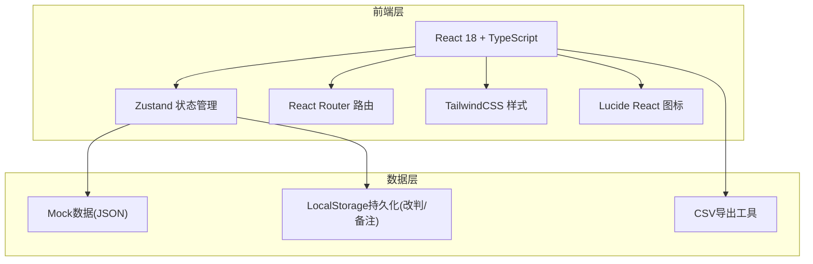
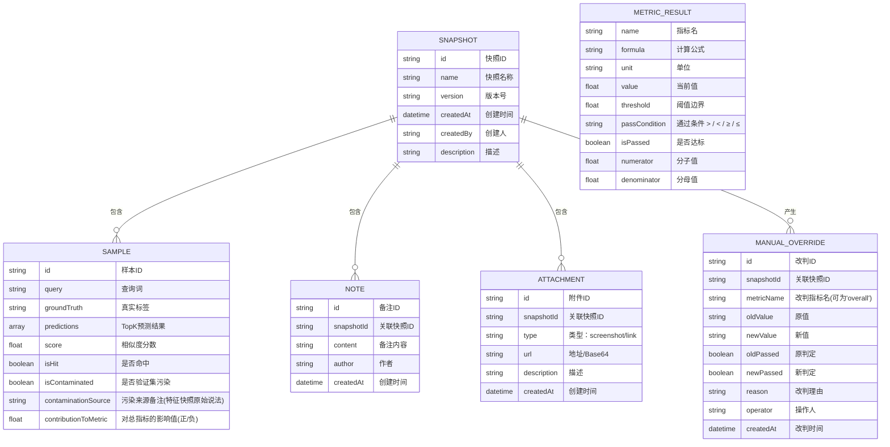

## 1. 架构设计



## 2. 技术说明

- 前端：React@18 + TypeScript + TailwindCSS@3 + Vite
- 初始化工具：vite-init（react-ts模板）
- 后端：无后端，纯前端Mock数据 + LocalStorage持久化
- 状态管理：Zustand
- 路由：react-router-dom
- 图标：lucide-react
- 数据持久化：LocalStorage保存人工改判记录和用户备注

## 3. 路由定义

| 路由 | 用途 |
|-------|---------|
| / | 守门总览页（默认首页） |
| /samples | 样本明细页 |
| /history | 历史追踪页 |

## 4. 数据模型

### 4.1 数据模型定义



### 4.2 核心指标计算公式

**Recall@K（召回率）**
```
Recall@K = (命中TopK的正样本数) / (全部正样本数)
单位：百分比(%)
默认阈值：≥ 85%
```

**Precision@K（精确率）**
```
Precision@K = (TopK预测中的正样本数) / (TopK预测总数)
单位：百分比(%)
默认阈值：≥ 80%
```

**NDCG@K（归一化折损累计增益）**
```
NDCG@K = DCG@K / IDCG@K
其中 DCG@K = Σ(2^rel_i - 1) / log2(i+1)
单位：无(0~1小数)
默认阈值：≥ 0.75
```

**QPS（每秒查询数）**
```
QPS = 总查询数 / 总耗时(秒)
单位：次/秒
默认阈值：≥ 1000
```

**Latency P99（99分位延迟）**
```
Latency P99 = 将所有查询延迟升序排列后，第99百分位的值
单位：毫秒(ms)
默认阈值：≤ 50
```

## 5. 目录结构

```
src/
├── components/
│   ├── MetricCard.tsx        # 指标卡片（含公式展示）
│   ├── ThresholdSlider.tsx   # 阈值配置滑块
│   ├── SampleTable.tsx       # 样本明细表
│   ├── SampleDrawer.tsx      # 样本下钻抽屉
│   ├── Timeline.tsx          # 版本时间线
│   ├── OverrideRecord.tsx    # 改判记录
│   ├── NoteList.tsx          # 备注列表
│   ├── AttachmentGrid.tsx    # 附件/截图网格
│   ├── OverrideModal.tsx     # 改判弹窗
│   └── NavBar.tsx            # 导航栏
├── pages/
│   ├── Overview.tsx          # 守门总览页
│   ├── Samples.tsx           # 样本明细页
│   └── History.tsx           # 历史追踪页
├── store/
│   └── gatekeeper.ts         # Zustand状态管理
├── data/
│   ├── mockData.ts           # 真实模拟数据
│   └── demoData.ts           # 演示数据（含改判和污染）
├── utils/
│   ├── metrics.ts            # 指标计算公式
│   └── csvExport.ts          # CSV导出工具
├── types/
│   └── index.ts              # 全局类型定义
├── App.tsx
├── main.tsx
└── index.css
```

## 6. 演示数据设计

演示数据需包含以下特征以展示完整功能：
- **1条人工改判样本**：样本ID=demo-override-001，原判定不通过（Recall拉低），值班小林改判为通过，理由填写"该query为长尾case，线上真实场景占比<0.1%，不影响整体质量"
- **2条验证集污染样本**：
  - 样本ID=demo-contam-001，污染来源备注="该样本在训练集中出现过，特征快照#123备注：疑似泄漏"
  - 样本ID=demo-contam-002，污染来源备注="特征快照标注：这条query的embedding是从线上日志直接捞的，并非推理生成"
- **3条拉低指标的异常样本**：展示在异常样本下钻区，方便运营主管追问
- **1条旧版本截图附件**：历史版本v0.9附带一张旧版指标截图缩略图
