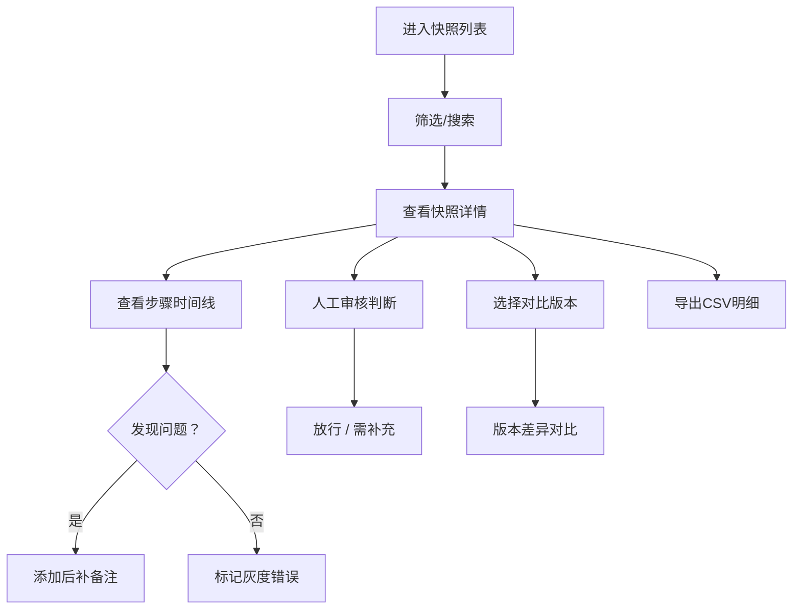

## 1. 产品概述

特征血缘版本快照系统是面向MLOps团队的训练日志追踪与审核工具，解决参数变化记录遗漏、版本对比困难、人工判断易被覆盖等痛点。

- **目标用户**：MLOps值班人员（小林）、模型负责人
- **核心价值**：让每一次参数变化都可追溯、每一次人工判断都可保留、两次快照对比一目了然

## 2. 核心功能

### 2.1 用户角色
| 角色 | 核心权限 |
|------|----------|
| MLOps值班 | 查看快照列表、添加后补备注、标记灰度错误、导出CSV |
| 模型负责人 | 版本对比、人工审核判断（放行/需补充）、查看详情 |

### 2.2 功能模块
1. **快照列表页**：快照总览、多维度筛选、状态标记、灰度错误高亮
2. **快照详情页**：步骤级参数变化追踪、后补备注、人工判断记录
3. **版本对比页**：两次快照横向对比、差异高亮、参数变化链路
4. **CSV导出**：与页面状态一致的明细导出

### 2.3 页面详情
| 页面名称 | 模块名称 | 功能描述 |
|----------|----------|----------|
| 快照列表页 | 筛选区 | 按模型版本、状态、时间范围、灰度标记筛选 |
| 快照列表页 | 列表区 | 展示快照基础信息、状态标签、灰度错误标记、操作按钮 |
| 快照列表页 | 导出功能 | 导出CSV明细，状态文案与页面完全一致 |
| 快照详情页 | 基本信息 | 快照版本、模型版本、创建时间、负责人 |
| 快照详情页 | 步骤时间线 | 训练各步骤参数变化记录，高亮异常步骤 |
| 快照详情页 | 后补备注 | 值班人员补充的备注记录，带时间戳和操作人 |
| 快照详情页 | 人工判断 | 负责人的放行/需补充判断，不随版本更新被覆盖 |
| 版本对比页 | 版本选择 | 选择两个快照进行对比 |
| 版本对比页 | 差异展示 | 参数差异高亮、步骤对比、备注对比 |

## 3. 核心流程

### 3.1 值班人员日常巡检流程
1. 值班小林进入快照列表页
2. 筛选出待审核的快照
3. 发现灰度比例写错的记录，标记"灰度错误"
4. 对参数变化不明确的步骤，添加后补备注
5. 导出CSV明细留档

### 3.2 负责人版本对比流程
1. 负责人选择两个模型版本的快照
2. 进入版本对比页
3. 查看参数变化差异，定位导致结果变化的步骤
4. 对每个快照做出人工判断（放行/需补充）
5. 人工判断独立存储，新版本不覆盖旧版本判断

### 3.3 流程图

## 4. 用户界面设计

### 4.1 设计风格
- **主色调**：深蓝靛青 (#1e3a5f) - 专业、稳重，符合MLOps技术氛围
- **辅助色**：琥珀橙 (#f59e0b) - 标记/警告，用于灰度错误和需补充状态
- **成功色**：翡翠绿 (#10b981) - 放行/正常状态
- **信息色**：天蓝 (#3b82f6) - 已备注/进行中
- **背景**：深色模式优先，浅灰渐变背景，科技感
- **字体**：标题使用 JetBrains Mono（等宽字体，技术感），正文使用 Inter
- **布局**：卡片式布局，左侧导航 + 主内容区
- **图标**：线性图标，简洁专业

### 4.2 页面设计概述
| 页面名称 | 模块名称 | UI元素 |
|----------|----------|--------|
| 快照列表页 | 筛选区 | 下拉选择器、日期范围、搜索框、标签筛选 |
| 快照列表页 | 列表卡片 | 状态徽章、灰度错误角标、参数概览、操作按钮 |
| 快照详情页 | 步骤时间线 | 垂直时间线、参数卡片、差异高亮、异常标记 |
| 快照详情页 | 备注区 | 气泡式备注、时间戳、操作人头像 |
| 版本对比页 | 对比表格 | 双列布局、差异行高亮、新增/删除标记 |

### 4.3 响应式
- 桌面端优先设计（1280px+）
- 平板端适配（768px-1280px），导航收起为侧边栏
- 移动端适配（<768px），列表改为单列，时间线简化

### 4.4 动效与交互
- 页面加载：卡片渐入 + 轻微上浮
- 状态切换：平滑过渡动画
- 悬停效果：卡片轻微放大 + 阴影加深
- 时间线：步骤节点脉冲动画提示当前位置
- 差异对比：新增内容绿色淡入，删除内容红色淡出
