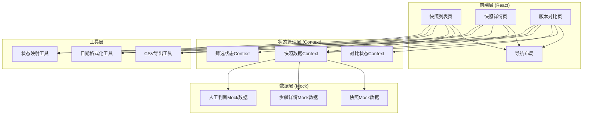
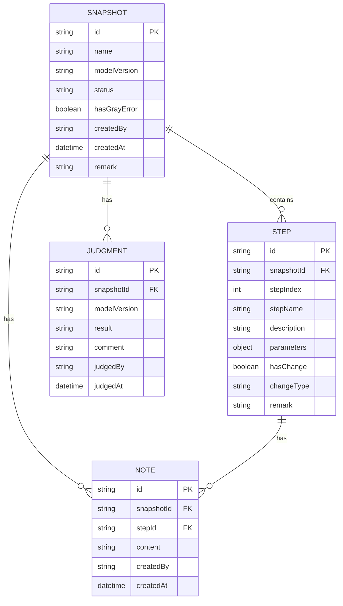

## 1. 架构设计



## 2. 技术描述

- **前端框架**：React@18 + TypeScript
- **构建工具**：Vite@5
- **样式方案**：TailwindCSS@3
- **路由**：React Router DOM@6
- **图标**：Lucide React
- **状态管理**：React Context + useState
- **数据来源**：Mock数据（前端内置）
- **CSV导出**：纯前端实现，使用 Blob + URL.createObjectURL

## 3. 路由定义

| 路由 | 页面 | 用途 |
|------|------|------|
| / | 快照列表页 | 展示所有快照，支持筛选、搜索、导出 |
| /snapshot/:id | 快照详情页 | 展示单个快照的步骤详情、备注、人工判断 |
| /compare | 版本对比页 | 对比两个快照的参数差异 |

## 4. 数据模型

### 4.1 数据模型定义



### 4.2 类型定义

```typescript
// 快照状态
type SnapshotStatus = 'pending' | 'approved' | 'need_supplement' | 'gray_error';

// 变更类型
type ChangeType = 'added' | 'removed' | 'modified' | 'none';

// 人工判断结果
type JudgmentResult = 'pass' | 'need_supplement';

interface Snapshot {
  id: string;
  name: string;
  modelVersion: string;
  status: SnapshotStatus;
  hasGrayError: boolean;
  createdBy: string;
  createdAt: string;
  remark: string;
  stepCount: number;
  changeCount: number;
}

interface Step {
  id: string;
  snapshotId: string;
  stepIndex: number;
  stepName: string;
  description: string;
  parameters: Record<string, any>;
  hasChange: boolean;
  changeType: ChangeType;
  changeDetail?: string;
}

interface Note {
  id: string;
  snapshotId: string;
  stepId?: string;
  content: string;
  createdBy: string;
  createdAt: string;
}

interface Judgment {
  id: string;
  snapshotId: string;
  modelVersion: string;
  result: JudgmentResult;
  comment: string;
  judgedBy: string;
  judgedAt: string;
}
```

## 5. 核心功能实现思路

### 5.1 状态映射工具（页面与CSV一致性）
- 统一的状态映射函数，页面展示和CSV导出共用
- 确保"待审核"、"已放行"、"需补充"、"灰度错误"等文案在两端完全一致

### 5.2 人工判断保留机制
- 每个判断记录关联 modelVersion，而非 snapshotId
- 新版本快照创建时，旧版本判断保留，互不覆盖
- 对比页面可同时展示两个版本的人工判断

### 5.3 灰度错误标记
- 快照级别的 hasGrayError 标记
- 列表页红色角标高亮
- 筛选器支持"仅看灰度错误"
- CSV导出包含"灰度错误"列

### 5.4 后补备注
- 支持快照级和步骤级两种备注
- 每条备注带操作人和时间戳
- 备注独立存储，不影响原始训练日志数据

### 5.5 CSV导出
- 导出字段与页面展示一一对应
- 状态文案使用同一映射函数
- 包含：快照名称、模型版本、状态、灰度错误、创建时间、备注等

## 6. 目录结构

```
src/
├── components/           # 公共组件
│   ├── Layout/          # 布局组件
│   ├── StatusBadge/     # 状态徽章
│   ├── StepTimeline/    # 步骤时间线
│   └── NoteBubble/      # 备注气泡
├── pages/               # 页面组件
│   ├── SnapshotList/    # 快照列表页
│   ├── SnapshotDetail/  # 快照详情页
│   └── Compare/         # 版本对比页
├── data/                # Mock数据
│   ├── snapshots.ts
│   ├── steps.ts
│   └── judgments.ts
├── utils/               # 工具函数
│   ├── status.ts        # 状态映射
│   ├── csv.ts           # CSV导出
│   └── date.ts          # 日期格式化
├── types/               # TypeScript类型
│   └── index.ts
├── App.tsx
├── main.tsx
└── index.css
```
