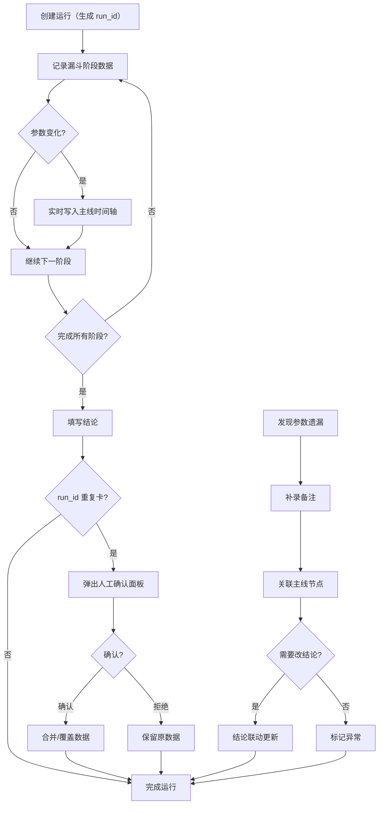

## 1. 产品概述

召回漏斗成本看板是一款面向评测工程师和排班同事的漏斗成本追踪工具，解决材料断续、参数变化遗漏、状态不持久等痛点，确保每轮评测的主线可追溯、备注与结论联动、灰度结果可拆分。
- 目标用户：评测工程师（小唐等）、排班同事
- 核心价值：让漏斗成本评测从"失败队列硬拼"变为结构化、可持续、可复盘的流程

## 2. 核心功能

### 2.1 用户角色

| 角色 | 典型场景 | 核心权限 |
|------|----------|----------|
| 评测工程师 | 执行评测、补录参数变化、填写结论 | 创建/编辑运行记录、补录备注、标记结论 |
| 排班同事 | 查看状态、接续未完成工作、记录异常 | 查看所有记录、补录记录、标记异常 |

### 2.2 功能模块

1. **看板主页**：漏斗成本总览、运行列表、状态卡片
2. **运行详情页**：单次 run_id 的完整主线、备注链、结论、灰度拆分、截图说明

### 2.3 页面详情

| 页面名称 | 模块名称 | 功能描述 |
|----------|----------|----------|
| 看板主页 | 状态总览卡片 | 显示当前活跃运行数、待人工确认数、已完成数 |
| 看板主页 | 运行列表 | 按 run_id 列出所有运行，显示状态标签（进行中/待确认/已完成）、最近更新时间 |
| 看板主页 | 快速操作 | 新建运行、按 run_id 重复卡一下（幂等重跑） |
| 运行详情页 | 主线时间轴 | 按时间顺序展示：失败队列拼出的主节点 → 后补备注 → 最终结论，确保参数变化不再遗漏到收尾 |
| 运行详情页 | 备注与结论联动 | 后补备注通过连线/引用与最终结论关联，点击备注可跳转到结论 |
| 运行详情页 | 灰度结果拆分 | 可折叠面板：样本变化、阈值变化、人工改判三维度分别展示，支持独立展开/收起 |
| 运行详情页 | 截图说明区 | 上传/粘贴截图，每张截图附带文字说明，重启后仍可查看 |
| 运行详情页 | 人工确认区 | 当 run_id 重复卡需人工确认时，显示原因和下一步建议，提供确认/拒绝按钮 |
| 运行详情页 | 操作区 | 补录备注、编辑结论、标记异常、导出报告 |

## 3. 核心流程

### 3.1 正常评测流程
评测工程师创建运行 → 系统生成 run_id → 逐步记录漏斗各阶段数据 → 参数变化实时进主线 → 填写结论 → 完成

### 3.2 幂等重跑流程
排班同事或工程师用同一 run_id 重跑 → 系统检测到重复 → 弹出人工确认面板（说明原因和下一步）→ 确认后合并或覆盖数据 → 历史备注保留

### 3.3 异常与补录流程
发现参数变化遗漏 → 补录备注并关联到主线节点 → 如需修改结论，后补备注与结论联动更新 → 异常标记

## 4. 用户界面设计

### 4.1 设计风格
- **主色调**：深灰底（#1a1a2e）+ 暗蓝强调色（#16213e）+ 琥珀色高亮（#f0a500），传达专业、工业感的评测工具气质
- **次色调**：暗绿（#0f3460）用于成功状态，暗红（#e94560）用于异常/失败状态
- **按钮风格**：圆角矩形（8px），微凸起质感，主操作用琥珀色，次操作用暗蓝
- **字体**：标题用 JetBrains Mono（代码/数据感），正文用 Noto Sans SC
- **布局风格**：左侧导航 + 右侧内容区，卡片式信息组织，时间轴竖向排列
- **图标风格**：线性图标，2px 描边，琥珀色填充

### 4.2 页面设计概述

| 页面名称 | 模块名称 | UI 元素 |
|----------|----------|----------|
| 看板主页 | 状态总览卡片 | 3 张横向排列的统计卡片，数字大字号 + 标签小字号，带微呼吸动画 |
| 看板主页 | 运行列表 | 表格/卡片混合布局，每行显示 run_id、状态标签（彩色胶囊）、最近更新时间、快捷操作按钮 |
| 看板主页 | 快速操作 | 顶部工具栏，新建运行按钮（琥珀色）+ run_id 搜索框 |
| 运行详情页 | 主线时间轴 | 竖向时间轴，左侧时间戳，右侧内容卡片，节点间用虚线连接，参数变化节点用琥珀色圆点标记 |
| 运行详情页 | 备注与结论联动 | 备注卡片带"关联结论"按钮，结论区域显示关联的备注引用，点击可高亮跳转 |
| 运行详情页 | 灰度结果拆分 | 3 个可折叠手风琴面板，标题栏带维度图标，展开后显示数据表格 + 对比图 |
| 运行详情页 | 截图说明区 | 网格排列的缩略图 + 文字说明，点击放大查看，支持拖拽上传 |
| 运行详情页 | 人工确认区 | 模态对话框，顶部警告图标 + 原因说明 + 下一步建议 + 双按钮（确认/拒绝） |

### 4.3 响应式设计
- 桌面优先设计，最小宽度 1280px
- 平板（768-1280px）：卡片从横向排列改为纵向堆叠，侧边栏可折叠
- 移动端（<768px）：单列布局，时间轴简化为列表

### 4.4 示例数据（3-4 条）

| run_id | 场景类型 | 状态 | 说明 |
|--------|----------|------|------|
| RUN-20240315-001 | 顺利记录 | 已完成 | 漏斗全阶段数据完整，参数无变化，结论一次填写 |
| RUN-20240315-002 | 补录记录 | 已完成 | 第 3 阶段阈值参数变化漏记，后补备注并联动更新结论 |
| RUN-20240315-003 | 异常记录 | 待确认 | run_id 重复卡，需人工确认是否合并数据 |
| RUN-20240315-004 | 灰度记录 | 已完成 | 灰度结果需拆分：样本量变化 + 阈值调整 + 人工改判 2 条 |
