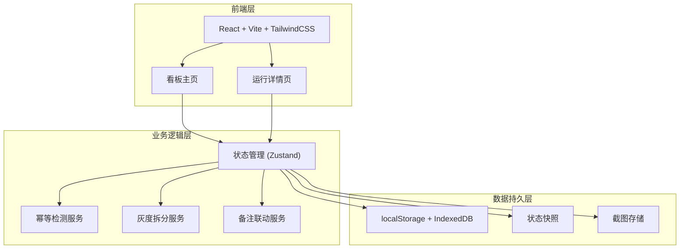
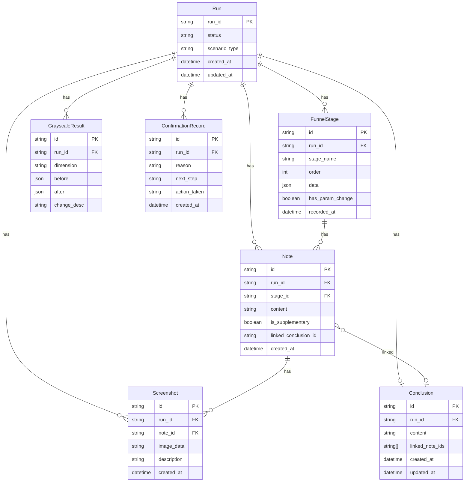

## 1. 架构设计



## 2. 技术说明

- **前端框架**：React@18 + TypeScript + Vite
- **样式方案**：TailwindCSS@3
- **状态管理**：Zustand（轻量、支持持久化中间件）
- **持久化**：localStorage 存储运行记录与状态 + IndexedDB 存储截图二进制
- **路由**：React Router v6
- **后端**：无（纯前端，数据全部持久化到浏览器本地存储，重启后自动恢复）
- **数据库**：无外部数据库，使用浏览器存储

### 2.1 持久化策略（核心）
- Zustand 的 `persist` 中间件将状态自动序列化到 localStorage
- 截图以 Base64 或 Blob 形式存入 IndexedDB
- 页面加载时自动从 localStorage 恢复状态 → 实现重启后状态可见
- 每次 state 变更自动同步到 localStorage → 实现崩溃恢复

### 2.2 幂等检测策略
- 创建/重跑运行时，先查询现有 run_id
- 若已存在，弹出人工确认模态框，显示原因（run_id 已存在）和下一步选项（合并/覆盖/取消）
- 合并：保留历史备注，新增数据追加到主线
- 覆盖：清空当前数据重新开始（历史备注归档）
- 取消：不执行任何操作

## 3. 路由定义

| 路由 | 用途 |
|------|------|
| `/` | 看板主页：运行列表、状态总览、快速操作 |
| `/run/:runId` | 运行详情页：主线时间轴、备注联动、灰度拆分、截图说明 |

## 4. 数据模型

### 4.1 数据模型定义



### 4.2 数据定义

```typescript
interface Run {
  run_id: string
  status: 'in_progress' | 'pending_confirmation' | 'completed'
  scenario_type: 'smooth' | 'supplementary' | 'exception'
  created_at: string
  updated_at: string
}

interface FunnelStage {
  id: string
  run_id: string
  stage_name: string
  order: number
  data: Record<string, unknown>
  has_param_change: boolean
  recorded_at: string
}

interface Note {
  id: string
  run_id: string
  stage_id: string | null
  content: string
  is_supplementary: boolean
  linked_conclusion_id: string | null
  created_at: string
}

interface Conclusion {
  id: string
  run_id: string
  content: string
  linked_note_ids: string[]
  created_at: string
  updated_at: string
}

interface Screenshot {
  id: string
  run_id: string
  note_id: string | null
  image_data: string
  description: string
  created_at: string
}

interface GrayscaleResult {
  id: string
  run_id: string
  dimension: 'sample_change' | 'threshold_change' | 'manual_override'
  before: Record<string, unknown>
  after: Record<string, unknown>
  change_desc: string
}

interface ConfirmationRecord {
  id: string
  run_id: string
  reason: string
  next_step: string
  action_taken: 'merge' | 'overwrite' | 'cancel'
  created_at: string
}
```
