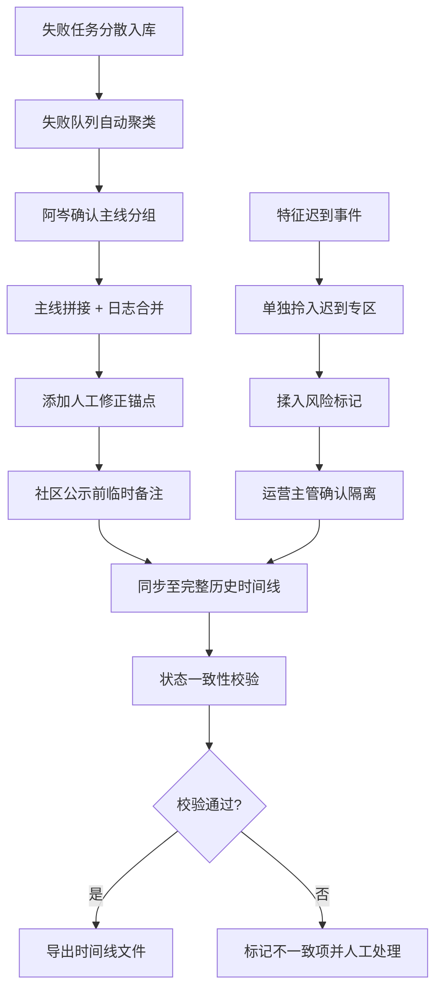

## 1. 产品概述

训练队列任务追踪系统，面向平台算法工程师（阿岑）和运营主管，解决AI模型训练过程中失败日志分散、特征迟到混入正常结果、版本变更难以追溯的问题。系统将失败队列、样本记录、版本变更、人工修正、历史时间线串联为完整的可追溯链路，支持社区公示前的备注补充和对外展示。

- 核心价值：将散落在多任务中的失败线索拼接成完整主线，确保特征异常可隔离、版本变更可对比、历史记录可导出且一致
- 目标用户：平台算法工程师（日常追踪）、运营主管（特征风险管控）、对外审核人员（社区公示查看）

## 2. 核心特性

### 2.1 用户角色

| 角色 | 核心使用场景 | 关键权限 |
|------|-------------|---------|
| 平台算法工程师（阿岑） | 日常追踪失败队列、拼接失败主线、添加公示备注、导出时间线 | 全功能读写、导出、人工修正录入 |
| 运营主管 | 监控特征迟到记录、核对正常结果与异常记录是否隔离 | 特征迟到模块查看、告警确认 |
| 外部审核人员 | 社区公示后查看历史追溯 | 只读模式查看时间线和处理记录 |

### 2.2 功能模块

1. **总览看板页**：失败队列概览、特征迟到预警、版本对比入口、近期时间线摘要
2. **失败队列追踪页**：多任务失败日志拼接为主线、任务关联样本查看、人工修正记录锚定
3. **历史时间线页**：样本/版本/阈值/人工修正/指标的完整时间线、状态一致性校验、导出
4. **版本对比页**：前版vs当前版对比（样本分布、阈值配置、人工修正清单、指标差异）
5. **特征迟到专区**：迟到特征记录单独拎出、与正常结果隔离展示、揉入风险标记

### 2.3 页面详情

| 页面名称 | 模块名称 | 功能描述 |
|---------|---------|---------|
| 总览看板 | 失败队列摘要卡片 | 展示失败任务数、主线拼接进度、待处理失败项，点击跳转失败队列页 |
| 总览看板 | 特征迟到预警区 | 醒目标记最近7天特征迟到记录数，是否有揉入正常结果的风险 |
| 总览看板 | 版本状态条 | 当前版号、前版号、可一键进入对比模式 |
| 总览看板 | 近期时间线流 | 以竖向时间轴展示最近20条关键事件（样本/版本/修正/指标） |
| 失败队列追踪 | 主线拼接视图 | 将多个相关任务的失败日志按时间合并，用颜色区分任务来源，自动标注因果链 |
| 失败队列追踪 | 失败日志详情抽屉 | 点击某条失败日志展开完整堆栈、关联样本ID、关联版本号 |
| 失败队列追踪 | 人工修正锚点 | 在失败主线上标注人工修正的位置，显示修正前后判断对比 |
| 失败队列追踪 | 公示备注录入 | 社区公示前临时添加备注，明确说明该失败/备注改变了哪些判断结论 |
| 历史时间线 | 完整时间轴 | 竖向大时间轴，按时间顺序串起样本入库、版本发布、阈值调整、人工修正、指标发布、失败发生 |
| 历史时间线 | 状态一致性校验 | 每条记录右侧绿色对勾/红色感叹号，标识页面状态与底层文件记录是否一致 |
| 历史时间线 | 分类筛选器 | 按类型（样本/版本/阈值/修正/指标/失败）、按版本号范围筛选 |
| 历史时间线 | 导出面板 | 支持导出为CSV/JSON，导出前执行一致性校验，附带校验报告 |
| 版本对比 | 四象限对比 | 样本分布对比、阈值配置对比、人工修正清单对比、核心指标变化对比 |
| 版本对比 | 差异高亮 | 所有变更项用色块高亮，新增绿色、修改琥珀色、删除红色 |
| 特征迟到专区 | 迟到记录列表 | 独立列表展示所有特征迟到记录，含特征名、迟到时长、原定批次、实际批次 |
| 特征迟到专区 | 揉入风险标记 | 迟到特征是否被揉入正常结果训练的标记，高风险红色醒目标注 |
| 特征迟到专区 | 隔离记录导出 | 单独导出特征迟到及其隔离状态的清单，供运营主管存档 |

## 3. 核心流程

### 3.1 失败主线拼接流程
平台算法阿岑打开失败队列追踪页 → 系统自动按任务关联ID和时间窗聚类相关失败任务 → 生成候选主线分组 → 阿岑确认或调整分组 → 系统按时间合并日志并标注因果链 → 阿岑在关键节点添加人工修正和公示备注 → 主线自动同步至历史时间线

### 3.2 版本对比流程
从总览看板点击版本对比入口 → 选择对比版本对（默认前版vs当前版）→ 系统加载四象限对比 → 阿岑逐一确认样本/阈值/修正/指标的差异 → 导出对比报告或标记至时间线

### 3.3 历史时间线导出流程
进入历史时间线页 → 应用筛选条件 → 点击"一致性校验" → 系统逐行比对页面状态与文件记录 → 显示校验结果 → 阿岑确认无误 → 导出CSV/JSON，附带校验摘要

### 3.4 Mermaid 流程图

## 4. 用户界面设计

### 4.1 设计风格
- **设计基调**：工业级数据控制台式设计，深色主体配琥珀色/青色强调色，营造严谨可追溯的专业感
- **主色**：深石墨灰 `#0f1419` 背景，次表层 `#1a1f26`
- **强调色**：琥珀橙 `#f59e0b`（失败/警告主线）、青绿 `#10b981`（通过/一致）、警示红 `#ef4444`（高风险/揉入）、信息蓝 `#3b82f6`（版本/样本）
- **字体**：标题使用 JetBrains Mono（等宽技术感），正文使用 Inter，数据数值统一等宽字体
- **按钮风格**：方正切角矩形，2px描边，悬浮时内部发光效果，营造硬件操作台按钮感
- **图标风格**：Lucide线性图标，状态节点使用实心色块+描边组合
- **布局风格**：左侧导航栏固定，右侧内容区卡片化，时间线页面使用竖向贯穿式布局

### 4.2 页面设计概览

| 页面名称 | 模块名称 | UI 元素与风格 |
|---------|---------|-------------|
| 总览看板 | 失败队列摘要 | 深色大卡片，琥珀色数字跳动动画，角落失败脉冲指示灯 |
| 总览看板 | 特征迟到预警 | 顶部横幅条，红/黄渐变背景，风险等级文字发光效果 |
| 总览看板 | 近期时间线流 | 左侧竖向细时间轴，节点带悬浮放大动画，hover展开详情 |
| 失败队列追踪 | 主线拼接视图 | 横向泳道图，每条泳道一个任务来源，琥珀色连线标注因果关系 |
| 失败队列追踪 | 公示备注录入 | 抽屉式表单，左侧原判断、右侧新判断，中间箭头连接 |
| 历史时间线 | 完整时间轴 | 竖向居中粗线，节点交替左右分布，状态一致性徽标固定在节点右边缘 |
| 历史时间线 | 导出面板 | 底部悬浮工具条，校验进度条带文件扫描动画 |
| 版本对比 | 四象限对比 | 2x2网格，每个象限标题带版本号标签，差异处浮动diff气泡 |
| 特征迟到专区 | 揉入风险标记 | 行内警示图标 + 红色背景发光，hover展开揉入影响说明 |

### 4.3 响应式
- 桌面优先设计（1440px及以上最优），保留侧边导航
- 1024px以下：侧边栏压缩为图标模式，卡片堆叠
- 移动端：纵向堆叠为主，时间线改为单列式，对比视图改为上下切分Tab切换

### 4.4 动效指引
- 失败节点脉冲：琥珀色节点每3秒一次柔和呼吸发光，暗示待处理
- 时间线加载：从上往下逐节点淡入滑入，模拟数据流写入
- 主线拼接：点击确认分组后，泳道连线以路径描边动画串起
- 校验通过：对勾图标做一次从左到右的描边填充动画
