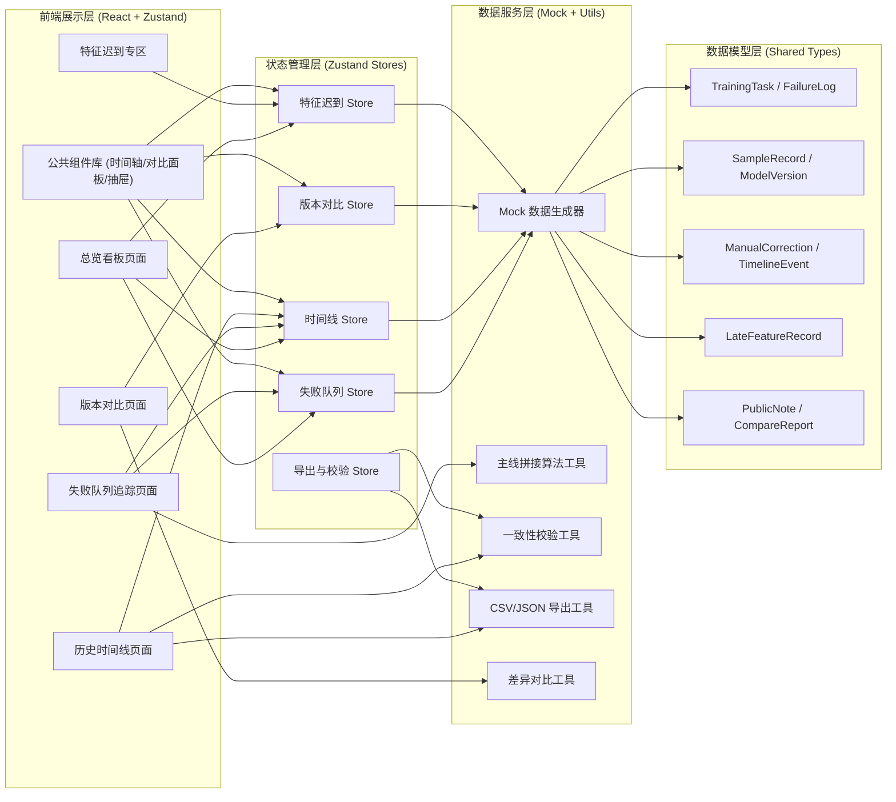
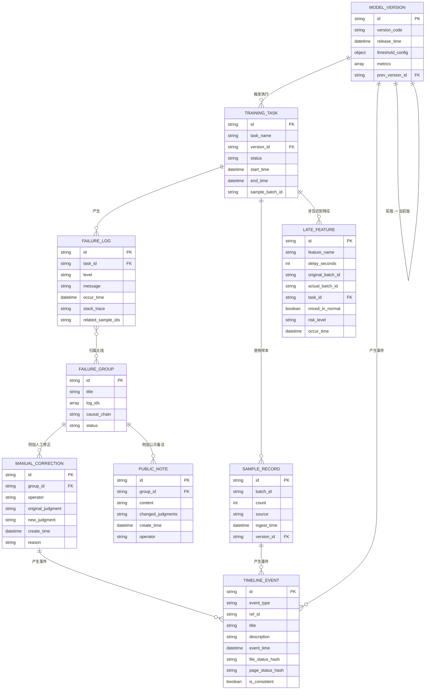

## 1. 架构设计



## 2. 技术描述

- **前端框架**：React@18 + TypeScript@5 + Vite@5
- **样式方案**：TailwindCSS@3 + CSS Variables（主题token系统）
- **状态管理**：Zustand@4（模块化Store，按功能域拆分）
- **路由方案**：React Router DOM@6
- **图标库**：Lucide React
- **动画方案**：纯CSS Animation + Transition（关键路径使用CSS变量控制）
- **数据层**：纯前端Mock，集中式Mock数据工厂 + 工具函数层
- **初始化工具**：vite-init（react-ts 模板）

## 3. 路由定义

| 路由路径 | 页面组件 | 页面用途 |
|---------|---------|---------|
| `/` | DashboardPage | 总览看板：失败队列摘要、特征迟到预警、版本状态、近期时间线 |
| `/failure-queue` | FailureQueuePage | 失败队列追踪：主线拼接、失败日志详情、人工修正锚点、公示备注录入 |
| `/timeline` | TimelinePage | 历史时间线：完整时间轴、分类筛选、一致性校验、导出面板 |
| `/compare` | ComparePage | 版本对比：四象限对比（样本/阈值/修正/指标）、差异高亮 |
| `/late-features` | LateFeaturesPage | 特征迟到专区：迟到记录列表、揉入风险标记、隔离清单导出 |

## 4. 核心数据模型

### 4.1 Mermaid ER 图



### 4.2 TypeScript 类型定义

```typescript
export type EventType = 'sample' | 'version' | 'threshold' | 'correction' | 'metric' | 'failure' | 'feature';
export type FailureLevel = 'error' | 'critical' | 'warning';
export type RiskLevel = 'high' | 'medium' | 'low';
export type ConsistencyStatus = 'consistent' | 'inconsistent' | 'pending';

export interface ModelVersion {
  id: string;
  versionCode: string;
  releaseTime: string;
  thresholdConfig: Record<string, number>;
  metrics: Record<string, number>;
  prevVersionId: string | null;
}

export interface TrainingTask {
  id: string;
  taskName: string;
  versionId: string;
  status: 'success' | 'failed' | 'partial';
  startTime: string;
  endTime: string | null;
  sampleBatchId: string;
}

export interface FailureLog {
  id: string;
  taskId: string;
  level: FailureLevel;
  message: string;
  occurTime: string;
  stackTrace: string;
  relatedSampleIds: string[];
}

export interface FailureGroup {
  id: string;
  title: string;
  logIds: string[];
  causalChain: Array<{ from: string; to: string; description: string }>;
  status: 'open' | 'analyzing' | 'resolved' | 'noted';
  taskIds: string[];
}

export interface SampleRecord {
  id: string;
  batchId: string;
  count: number;
  source: string;
  ingestTime: string;
  versionId: string;
  distribution: Record<string, number>;
}

export interface ManualCorrection {
  id: string;
  groupId: string;
  operator: string;
  originalJudgment: string;
  newJudgment: string;
  createTime: string;
  reason: string;
}

export interface PublicNote {
  id: string;
  groupId: string;
  content: string;
  changedJudgments: string[];
  createTime: string;
  operator: string;
}

export interface TimelineEvent {
  id: string;
  eventType: EventType;
  refId: string;
  title: string;
  description: string;
  eventTime: string;
  fileStatusHash: string;
  pageStatusHash: string;
  isConsistent: ConsistencyStatus;
  metadata: Record<string, unknown>;
}

export interface LateFeature {
  id: string;
  featureName: string;
  delaySeconds: number;
  originalBatchId: string;
  actualBatchId: string;
  taskId: string;
  mixedInNormal: boolean;
  riskLevel: RiskLevel;
  occurTime: string;
  impactDescription: string;
}

export interface CompareDiffItem<T = unknown> {
  key: string;
  previous: T | null;
  current: T | null;
  changeType: 'added' | 'removed' | 'modified' | 'unchanged';
}

export interface VersionCompareReport {
  versionPair: { previous: string; current: string };
  samples: CompareDiffItem[];
  thresholds: CompareDiffItem<number>[];
  corrections: CompareDiffItem[];
  metrics: CompareDiffItem<number>[];
}
```

## 5. 模块目录结构

```
src/
├── components/
│   ├── layout/
│   │   ├── SideNav.tsx              # 侧边导航栏
│   │   ├── TopBar.tsx               # 顶部状态栏
│   │   └── CardShell.tsx            # 通用卡片外壳
│   ├── timeline/
│   │   ├── TimelineAxis.tsx         # 竖向时间轴
│   │   ├── TimelineNode.tsx         # 时间节点
│   │   └── ConsistencyBadge.tsx     # 一致性校验徽标
│   ├── failure/
│   │   ├── FailureLane.tsx          # 单泳道失败线
│   │   ├── MainlineView.tsx         # 主线拼接泳道图
│   │   ├── LogDetailDrawer.tsx      # 日志详情抽屉
│   │   └── PublicNoteForm.tsx       # 公示备注表单
│   ├── compare/
│   │   ├── CompareQuadrant.tsx      # 四象限容器
│   │   ├── DiffBlock.tsx            # 差异块（高亮）
│   │   └── DiffBadge.tsx            # 新增/删除/修改徽标
│   └── features/
│       ├── LateFeatureRow.tsx       # 迟到特征行
│       ├── RiskIndicator.tsx        # 揉入风险指示器
│       └── WarningBanner.tsx        # 预警横幅
├── pages/
│   ├── DashboardPage.tsx
│   ├── FailureQueuePage.tsx
│   ├── TimelinePage.tsx
│   ├── ComparePage.tsx
│   └── LateFeaturesPage.tsx
├── stores/
│   ├── failureStore.ts
│   ├── timelineStore.ts
│   ├── compareStore.ts
│   ├── featureStore.ts
│   └── exportStore.ts
├── data/
│   ├── mock/
│   │   ├── generateVersions.ts
│   │   ├── generateFailures.ts
│   │   ├── generateTimeline.ts
│   │   └── generateLateFeatures.ts
│   │   └── index.ts
│   └── sampleData.ts                # 静态示例数据
├── utils/
│   ├── mainlineBuilder.ts           # 主线拼接算法
│   ├── consistencyChecker.ts        # 一致性校验工具
│   ├── diffComparator.ts            # 差异对比工具
│   ├── exportHelpers.ts             # CSV/JSON 导出
│   ├── hash.ts                      # 状态哈希工具
│   └── time.ts                      # 时间格式化工具
├── types/
│   └── index.ts                     # 共享类型定义
├── styles/
│   └── globals.css                  # 全局样式 + CSS Variables 主题
├── router/
│   └── index.tsx                    # 路由配置
├── App.tsx
└── main.tsx
```

## 6. 关键算法与工具说明

### 6.1 主线拼接算法（mainlineBuilder.ts）
- **输入**：FailureLog[] + TrainingTask[]
- **步骤**：
  1. 按关联样本ID和时间窗口（±30分钟）构建任务关联图
  2. 使用并查集将连通任务归为同一候选组
  3. 组内按时间排序日志，识别因果链（后发日志引用前发日志message关键词）
  4. 输出 FailureGroup（带 causal_chain）

### 6.2 一致性校验（consistencyChecker.ts）
- 对每条 TimelineEvent 计算：`fileStatusHash = hash(原始文件行内容)` 与 `pageStatusHash = hash(渲染时读取的状态字段)`
- 比对两哈希值，输出 `isConsistent`，不一致时记录差异字段
- 导出时生成校验摘要附在文件头部

### 6.3 差异对比（diffComparator.ts）
- 按 key 对齐前版/当前版的样本、阈值、修正、指标
- 输出 CompareDiffItem[]，changeType 驱动颜色渲染
- 阈值/指标类数值型差异计算变化百分比

## 7. 主题与设计Token

```css
:root {
  /* 背景层 */
  --bg-root: #0f1419;
  --bg-surface: #1a1f26;
  --bg-elevated: #252c35;
  
  /* 主色 */
  --accent-amber: #f59e0b;
  --accent-amber-glow: rgba(245, 158, 11, 0.25);
  --accent-emerald: #10b981;
  --accent-emerald-glow: rgba(16, 185, 129, 0.25);
  --accent-red: #ef4444;
  --accent-red-glow: rgba(239, 68, 68, 0.25);
  --accent-blue: #3b82f6;
  --accent-blue-glow: rgba(59, 130, 246, 0.25);
  
  /* 文本 */
  --text-primary: #e5e7eb;
  --text-secondary: #9ca3af;
  --text-muted: #6b7280;
  --text-mono: 'JetBrains Mono', monospace;
  
  /* 边框 */
  --border-default: rgba(156, 163, 175, 0.12);
  --border-emphasis: rgba(156, 163, 175, 0.28);
  
  /* 动效 */
  --ease-out: cubic-bezier(0.16, 1, 0.3, 1);
  --pulse-duration: 3s;
}
```
