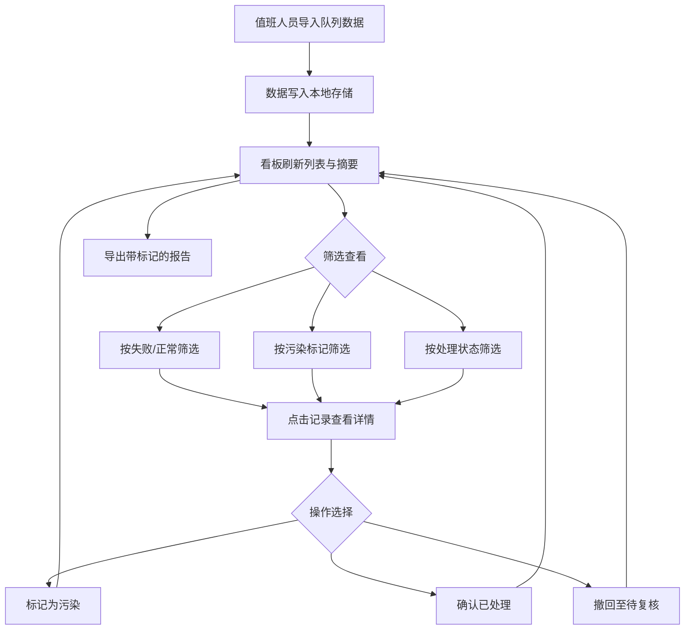
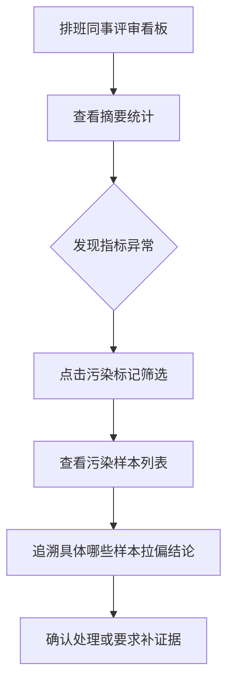

## 1. 产品概述

训练队列成本看板是面向 MLOps 值班人员的本地化复核工具，用于集中管理训练队列中失败任务的导入、确认、撤回与异常标记。解决的核心问题：失败日志散落在多个任务中，值班人员需要翻查多个入口才能完成一次复核，且无法追踪哪些样本污染了验证集、哪些已处理、哪些仍需补证据。

- 目标用户：MLOps 值班人员（小林等）、排班评审同事、未参与开发但需要查看看板的人员
- 核心价值：将导入、确认、撤回和页面摘要统一到同一份本地数据，让复核流程可追溯、异常可标记、结论可审计

## 2. 核心功能

### 2.1 用户角色

| 角色 | 核心权限 |
|------|----------|
| MLOps 值班人员 | 导入队列、标记污染、确认/撤回处理、导出报告 |
| 排班评审同事 | 查看看板摘要、追溯影响样本、审计处理状态 |
| 外部查看人员 | 浏览材料入口和异常出口，理解处理进展 |

### 2.2 功能模块

1. **看板主页面**：摘要统计卡片区、队列列表区（含筛选/搜索）、详情侧栏
2. **导入流程**：从本地粘贴/上传队列数据，统一写入同一份本地数据源
3. **确认与撤回**：对单条或多条记录执行确认（已处理）或撤回（待复核），状态即时反映到摘要
4. **污染标记**：筛选、详情和导出均保留验证集污染标记，可追溯哪几条样本拉偏了结论
5. **导出功能**：支持导出带标记的队列报告（含处理状态和污染标记）

### 2.3 页面详情

| 页面名称 | 模块名称 | 功能描述 |
|----------|----------|----------|
| 看板主页 | 摘要统计卡片 | 显示总任务数、失败数、正常数、已处理数、待处理数、污染标记数 |
| 看板主页 | 队列列表 | 展示所有导入的队列记录，支持按状态/类型/污染标记筛选，支持搜索 |
| 看板主页 | 详情侧栏 | 点击记录展开详情，显示完整失败日志、污染标记、处理状态变更历史 |
| 看板主页 | 导入弹窗 | 粘贴 JSON 或上传文件导入队列数据，预览后确认写入 |
| 看板主页 | 批量操作栏 | 选中多条记录后批量确认/撤回/标记污染 |
| 看板主页 | 导出按钮 | 导出当前筛选条件下的队列报告，含所有标记字段 |

## 3. 核心流程

### 导入-复核-导出流程

### 污染追溯流程

## 4. 用户界面设计

### 4.1 设计风格

- **主色调**：深灰（zinc-900）为底，琥珀色（amber-500）为异常/警告标记，翠绿（emerald-500）为正常/已处理状态，玫红（rose-500）为污染标记
- **按钮风格**：圆角中等（rounded-lg），轻微阴影，hover 时阴影加深
- **字体**：JetBrains Mono 用于数据/日志区域，Noto Sans SC 用于界面文本
- **布局**：左侧列表 + 右侧详情侧栏，顶部摘要卡片区，桌面优先
- **图标**：Lucide 图标库，极简线条风

### 4.2 页面设计概述

| 页面名称 | 模块名称 | UI 元素 |
|----------|----------|----------|
| 看板主页 | 摘要统计卡片 | 6 张卡片横排，数字大字+标签小字，微动画计数 |
| 看板主页 | 队列列表 | 表格布局，行间交替色，状态/污染标记用彩色徽章，hover 高亮 |
| 看板主页 | 详情侧栏 | 右侧抽屉式，暗色背景，等宽字体显示日志，标记按钮固定底栏 |
| 看板主页 | 导入弹窗 | 居中模态框，代码编辑区粘贴 JSON，底部预览表格+确认按钮 |
| 看板主页 | 批量操作栏 | 选中记录后顶部浮出操作栏，含确认/撤回/标记污染按钮 |
| 看板主页 | 导出按钮 | 右上角图标按钮，点击生成下载 |

### 4.3 响应式设计

- 桌面优先设计（1440px 基准）
- 列表与详情侧栏在窄屏下堆叠为上下布局
- 摘要卡片在窄屏下 2 列网格

### 4.4 3D 场景

不适用
