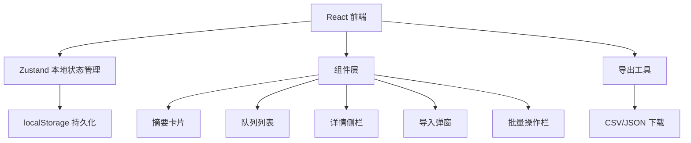
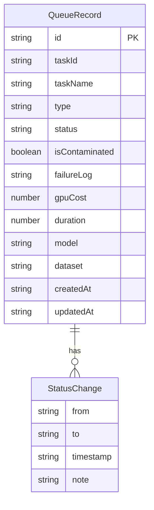

## 1. 架构设计



纯前端架构，无后端服务。所有数据通过 Zustand store 管理并持久化到 localStorage，确保导入、确认、撤回和页面摘要操作同一份数据源。

## 2. 技术说明

- **前端**：React@18 + TypeScript + Tailwind CSS@3 + Vite
- **初始化工具**：vite-init（react-ts 模板）
- **后端**：无（纯前端，所有数据本地存储）
- **状态管理**：Zustand（含 persist 中间件，自动同步 localStorage）
- **数据存储**：localStorage（通过 Zustand persist）
- **图标库**：lucide-react

## 3. 路由定义

| 路由 | 用途 |
|------|------|
| / | 看板主页面，包含摘要、列表、详情侧栏 |

单页应用，核心内容集中在一个页面，通过组件内状态切换视图。

## 4. API 定义

无后端 API。所有操作通过 Zustand store 的 action 完成：

### Store Actions

| Action | 参数 | 说明 |
|--------|------|------|
| importRecords | records: QueueRecord[] | 批量导入队列记录 |
| confirmRecord | id: string | 将记录标记为"已处理" |
| withdrawRecord | id: string | 将记录撤回为"待复核" |
| toggleContamination | id: string | 切换污染标记 |
| batchConfirm | ids: string[] | 批量确认 |
| batchWithdraw | ids: string[] | 批量撤回 |
| batchToggleContamination | ids: string[] | 批量切换污染标记 |
| deleteRecord | id: string | 删除单条记录 |

### 数据类型

```typescript
type RecordStatus = "pending" | "confirmed" | "withdrawn"
type RecordType = "failure" | "normal"

interface QueueRecord {
  id: string
  taskId: string
  taskName: string
  type: RecordType
  status: RecordStatus
  isContaminated: boolean
  failureLog: string
  gpuCost: number
  duration: number
  model: string
  dataset: string
  createdAt: string
  updatedAt: string
  statusHistory: StatusChange[]
}

interface StatusChange {
  from: RecordStatus
  to: RecordStatus
  timestamp: string
  note?: string
}
```

## 5. 服务器架构图

不适用（纯前端项目）

## 6. 数据模型

### 6.1 数据模型定义



### 6.2 初始数据

项目内置贴近现场的测试数据集，包含：
- 5 条失败记录（不同失败原因：OOM、超时、数据格式错误、梯度爆炸、验证集泄漏）
- 1 条正常记录（混入其中，用于对比）
- 其中 2 条失败记录带有验证集污染标记
- 数据涵盖不同模型和 GPU 成本
