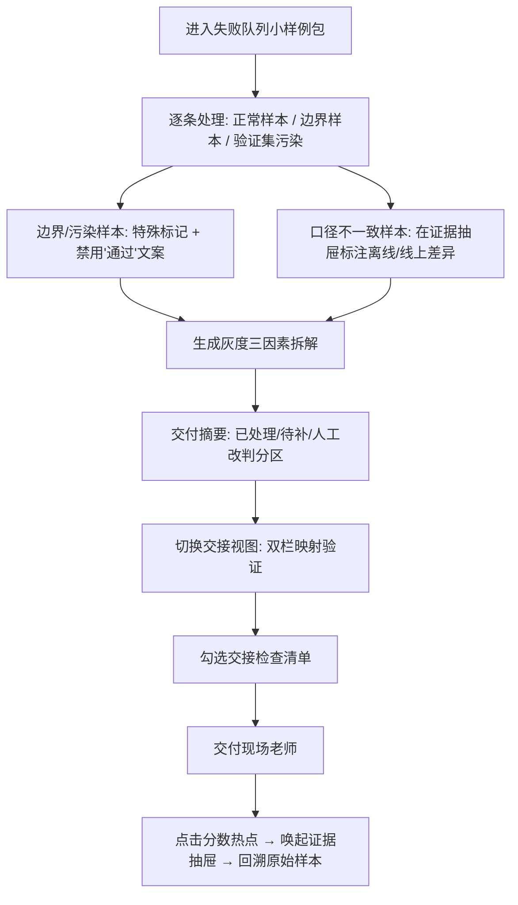

## 1. 产品概述
模型压缩成本看板是面向AI模型评测团队的质量管理平台，解决模型压缩评测过程中材料零散、离线线上口径不一致、证据追溯困难等问题，支撑评测工程师处理失败队列并向现场老师交付可追溯的评测报告。

- 核心价值：材料断点可拼接、结果证据可回溯、灰度影响可拆解、交付状态一目了然
- 目标用户：评测工程师（小唐）负责处理队列和交接、现场老师负责审阅报告和抽查样本

## 2. 核心特性

### 2.1 用户角色
| 角色 | 接入方式 | 核心权限 |
|------|----------|----------|
| 评测工程师（小唐） | 内部账号登录 | 浏览失败队列、处理样本、标注原因、执行交接、查看全量数据 |
| 现场老师 | 只读分享链接 | 浏览报告摘要、点击分数回溯样本证据、查看灰度拆解、确认已处理项 |

### 2.2 功能模块
1. **交付摘要页**：统计卡片分区（已处理 / 待补材料 / 人工改判），总体通过率趋势
2. **失败队列页**：时间线拼接主流程，含边界样本标记、验证集污染警示标
3. **样本证据抽屉**：点击任意分数/指标唤起，展示原始输入、模型输出、标注对比、判定来源
4. **灰度结果拆解页**：三因素瀑布图（样本变化 / 阈值变化 / 人工改判），支持逐项下钻
5. **工程师交接视图**：失败队列→原始说法链路、摘要→处理结果链路双视角切换

### 2.3 页面详情
| 页面名称 | 模块名称 | 功能描述 |
|----------|----------|----------|
| 交付摘要页 | 分区统计卡片 | 已处理（绿）、待补材料（橙）、人工改判（紫）三大色块分区，点击跳转对应列表 |
| 交付摘要页 | 通过率趋势图 | 近10次压缩版本的离线/线上双口径折线，口径差异处标红 |
| 交付摘要页 | 快速交接面板 | 工程师视角一键切换，展示本次需交接说明的要点清单 |
| 失败队列页 | 时间线主流程 | 按材料出现顺序拼接，不同来源用不同色边卡片表示，时间轴上标注断点缺口 |
| 失败队列页 | 边界样本标记 | 验证集污染样本用斜纹红边框+警示图标，处理结果文案不得使用"通过""正常"等词 |
| 失败队列页 | 批次过滤器 | 按压缩批次、模型版本、失败类型筛选，一键定位小样例包 |
| 样本证据抽屉 | 原始说法区 | 失败队列中记录的原始问题描述、提交人、提交时间 |
| 样本证据抽屉 | 指标对比区 | 离线指标值、线上指标值、口径差异说明，数值旁设置可点击热点 |
| 样本证据抽屉 | 样本内容区 | 输入文本/图像、模型输出、人工标注、判定规则命中说明 |
| 灰度结果拆解页 | 三因素瀑布图 | 从基线版本→当前版本的通过率变化，拆为样本变化Δ、阈值变化Δ、人工改判Δ三段 |
| 灰度结果拆解页 | 因素明细列表 | 每段变化对应具体样本列表，点击直接唤起证据抽屉 |
| 工程师交接视图 | 双栏对比 | 左栏失败队列原始说法，右栏摘要页处理结果，逐条映射验证 |
| 工程师交接视图 | 交接检查清单 | 口径对齐、边界样本、污染记录、灰度拆解四项勾选，完成后生成交接快照 |

## 3. 核心流程
评测工程师从小样例失败队列切入→逐条处理样本（正常/边界/污染分类标记）→遇到离线线上口径不一致时在证据抽屉标注差异→生成灰度结果三因素拆解→切换交付摘要确认三类状态分区→进入交接视图，从失败队列可追溯原始说法、从摘要可解释处理结果→完成交接清单勾选后交付现场老师→现场老师通过分数热点回溯样本证据。

## 4. 界面设计

### 4.1 设计风格
- **主色调**：深夜蓝 #0F172A 作为背景基底，搭配琥珀橙 #F59E0B（待补材料）、翡翠绿 #10B981（已处理）、紫罗兰 #8B5CF6（人工改判）三色块分区
- **警示色**：验证集污染使用斜纹底纹 + 玫红 #EC4899 边框，确保与正常通过样本视觉隔离
- **字体方案**：展示标题使用 Newsreader 衬线体（学术权威感），数据表格与正文使用 Geist Mono 等宽体（评测报告的精密感）
- **卡片风格**：2px 细边框 + 8px 圆角，hover 状态出现左侧 4px 色边滑入动画，分区卡片背景使用低透明度渐变叠加噪点纹理
- **图标风格**：使用 lucide-react 线性图标，重要状态叠加 1px 发光描边

### 4.2 页面设计概览
| 页面名称 | 模块名称 | UI 元素 |
|----------|----------|----------|
| 交付摘要页 | 分区统计卡片 | 三色大色块 + 渐变叠加 + 大字号数字 + 衬线体标签 + 右下缺口装饰线 |
| 交付摘要页 | 双口径折线图 | 双折线（虚线离线/实线线上）+ 差异点红点脉冲 + 悬浮 tooltip 显示口径说明 |
| 失败队列页 | 时间线主流程 | 左侧细竖轴 + 圆点节点 + 断点虚线衔接 + 卡片来源色边 |
| 失败队列页 | 污染样本卡 | 45° 斜纹底纹 + 玫红边框 + 警示三角图标 + 文案强制使用"需复核/不纳入统计" |
| 样本证据抽屉 | 右侧抽屉 | 从右向左滑入 + 深色遮罩 + 分区折叠面板 + 代码块风格展示模型输出 |
| 灰度结果拆解页 | 瀑布图 | 三段色块瀑布 + 起始结束虚线 + 每段悬浮显示具体样本列表入口 |
| 工程师交接视图 | 双栏布局 | 左失败右摘要 + 中间映射连线 + 未匹配项黄色高亮 + 底部清单四宫格勾选 |

### 4.3 响应式
桌面端优先（最小支持 1440px 宽度），关键数据展示区采用 min-width 防挤压；侧边抽屉在 1024px 以下改为底部抽屉上浮；时间线在窄屏下改为垂直紧凑布局。触控设备优化：所有可点击区域 ≥ 44px，样本列表支持左右滑动快速标记。
