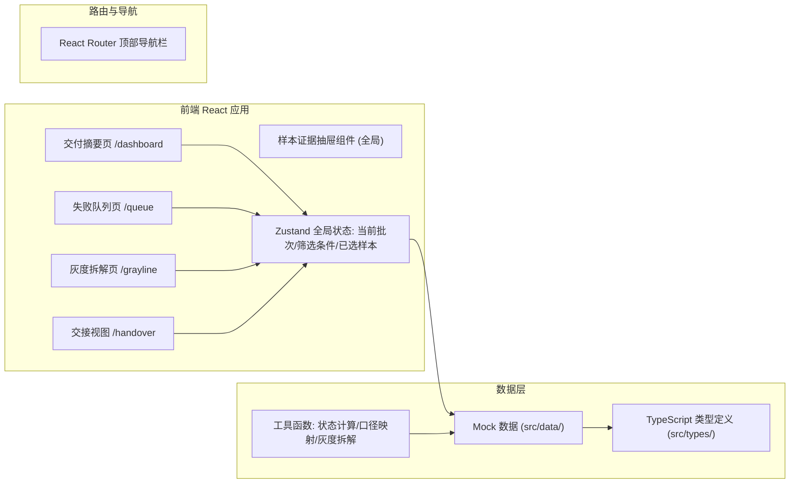

## 1. 架构设计



## 2. 技术说明
- **前端框架**：React@18 + TypeScript + Vite
- **样式方案**：Tailwind CSS@3 + CSS 变量主题系统 + 噪点纹理/渐变 Mesh 背景
- **状态管理**：Zustand（批次上下文、筛选条件、抽屉开关、证据锚点）
- **路由**：React Router DOM@6
- **图表**：Recharts（双口径折线图、灰度瀑布图）
- **图标**：lucide-react
- **后端**：纯前端 Mock 数据，不引入后端服务
- **数据库**：无后端，所有数据以 TypeScript 常量形式定义在 `src/data/` 下

## 3. 路由定义
| 路由路径 | 页面名称 | 说明 |
|----------|----------|------|
| `/` | 交付摘要页 | 默认首页，三大分区卡片 + 双口径趋势图 + 交接面板 |
| `/queue` | 失败队列页 | 时间线主流程 + 边界/污染标记 + 批次筛选器 |
| `/grayline` | 灰度拆解页 | 三因素瀑布图 + 因素明细下钻 |
| `/handover` | 交接视图 | 双栏映射 + 交接检查清单 |

全局组件：`<EvidenceDrawer sampleId={string} />` 通过路由 query 参数或 Zustand state 控制唤起。

## 4. 数据模型

### 4.1 类型定义

```typescript
// 样本处理状态
type SampleStatus = 'processed' | 'pending_material' | 'manual_review';
// 样本分类
type SampleCategory = 'normal' | 'boundary' | 'validation_pollution';
// 失败类型
type FailureType = 'metric_mismatch' | 'threshold' | 'label_error' | 'pollution' | 'unknown';
// 灰度变化因素
type GrayFactor = 'sample_change' | 'threshold_change' | 'manual_override';

interface MetricValue {
  offline: number;
  online: number;
  diffNote?: string;      // 口径差异说明
  caliperAligned: boolean; // 口径是否对齐
}

interface EvidenceEntry {
  id: string;
  title: string;
  content: string;        // 原始问题描述
  source: string;         // 来源人/系统
  timestamp: number;
}

interface CompressionSample {
  id: string;
  batchId: string;
  modelVersion: string;
  name: string;
  category: SampleCategory;
  status: SampleStatus;
  failureType: FailureType;
  metrics: {
    accuracy?: MetricValue;
    latency?: MetricValue;
    cost?: MetricValue;
    [key: string]: MetricValue | undefined;
  };
  inputPreview: string;   // 样本输入摘要/缩略图描述
  modelOutput: string;    // 模型输出
  groundTruth: string;    // 人工标注
  judgmentRule: string;   // 判定规则
  originalStatement: EvidenceEntry[]; // 原始说法时间线
  processedBy?: string;   // 处理人
  processedNote?: string; // 处理备注
  grayFactor?: GrayFactor; // 归因于哪类灰度变化
  createdAt: number;
}

interface CompressionBatch {
  id: string;
  version: string;
  name: string;
  baselineVersion?: string;
  overallMetrics: {
    offlineAccuracy: number;
    onlineAccuracy: number;
    processedCount: number;
    pendingCount: number;
    manualCount: number;
    pollutionCount: number;
  };
  samples: CompressionSample[];
  grayBreakdown: {
    factor: GrayFactor;
    delta: number;         // 通过率变化百分点
    sampleIds: string[];
    description: string;
  }[];
  handoverChecklist: {
    caliperAligned: boolean;
    boundaryMarked: boolean;
    pollutionIsolated: boolean;
    grayBreakdownReady: boolean;
  };
}
```

### 4.2 Mock 数据包约束
失败队列小样例包包含 **8 条样本**：
- 5 条正常失败记录（含 2 条离线线上口径不一致）
- 1 条边界样本（处于阈值边缘，需人工改判）
- 1 条验证集污染样本（处理结果文案禁用"通过""正常"）
- 1 条待补材料记录（材料缺失，状态为 pending）

灰度批次设置 2 个版本：基线 v1.2 → 当前 v1.3，三因素各对应 1~2 条样本变化。

## 5. 工具函数模块
- `src/utils/statusCalc.ts`：根据样本数组计算已处理/待补/人工改判数量，隔离污染样本
- `src/utils/caliperAlign.ts`：比对离线线上指标，标记差异点并生成口径说明文案
- `src/utils/grayBreakdown.ts`：根据基线版本和当前版本生成三因素瀑布图数据
- `src/utils/evidence.ts`：根据样本 ID 组装原始说法时间线和证据链
- `src/utils/copyText.ts`：交接视图中生成可复制的处理结果话术
