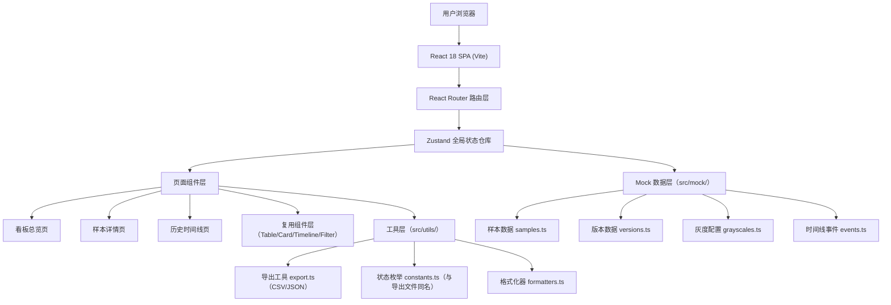
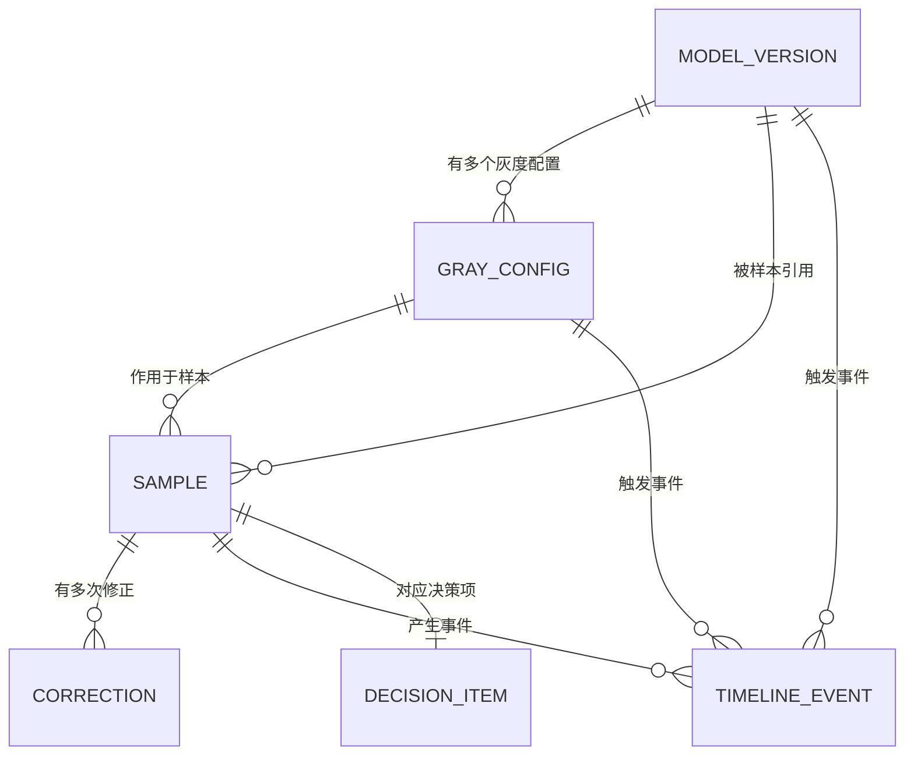

## 1. 架构设计

纯前端应用，使用Mock数据模拟后端，所有状态通过zustand在前端管理。



---

## 2. 技术说明

- **前端框架**：React@18 + TypeScript@5 + Vite@6
- **初始化工具**：vite-init（react-ts 模板）
- **样式方案**：TailwindCSS@3 + CSS 变量主题系统
- **状态管理**：zustand@4（分模块：dashboard / sample / timeline）
- **路由**：react-router-dom@6
- **图标库**：lucide-react
- **后端**：无，纯前端 Mock 数据
- **数据库**：无，使用 TypeScript 对象作为内存数据源

---

## 3. 路由定义

| 路由路径 | 页面组件 | 用途 |
|----------|----------|------|
| `/` | DashboardPage | 看板总览：筛选、样本列表、决策面板 |
| `/sample/:id` | SampleDetailPage | 样本详情：边界-结论关联、灰度拆解、版本对比 |
| `/timeline` | TimelinePage | 历史时间线：事件轴、状态筛选、导出 |

---

## 4. 类型定义（TypeScript）

```typescript
// ---------- 状态枚举（与导出文件字段名完全一致）----------
export const CONCLUSION_STATUS = {
  PENDING: '待审核',
  PASSED: '可放行',
  NEED_MORE: '待补材料',
  MANUAL_OVERRIDDEN: '人工改判',
} as const;

export const EVENT_TYPE = {
  SAMPLE_CREATED: '样本生成',
  ALGO_JUDGED: '算法判定',
  GRAY_RELEASED: '灰度发布',
  MANUAL_CORRECTED: '人工修正',
  POLLUTION_MARKED: '污染标记',
  DECISION_MADE: '放行决策',
} as const;

export const POLLUTION_STATUS = {
  CLEAN: '正常',
  SUSPICIOUS: '疑似污染',
  CONFIRMED: '验证集污染',
} as const;

// ---------- 核心数据模型 ----------
export interface ModelVersion {
  id: string;           // 如 v2.4.1
  releasedAt: string;   // ISO 时间
  threshold: number;    // 判定阈值
  description: string;
}

export interface GrayConfig {
  id: string;
  name: string;         // 灰度策略名称
  ratio: number;        // 灰度比例 0-1
  windowSize: number;   // 平滑窗口大小（小样本被平均数盖住的关键参数）
  versionId: string;
  createdBy: string;
}

export interface Sample {
  id: string;           // SPL-20260615-00321
  featureVector: number[];
  algoScores: { versionId: string; score: number }[];
  isBoundary: boolean;  // 是否边界样本
  coveredByMean: boolean; // 是否被平均数盖住（windowSize过大导致）
  pollutionStatus: keyof typeof POLLUTION_STATUS;
  conclusion: keyof typeof CONCLUSION_STATUS;
  conclusionReason: string;
  grayConfigId: string;
  versionId: string;
  sampledAt: string;
  correctionHistory: Correction[];
}

export interface Correction {
  id: string;
  sampleId: string;
  operator: string;     // 值班人
  timestamp: string;
  oldConclusion: string;
  newConclusion: string;
  reason: string;
}

export interface TimelineEvent {
  id: string;
  type: keyof typeof EVENT_TYPE;
  timestamp: string;
  operator?: string;
  sampleId?: string;
  versionId?: string;
  grayConfigId?: string;
  payload: Record<string, unknown>;
  displayLabel: string; // 与页面展示文字一致，导出时直接使用
}

export interface DecisionItem {
  id: string;
  sampleId: string;
  category: 'NEED_MORE' | 'PASSED';
  remark: string;
  createdAt: string;
  operator: string;
}
```

---

## 5. 数据模型关系



---

## 6. Zustand 状态模块划分

### 6.1 dashboardStore
- filters: 筛选条件集合
- samples: 当前筛选后的样本列表
- decisionItems: 待补/放行决策项
- actions: setFilters / togglePollutionFilter / markDecision / removeDecision

### 6.2 sampleStore
- currentSample: 当前查看的样本详情
- versions: 相关版本对比数据
- grayBreakdown: 灰度拆解三段结果
- actions: fetchSampleById / computeGrayBreakdown / addCorrection

### 6.3 timelineStore
- events: 事件列表
- activeTypeFilters: 选中的事件类型
- actions: filterByTypes / filterByDateRange / exportCSV / exportJSON

---

## 7. 导出功能规格

### 7.1 CSV 导出格式
```
# 筛选条件: 版本=v2.4.1, 污染状态=验证集污染, 时间=2026-06-01~2026-06-21
# 状态枚举说明:
#   CONCLUSION_STATUS: PENDING=待审核 | PASSED=可放行 | NEED_MORE=待补材料 | MANUAL_OVERRIDDEN=人工改判
#   POLLUTION_STATUS: CLEAN=正常 | SUSPICIOUS=疑似污染 | CONFIRMED=验证集污染
#   EVENT_TYPE: SAMPLE_CREATED=样本生成 | ALGO_JUDGED=算法判定 | ...
sample_id,version_id,gray_config,algo_score,is_boundary,covered_by_mean,pollution_status,conclusion,sampled_at,operator
SPL-20260615-00321,v2.4.1,smooth-7d-15pct,0.782,true,true,CONFIRMED,NEED_MORE,2026-06-15T09:30:00Z,小林
```

### 7.2 JSON 导出格式
```json
{
  "exportedAt": "2026-06-21T14:00:00Z",
  "filters": { "versionId": "v2.4.1", "pollution": ["CONFIRMED"], "dateRange": ["2026-06-01","2026-06-21"] },
  "enumDescriptions": { "CONCLUSION_STATUS": {...}, "POLLUTION_STATUS": {...}, "EVENT_TYPE": {...} },
  "records": [
    { "sampleId": "SPL-20260615-00321", "...": "..." }
  ]
}
```

**关键约束**：所有枚举的字符串值（如 `NEED_MORE`、`CONFIRMED`）与页面上展示的中文标签（`待补材料`、`验证集污染`）通过 `enumDescriptions` 一一对应，确保离线查看一致。

---
