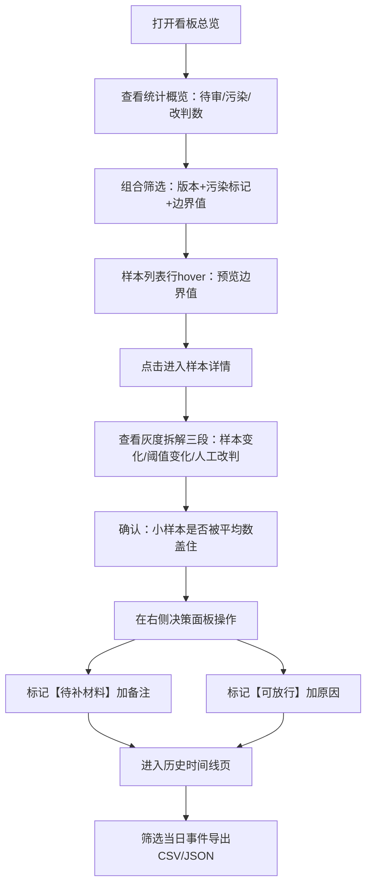

## 1. 产品概述

面向MLOps值班人员的"漂移监控成本看板"，解决算法漂移监控中人工记录成本高、信息零散的问题。将样本、模型版本、灰度配置、人工修正判断与历史时间线串联，帮助值班人员快速定位问题、做出"补材料/放行"决策。

- 核心目标：把"靠人记"变成"看板追"，让灰度配置、样本边界、验证集污染、人工改判之间的关系一目了然
- 目标用户：MLOps值班人员（小林角色）

---

## 2. 核心功能

### 2.1 用户角色

| 角色 | 使用场景 | 核心权限 |
|------|----------|----------|
| MLOps值班员 | 每日巡检、问题追溯、决策放行 | 查看全部数据、标记验证集污染、人工修正结论、导出报告、标记待补/放行 |

### 2.2 功能模块

1. **看板总览页**：筛选器、样本列表（带验证集污染标记）、值班决策面板、灰度配置概览
2. **样本详情页**：边界样本与结论关联、灰度结果拆解（样本变化/阈值变化/人工改判）、版本对比、修正历史
3. **历史时间线页**：全量事件时间轴、状态筛选、CSV/JSON导出（页面状态与文件一致）

### 2.3 页面详情

| 页面名称 | 模块名称 | 功能描述 |
|----------|----------|----------|
| 看板总览 | 顶部筛选区 | 按版本、灰度策略、污染状态、结论状态、时间范围筛选，所有筛选条件同步到导出文件 |
| 看板总览 | 统计概览卡 | 待审样本数、污染标记数、人工改判数、本月放行率，一目了然值班压力 |
| 看板总览 | 样本列表 | 样本ID、所属版本、灰度配置、算法评分、平均值覆盖标记、最终结论、验证集污染标记、操作按钮，hover显示边界样本值 |
| 看板总览 | 值班决策面板 | 右侧固定面板，列出"待补材料"和"可放行"两类，可一键标记、加备注 |
| 样本详情 | 基本信息区 | 样本元数据、所属版本、灰度策略名称与参数、采样时间 |
| 样本详情 | 边界样本-结论关联 | 左侧该样本的算法判断轨迹（各版本评分变化），右侧最终结论，中间连线展示影响节点 |
| 样本详情 | 灰度结果拆解 | 三段式卡片：样本变化贡献度、阈值变化贡献度、人工改判说明，各段可展开看细节 |
| 样本详情 | 版本对比 | 相邻版本评分差、分布偏移幅度可视化，突出"被平均数盖住"的小样本情况 |
| 样本详情 | 修正历史 | 该样本的所有人工修改记录（谁、何时、改了什么、原因） |
| 历史时间线 | 时间轴视图 | 按时间倒序展示所有事件：样本生成、算法判定、灰度发布、人工修正、污染标记、放行决策 |
| 历史时间线 | 状态图例 | 不同颜色对应不同事件类型，可点击过滤，页面上看到的状态标签与导出文件中的字段完全一致 |
| 历史时间线 | 导出功能 | CSV与JSON两种格式，包含当前筛选条件、状态枚举说明表，确保离线查看与页面展示一致 |

---

## 3. 核心流程

### 3.1 值班巡检流程

小林打开看板 → 查看"待审样本"统计 → 用筛选器定位高风险（污染+边界）样本 → 点击查看详情 → 检查灰度拆解确认问题来源 → 在决策面板标记"待补材料"或"放行" → 导出当日时间线留档

---

## 4. 用户界面设计

### 4.1 设计风格

- **主色调**：深邃墨蓝（#0F172A）为背景，搭配琥珀橙（#F59E0B）强调"待补材料"，松叶绿（#10B981）标记"可放行"，警示红（#EF4444）标记"验证集污染"
- **次色调**：石板灰（#64748B）用于次级信息，淡青蓝（#38BDF8）用于算法曲线与连线
- **按钮风格**：方中带圆（圆角 6px），2px 边框，hover 时轻微上浮 + 阴影加深
- **字体**：标题使用"思源黑体 Heavy"（或 Noto Sans SC Black），正文使用"JetBrains Mono"等宽字体显示样本ID、评分等数值
- **布局**：三栏式主布局——左筛选（240px固定）、中列表（自适应）、右决策面板（300px固定）
- **图标风格**：lucide-react 线性图标，配色与语义一致

### 4.2 页面设计概览

| 页面名称 | 模块名称 | UI元素 |
|----------|----------|--------|
| 看板总览 | 筛选区 | 下拉选择器、日期范围、开关组（污染标记/边界样本/已改判），标签可移除 |
| 看板总览 | 统计卡 | 大号数字 + 环比小箭头 + 图标，背景用微光渐变 |
| 看板总览 | 样本列表 | 斑马纹表格，污染行左侧红色竖条，边界行右侧橙色圆点，结论列用彩色圆角标签 |
| 看板总览 | 决策面板 | 上下分区：上橙"待补材料"（可拖拽排序）、下绿"可放行"，每条带时间戳 |
| 样本详情 | 边界-结论关联 | SVG连线图，左侧时间节点纵向排列，右侧结论卡片居中，连线粗细表示影响程度 |
| 样本详情 | 灰度拆解 | 三段水平卡片，每段顶部有色条（蓝/紫/橙），展开后显示数据表格与小柱状图 |
| 历史时间线 | 时间轴 | 左侧彩色竖线 + 圆点，右侧事件卡片，卡片内标签与页面状态完全同名 |
| 历史时间线 | 导出按钮 | 右上角固定，点击弹出格式选择（CSV/JSON），预览导出前5行 |

### 4.3 响应式

- Desktop 优先设计，最小支持 1280px 宽度
- Tablet（768-1279px）：决策面板变为底部抽屉
- Mobile（<768px）：筛选器收起为顶部悬浮按钮，列表简化为卡片式

---
