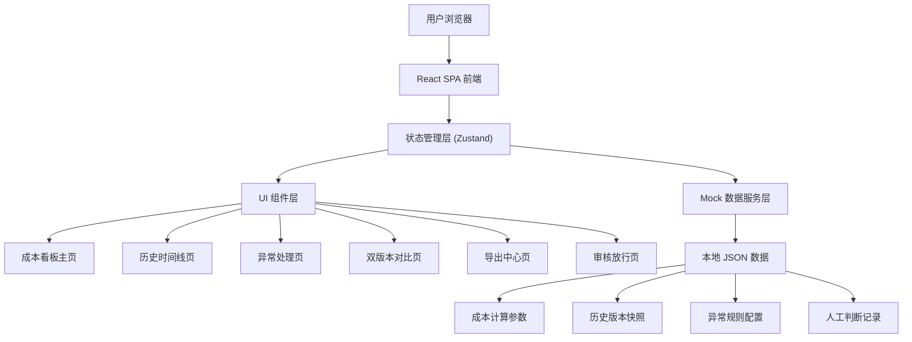
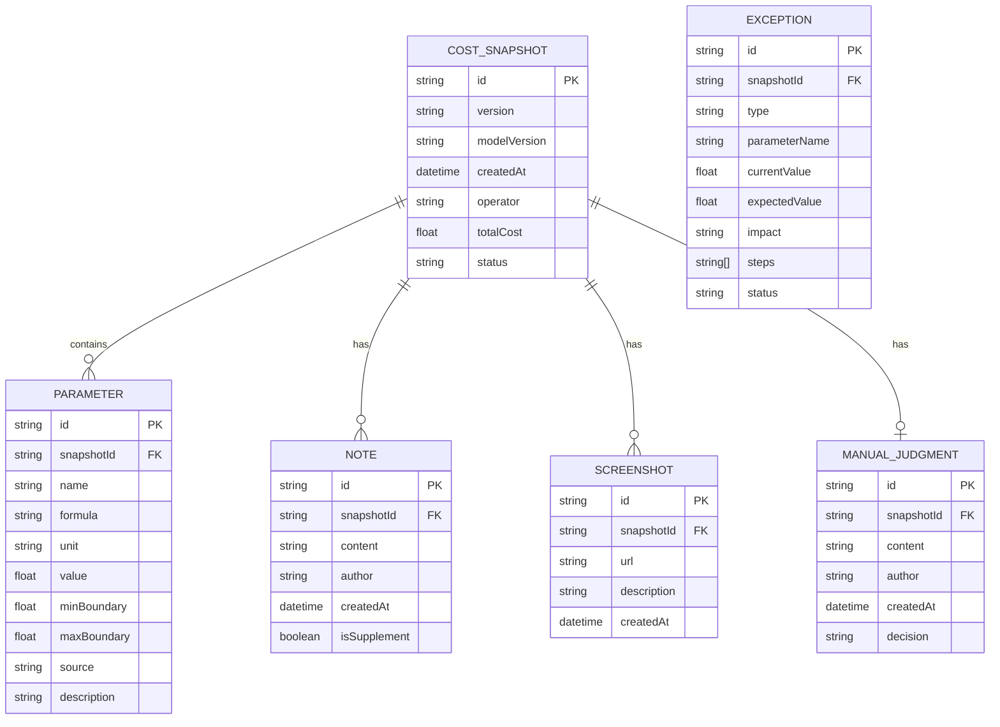

## 1. 架构设计



## 2. 技术描述

- **前端框架**: React@18 + TypeScript + Vite
- **状态管理**: Zustand (轻量级状态管理，适合看板类应用)
- **样式方案**: TailwindCSS@3 + CSS Variables
- **图标库**: Lucide React (线性图标，符合设计风格)
- **路由**: React Router v6
- **图表**: Recharts (用于成本趋势、边界值监控图表)
- **动画**: Framer Motion (用于页面过渡、数字滚动等动效)
- **后端**: 无后端，使用本地 Mock 数据模拟
- **数据存储**: LocalStorage 持久化用户操作记录

## 3. 路由定义

| 路由 | 页面 | 用途 |
|------|------|------|
| `/` | 成本看板主页 | 展示成本公式、边界值监控、成本概览 |
| `/timeline` | 历史时间线页 | 版本追溯、备注查看、截图归档 |
| `/exceptions` | 异常处理页 | 异常检测、操作指引、状态跟踪 |
| `/compare` | 双版本对比页 | 两次快照对比、差异高亮、人工判断 |
| `/export` | 导出中心页 | 时间线导出、内容预览、格式选择 |
| `/review` | 审核放行页 | 材料清单、放行指引、操作清单 |

## 4. 数据模型

### 4.1 数据模型定义



### 4.2 TypeScript 类型定义

```typescript
// 成本快照
interface CostSnapshot {
  id: string;
  version: string;
  modelVersion: string;
  createdAt: string;
  operator: string;
  totalCost: number;
  status: 'normal' | 'warning' | 'error';
  parameters: Parameter[];
  notes: Note[];
  screenshots: Screenshot[];
  manualJudgment?: ManualJudgment;
}

// 参数
interface Parameter {
  id: string;
  name: string;
  formula: string;
  unit: string;
  value: number;
  minBoundary: number;
  maxBoundary: number;
  source: string;
  description: string;
}

// 备注
interface Note {
  id: string;
  content: string;
  author: string;
  createdAt: string;
  isSupplement: boolean;
}

// 截图
interface Screenshot {
  id: string;
  url: string;
  description: string;
  createdAt: string;
}

// 人工判断
interface ManualJudgment {
  id: string;
  content: string;
  author: string;
  createdAt: string;
  decision: 'approve' | 'reject' | 'pending';
}

// 异常
interface Exception {
  id: string;
  type: 'grayscale_ratio' | 'parameter_out_of_bound' | 'formula_mismatch';
  parameterName: string;
  currentValue: number;
  expectedValue: number;
  impact: string;
  steps: string[];
  status: 'open' | 'in_progress' | 'resolved';
}

// 审核项
interface ReviewItem {
  id: string;
  snapshotId: string;
  material: string;
  isComplete: boolean;
  action: 'supplement' | 'release';
  remark: string;
}
```

## 5. 核心模块设计

### 5.1 成本计算引擎

```typescript
// 公式解析与计算
interface CostCalculator {
  parseFormula(formula: string, params: Record<string, number>): number;
  validateBoundary(param: Parameter): { valid: boolean; message: string };
  calculateTotalCost(snapshot: CostSnapshot): number;
}
```

### 5.2 异常检测引擎

```typescript
interface ExceptionDetector {
  detectGrayscaleRatio(snapshot: CostSnapshot): Exception | null;
  detectBoundaryViolations(snapshot: CostSnapshot): Exception[];
  detectFormulaConsistency(current: CostSnapshot, baseline: CostSnapshot): Exception[];
}
```

### 5.3 版本对比引擎

```typescript
interface VersionComparator {
  compare(a: CostSnapshot, b: CostSnapshot): ComparisonResult;
  highlightDifferences(paramsA: Parameter[], paramsB: Parameter[]): ParameterDiff[];
}

interface ComparisonResult {
  totalCostDiff: number;
  totalCostDiffPercent: number;
  parameterDiffs: ParameterDiff[];
  noteDiffs: NoteDiff[];
  hasManualJudgmentChange: boolean;
}
```

### 5.4 导出引擎

```typescript
interface Exporter {
  exportTimeline(snapshots: CostSnapshot[], format: 'csv' | 'excel' | 'pdf'): Blob;
  ensureConsistency(exportData: ExportData, pageState: PageState): boolean;
  generateExportMetadata(snapshots: CostSnapshot[]): ExportMetadata;
}
```

## 6. 目录结构

```
src/
├── components/          # 通用组件
│   ├── layout/         # 布局组件
│   ├── cards/          # 卡片组件
│   ├── charts/         # 图表组件
│   └── ui/             # 基础UI组件
├── pages/              # 页面组件
│   ├── Dashboard/
│   ├── Timeline/
│   ├── Exceptions/
│   ├── Compare/
│   ├── Export/
│   └── Review/
├── store/              # Zustand 状态管理
│   ├── snapshotStore.ts
│   ├── exceptionStore.ts
│   └── reviewStore.ts
├── services/           # 业务服务
│   ├── costCalculator.ts
│   ├── exceptionDetector.ts
│   ├── versionComparator.ts
│   └── exporter.ts
├── data/               # Mock 数据
│   ├── snapshots.ts
│   ├── exceptions.ts
│   └── reviewItems.ts
├── types/              # TypeScript 类型定义
│   └── index.ts
├── utils/              # 工具函数
│   ├── formatters.ts
│   └── animations.ts
├── App.tsx
├── main.tsx
└── index.css
```

## 7. 前端设计规范

### 7.1 CSS 变量定义

```css
:root {
  --color-bg-primary: #0F172A;
  --color-bg-secondary: #1E293B;
  --color-bg-card: rgba(30, 41, 59, 0.7);
  --color-border: rgba(148, 163, 184, 0.15);
  --color-text-primary: #F1F5F9;
  --color-text-secondary: #94A3B8;
  --color-text-muted: #64748B;
  --color-accent: #3B82F6;
  --color-warning: #F59E0B;
  --color-danger: #EF4444;
  --color-success: #10B981;
  
  --font-display: 'Space Mono', monospace;
  --font-body: 'Inter', system-ui, sans-serif;
  
  --shadow-card: 0 4px 6px -1px rgba(0, 0, 0, 0.3), 0 2px 4px -2px rgba(0, 0, 0, 0.2);
  --shadow-glow: 0 0 20px rgba(59, 130, 246, 0.3);
}
```

### 7.2 动效规范

- 数字滚动动画：使用 `framer-motion` 的 `animate` 功能，duration 600ms
- 页面过渡：`AnimatePresence` 包裹路由，initial: { opacity: 0, y: 20 }, animate: { opacity: 1, y: 0 }
- 异常呼吸动画：CSS keyframes，opacity 0.5-1 循环，duration 2s
- 时间轴滑入：Intersection Observer 触发，translateX 从 -20 到 0
