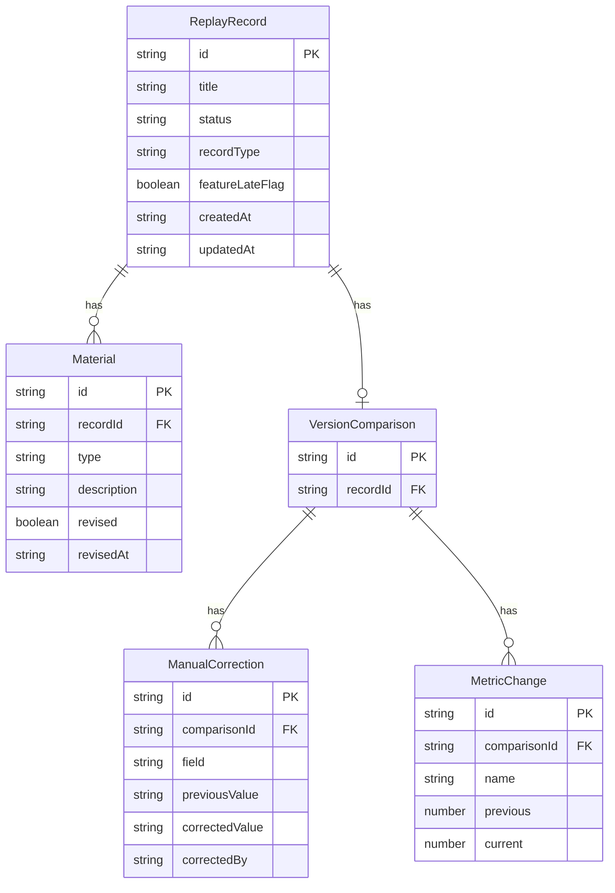

## 1. 架构设计

```mermaid
flowchart TD
    "前端 React 应用" --> "Mock 数据层"
    "Mock 数据层" --> "回放记录数据"
    "Mock 数据层" --> "版本对比数据"
    "Mock 数据层" --> "报告生成逻辑"
    "报告生成逻辑" --> "Markdown 导出"
```

纯前端应用，所有数据通过 Mock 数据层提供，报告生成逻辑在前端完成，确保接口查询状态与 Markdown 报告一致。

## 2. 技术说明

- 前端：React@18 + tailwindcss@3 + vite
- 初始化工具：vite-init
- 后端：无
- 数据库：无，使用 Mock 数据

## 3. 路由定义

| 路由 | 用途 |
|------|------|
| / | 回放工作台：记录列表、状态筛选、材料溯源标记 |
| /compare/:id | 版本对比：样本/阈值/人工修正/指标变化分层展示 |
| /report | 报告预览与导出：已处理/待补材料/人工改判分类 |

## 4. API 定义

无后端 API，所有数据通过前端 Mock 层提供。数据结构定义如下：

### 4.1 回放记录类型

```typescript
interface ReplayRecord {
  id: string
  title: string
  status: "processed" | "pending_material" | "manual_override"
  recordType: "normal" | "supplementary" | "anomaly"
  featureLateFlag: boolean
  materials: Material[]
  createdAt: string
  updatedAt: string
}

interface Material {
  type: "training_log" | "supplementary_note" | "verbal_note"
  description: string
  revised: boolean
  revisedAt?: string
  revisedContent?: string
}
```

### 4.2 版本对比类型

```typescript
interface VersionComparison {
  recordId: string
  sampleChange: { previous: number; current: number; delta: number }
  thresholdChange: { previous: number; current: number; reason: string }
  manualCorrections: ManualCorrection[]
  metricChanges: MetricChange[]
}

interface ManualCorrection {
  field: string
  previousValue: string | number
  correctedValue: string | number
  correctedBy: string
  correctedAt: string
  reason: string
}

interface MetricChange {
  name: string
  previous: number
  current: number
  unit: string
}
```

### 4.3 报告类型

```typescript
interface Report {
  generatedAt: string
  processedItems: ReplayRecord[]
  pendingMaterialItems: ReplayRecord[]
  manualOverrideItems: ReplayRecord[]
}
```

## 5. 服务器架构图

不适用（纯前端应用）

## 6. 数据模型

### 6.1 数据模型定义



### 6.2 Mock 数据

预置 4 条回放记录数据，覆盖三种记录类型（顺利记录、补录记录、异常记录），含特征迟到标记、材料口径变更、人工修正等场景。
