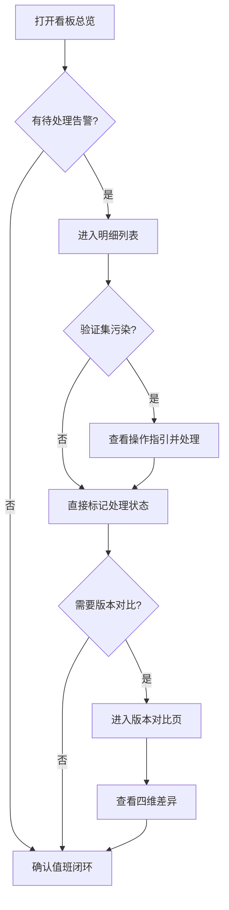

## 1. 产品概述

影子流量成本看板是为算法值班团队打造的训练数据质量追踪工具。它解决的核心问题是：训练日志碎片化、参数变更未及时入报、验证集污染难以追溯。目标用户为算法值班人员，他们需要从接口查询看板明细、导出页面摘要、比对版本差异，并明确知道哪些问题已处理、哪些还需要补充证据。

## 2. 核心功能

### 2.1 用户角色

| 角色 | 核心权限 |
|------|----------|
| 算法值班人 | 查看看板明细、导出摘要、比对版本、标记处理状态 |
| 算法负责人 | 审核处理状态、确认证据闭环 |

### 2.2 功能模块

1. **看板总览页**：状态统计卡片、指标趋势、待处理告警
2. **明细列表页**：按来源/状态/类型筛选的完整流水、原始数据保留、污染标记与操作指引
3. **版本对比页**：前一版 vs 当前版的样本/阈值/人工修正/指标四维差异

### 2.3 页面详情

| 页面名称 | 模块名称 | 功能描述 |
|----------|----------|----------|
| 看板总览页 | 状态统计卡片 | 显示已处理/待补充证据/异常/总计四个计数 |
| 看板总览页 | 指标趋势图 | 影子流量成本随时间变化的折线图 |
| 看板总览页 | 待处理告警列表 | 最新未处理条目，含污染类型和处理指引 |
| 明细列表页 | 筛选栏 | 按来源、状态、类型（样本/阈值/人工修正/指标变化）筛选 |
| 明细列表页 | 数据流水表 | 展示每条记录的原始来源、原始值、当前值、变更类型、状态标记 |
| 明细列表页 | 污染提示卡片 | 验证集污染条目展开可操作的下一步指引 |
| 明细列表页 | 导出摘要按钮 | 导出与接口查询一致的页面摘要 |
| 版本对比页 | 版本选择器 | 选择前一版与当前版进行比对 |
| 版本对比页 | 四维差异面板 | 样本、阈值、人工修正、指标变化四个维度的差异高亮展示 |
| 版本对比页 | 差异统计摘要 | 变更总数、新增/删除/修改的分类计数 |

## 3. 核心流程

算法值班人打开看板总览页，快速了解整体状态。发现待处理告警后进入明细列表页，按筛选条件定位具体条目。若条目涉及验证集污染，查看可操作的下一步指引并处理。处理完成后标记状态。如需对比历史变更，进入版本对比页选择两个版本查看四维差异。最终确认所有条目的处理状态，完成值班闭环。

## 4. 用户界面设计

### 4.1 设计风格

- 主色：深墨绿（#0D1B2A），辅色：琥珀警告色（#F59E0B）、翠绿完成色（#10B981）
- 按钮：圆角微立体，状态按钮带色彩编码
- 字体：标题使用 Source Serif 4，正文使用 DM Sans
- 布局：左侧固定导航 + 右侧内容区，卡片式模块
- 图标：lucide-react 线性图标

### 4.2 页面设计概览

| 页面名称 | 模块名称 | UI元素 |
|----------|----------|--------|
| 看板总览页 | 状态统计卡片 | 四宫格卡片，带图标和色彩编码，数字用大字号 |
| 看板总览页 | 指标趋势图 | 折线图，支持悬浮查看数值 |
| 看板总览页 | 待处理告警列表 | 卡片列表，污染条目带警告色左边框 |
| 明细列表页 | 筛选栏 | 下拉筛选 + 搜索框，水平排列 |
| 明细列表页 | 数据流水表 | 条纹表格，污染行背景色区分，原始值保留删除线样式 |
| 明细列表页 | 污染提示卡片 | 展开式卡片，含编号的下一步操作列表 |
| 明细列表页 | 导出摘要按钮 | 右上角固定按钮，点击下载JSON |
| 版本对比页 | 版本选择器 | 两个下拉框 + 箭头指示方向 |
| 版本对比页 | 四维差异面板 | 双列对比，差异项高亮背景色 |
| 版本对比页 | 差异统计摘要 | 顶部标签组，显示变更计数 |

### 4.3 响应式设计

桌面优先设计，最小宽度1280px完整展示。1024-1280px时侧边导航折叠为图标模式。1024px以下暂不适配。

### 4.4 演示数据要求

保留一组不太干净的演示数据，具体包含：
- 1条人工改判记录（原始值为脏数据，保留删除线标记）
- 1条验证集污染记录（带污染标记和操作指引）
- 若干正常记录（含样本、阈值、指标变化等不同类型）
- 数据来源字段保留原始日志片段引用，不做过份清洗
