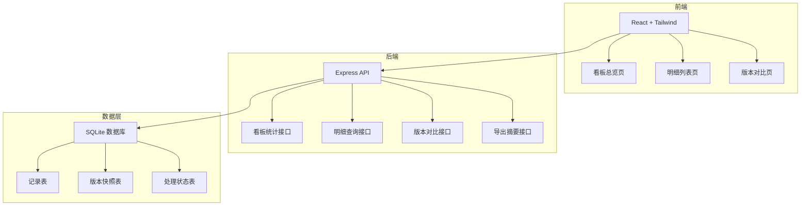
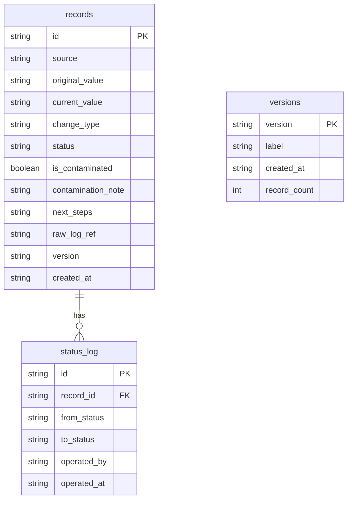

## 1. 架构设计



## 2. 技术说明

- 前端：React@18 + tailwindcss@3 + vite + zustand + react-router-dom
- 初始化工具：vite-init
- 后端：Express@4 + TypeScript (ESM)
- 数据库：SQLite（better-sqlite3），内置演示数据
- 图表：recharts

## 3. 路由定义

| 路由 | 用途 |
|------|------|
| / | 看板总览页，状态统计与待处理告警 |
| /detail | 明细列表页，完整流水与筛选 |
| /compare | 版本对比页，四维差异展示 |

## 4. API 定义

### 4.1 看板统计

```
GET /api/dashboard/summary
Response: {
  total: number
  processed: number
  pendingEvidence: number
  anomalous: number
  trend: Array<{ date: string; cost: number }>
  alerts: Array<AlertItem>
}
```

### 4.2 明细查询

```
GET /api/records?type=sample|threshold|manual|metric&status=processed|pending|anomalous&source=string
Response: {
  records: Array<{
    id: string
    source: string
    originalValue: string | null
    currentValue: string
    changeType: "sample" | "threshold" | "manual" | "metric"
    status: "processed" | "pending" | "anomalous"
    isContaminated: boolean
    contaminationNote: string | null
    nextSteps: string[] | null
    rawLogRef: string | null
    createdAt: string
  }>
  total: number
}
```

### 4.3 导出摘要

```
GET /api/records/export
Response: 同明细查询，Content-Disposition: attachment
```

### 4.4 更新处理状态

```
PATCH /api/records/:id/status
Body: { status: "processed" | "pending" | "anomalous" }
Response: { success: boolean }
```

### 4.5 版本对比

```
GET /api/versions/compare?from=v1&to=v2
Response: {
  from: { version: string; timestamp: string; recordCount: number }
  to: { version: string; timestamp: string; recordCount: number }
  diff: {
    sample: DiffItem[]
    threshold: DiffItem[]
    manual: DiffItem[]
    metric: DiffItem[]
  }
  summary: { added: number; removed: number; modified: number; total: number }
}

DiffItem: {
  id: string
  field: string
  fromValue: string | null
  toValue: string | null
  changeType: "added" | "removed" | "modified"
}
```

## 5. 数据模型

### 5.1 数据模型定义



### 5.2 数据定义语言

```sql
CREATE TABLE versions (
  version TEXT PRIMARY KEY,
  label TEXT NOT NULL,
  created_at TEXT NOT NULL,
  record_count INTEGER NOT NULL
);

CREATE TABLE records (
  id TEXT PRIMARY KEY,
  source TEXT NOT NULL,
  original_value TEXT,
  current_value TEXT NOT NULL,
  change_type TEXT NOT NULL CHECK(change_type IN ('sample','threshold','manual','metric')),
  status TEXT NOT NULL DEFAULT 'pending' CHECK(status IN ('processed','pending','anomalous')),
  is_contaminated INTEGER NOT NULL DEFAULT 0,
  contamination_note TEXT,
  next_steps TEXT,
  raw_log_ref TEXT,
  version TEXT NOT NULL,
  created_at TEXT NOT NULL,
  FOREIGN KEY (version) REFERENCES versions(version)
);

CREATE TABLE status_log (
  id TEXT PRIMARY KEY,
  record_id TEXT NOT NULL,
  from_status TEXT NOT NULL,
  to_status TEXT NOT NULL,
  operated_by TEXT NOT NULL DEFAULT 'system',
  operated_at TEXT NOT NULL,
  FOREIGN KEY (record_id) REFERENCES records(id)
);

INSERT INTO versions (version, label, created_at, record_count) VALUES
  ('v1', '2026-06-14 基线版本', '2026-06-14T10:00:00Z', 8),
  ('v2', '2026-06-21 当前版本', '2026-06-21T10:00:00Z', 10);

INSERT INTO records (id, source, original_value, current_value, change_type, status, is_contaminated, contamination_note, next_steps, raw_log_ref, version, created_at) VALUES
  ('r001', '训练日志 #2847', '0.032', '0.032', 'sample', 'processed', 0, NULL, NULL, 'train_log_2847.json:L142', 'v1', '2026-06-14T10:00:00Z'),
  ('r002', '训练日志 #2847', '0.05', '0.05', 'threshold', 'processed', 0, NULL, NULL, 'train_log_2847.json:L198', 'v1', '2026-06-14T10:05:00Z'),
  ('r003', '人工修正 #019', '0.041', '0.038', 'manual', 'processed', 0, NULL, NULL, 'manual_correction_019.json', 'v1', '2026-06-14T10:10:00Z'),
  ('r004', '指标采集 #2847', '0.037', '0.037', 'metric', 'processed', 0, NULL, NULL, 'metric_2847.json:L12', 'v1', '2026-06-14T10:15:00Z'),
  ('r005', '训练日志 #2901', '0.029', '0.029', 'sample', 'processed', 0, NULL, NULL, 'train_log_2901.json:L88', 'v1', '2026-06-14T10:20:00Z'),
  ('r006', '训练日志 #2901', '0.055', '0.055', 'threshold', 'processed', 0, NULL, NULL, 'train_log_2901.json:L201', 'v1', '2026-06-14T10:25:00Z'),
  ('r007', '指标采集 #2901', '0.034', '0.034', 'metric', 'processed', 0, NULL, NULL, 'metric_2901.json:L15', 'v1', '2026-06-14T10:30:00Z'),
  ('r008', '训练日志 #2901', '0.031', '0.031', 'sample', 'processed', 0, NULL, NULL, 'train_log_2901.json:L145', 'v1', '2026-06-14T10:35:00Z'),
  ('r009', '训练日志 #2956', '0.044', '0.044', 'sample', 'pending', 0, NULL, NULL, 'train_log_2956.json:L77', 'v2', '2026-06-21T10:00:00Z'),
  ('r010', '训练日志 #2956', '0.048', '0.048', 'threshold', 'pending', 0, NULL, NULL, 'train_log_2956.json:L203', 'v2', '2026-06-21T10:05:00Z'),
  ('r011', '人工改判 #033', '0.067', '0.042', 'manual', 'anomalous', 0, '原始值0.067疑似日志截断导致偏高，人工改判为0.042', '["1. 核实训练日志 #2956 完整性","2. 确认截断位置与改判依据","3. 补充改判截图到证据库"]', 'manual_correction_033.json', 'v2', '2026-06-21T10:10:00Z'),
  ('r012', '指标采集 #2956', '0.039', '0.039', 'metric', 'pending', 0, NULL, NULL, 'metric_2956.json:L9', 'v2', '2026-06-21T10:15:00Z'),
  ('r013', '训练日志 #2956', '0.051', '0.051', 'sample', 'anomalous', 1, '验证集污染：训练日志 #2956 的采样数据包含验证集样本ID [V-0042, V-0087, V-0156]', '["1. 从训练集移除样本ID: V-0042, V-0087, V-0156","2. 重新运行训练日志 #2956 对应的训练任务","3. 更新数据清洗管道，添加验证集ID校验规则","4. 在此条目标记处理完成后上传清洗日志"]', 'train_log_2956.json:L312', 'v2', '2026-06-21T10:20:00Z'),
  ('r014', '训练日志 #2956', '0.053', '0.053', 'threshold', 'processed', 0, NULL, NULL, 'train_log_2956.json:L220', 'v2', '2026-06-21T10:25:00Z'),
  ('r015', '指标采集 #2956', '0.041', '0.041', 'metric', 'processed', 0, NULL, NULL, 'metric_2956.json:L22', 'v2', '2026-06-21T10:30:00Z'),
  ('r016', '训练日志 #2956', '0.036', '0.036', 'sample', 'processed', 0, NULL, NULL, 'train_log_2956.json:L156', 'v2', '2026-06-21T10:35:00Z'),
  ('r017', '人工修正 #035', '0.046', '0.046', 'manual', 'processed', 0, NULL, NULL, 'manual_correction_035.json', 'v2', '2026-06-21T10:40:00Z'),
  ('r018', '指标采集 #2956', '0.038', '0.038', 'metric', 'pending', 0, NULL, NULL, 'metric_2956.json:L30', 'v2', '2026-06-21T10:45:00Z');
```
