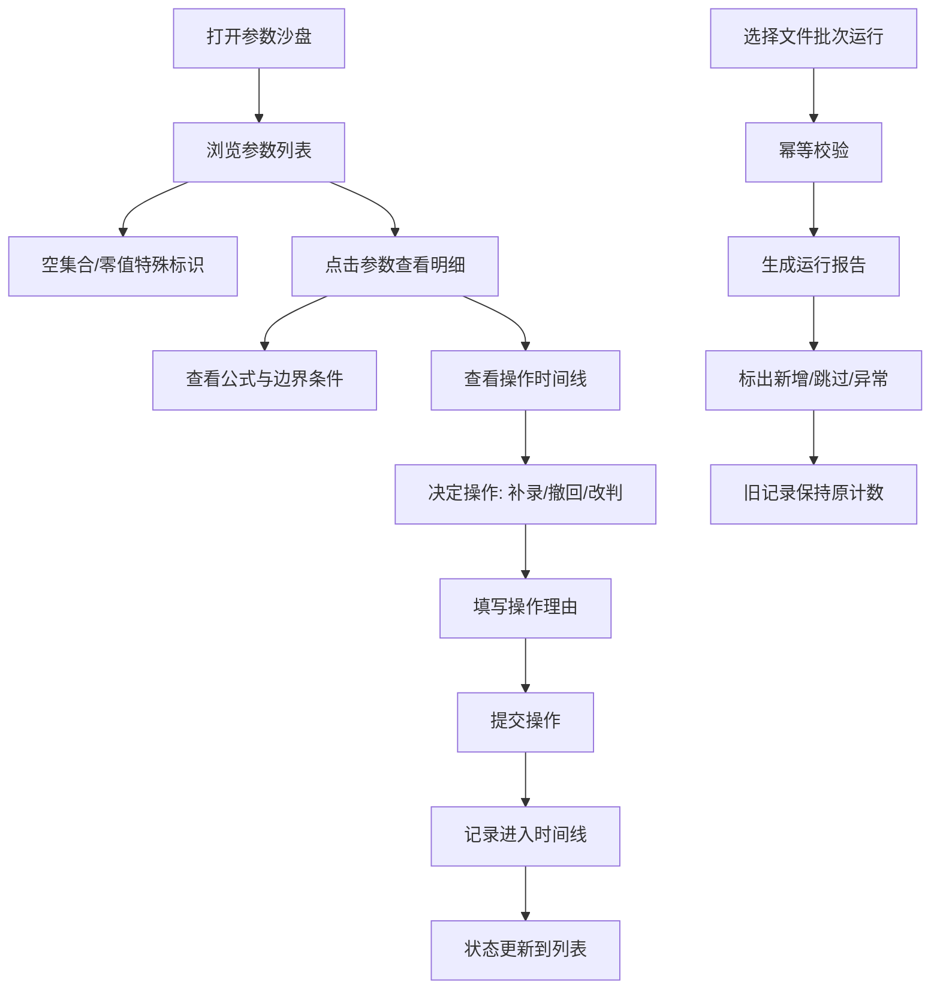

## 1. 产品概述

拓扑路径参数沙盘是一款面向数学复核场景的参数审查工具，帮助复核人（如数学老师老叶）系统化地处理参数表中的空集合、零值、重复样本等特殊情况，追踪操作历史，保证重跑稳定性，降低对个人记忆的依赖。

- 核心目标：把参数复核从"靠记忆补洞"变成"看证据办事"
- 目标用户：数学老师、数据复核员、参数配置审查人员
- 价值：让补录、撤回、改判都可追溯，换人接手也能快速接上

## 2. 核心功能

### 2.1 用户角色

| 角色 | 说明 | 核心权限 |
|------|------|----------|
| 复核人 | 主要使用者，如数学老师老叶 | 查看参数、标记状态、补录/撤回/改判、导出报告 |

### 2.2 功能模块

1. **参数沙盘主页**：总览参数列表、统计概览、快速操作入口
2. **参数明细面板**：单个参数的完整信息、公式术语、单位边界条件
3. **时间线视图**：所有操作历史（补录、撤回、改判）按时间排列可追溯
4. **运行报告**：批次运行结果，标出新增和被跳过的内容，保证幂等
5. **重复样本提示**：温和的颜色提醒，重点展示下一步处理建议

### 2.3 页面详情

| 页面名称 | 模块名称 | 功能描述 |
|---------|---------|----------|
| 沙盘主页 | 统计概览 | 总参数、空集合数、零值数、待复核数、重复样本数 |
| 沙盘主页 | 参数列表 | 支持按状态/类型筛选，支持搜索，空集合和零值特殊标识 |
| 沙盘主页 | 批次运行区 | 选择文件运行，显示运行结果摘要（新增/跳过/总数） |
| 参数明细 | 基本信息 | 参数名、单位、当前值、状态、边界条件 |
| 参数明细 | 公式与术语 | 保留原始公式和专业术语，附带通俗解释 |
| 参数明细 | 操作时间线 | 该参数的所有历史操作，可查看每次变更详情 |
| 参数明细 | 操作区 | 补录、撤回、改判按钮，需填写理由 |
| 时间线页 | 全局时间线 | 所有参数的操作历史，支持按操作类型筛选 |
| 运行报告 | 批次列表 | 历史运行批次，可对比两次运行结果 |
| 运行报告 | 批次详情 | 当次运行的新增、跳过、异常明细 |

## 3. 核心流程

### 3.1 参数复核流程

复核人打开沙盘 → 浏览参数列表（空集合/零值突出但不吓人） → 点击参数查看明细 → 查看公式、单位、边界条件 → 查看历史操作时间线 → 决定下一步（补录/改判/标记通过）→ 填写理由提交 → 操作记录进入时间线

### 3.2 批次运行流程

选择一批参数文件 → 系统幂等校验（与上一次运行对比）→ 生成运行报告（新增 N 条 / 跳过 M 条 / 异常 K 条）→ 旧记录保持原计数 → 复核人可查看新增明细 → 决定是否纳入沙盘

### 3.3 流程图

## 4. 用户界面设计

### 4.1 设计风格

- **整体调性**：学术/专业感，偏编辑室/工作台风格，严谨但不压抑
- **主色调**：墨蓝色（#1e3a5f）为主，搭配暖米色背景，营造灯下阅卷的感觉
- **辅助色**：
  - 空集合：淡灰蓝标识（不是红色警告，是特殊状态）
  - 零值：淡橙黄标识（温和提醒，不是错误）
  - 重复样本：淡紫边框 + 轻微背景，重点显示"下一步"按钮
  - 正常通过：柔和的绿
- **字体**：
  - 标题：使用有书卷气的衬线字体（如 Noto Serif SC）
  - 正文：清晰易读的无衬线字体（如 Noto Sans SC）
  - 公式/代码：等宽字体（如 JetBrains Mono）
- **按钮风格**：圆角中等（6px），有轻微阴影，hover 有细腻过渡
- **布局风格**：卡片式布局，参数卡片像一张张索引卡，时间线像笔记本的边栏

### 4.2 页面设计概览

| 页面名称 | 模块名称 | UI 元素 |
|---------|---------|---------|
| 沙盘主页 | 统计概览 | 五个数据卡片横向排列，每个有图标+数字+标签，数字用衬线大字 |
| 沙盘主页 | 参数列表 | 表格形式，空集合行背景淡灰蓝，零值行背景淡橙黄，每行右侧有状态标签 |
| 沙盘主页 | 批次运行 | 顶部操作栏，文件选择区 + 运行按钮 + 最近运行摘要 |
| 参数明细 | 左侧信息区 | 参数名（大标题）、单位、当前值、状态标签、边界条件块 |
| 参数明细 | 中间公式区 | 灰色卡片，公式用等宽字体，下面有通俗解释小字 |
| 参数明细 | 右侧时间线 | 竖向时间线，每个节点有操作类型、时间、操作人、理由摘要 |
| 参数明细 | 底部操作栏 | 三个主按钮（补录/改判/撤回）+ 通过按钮 |
| 时间线页 | 筛选栏 | 操作类型筛选 + 参数搜索 + 时间范围 |
| 时间线页 | 时间线列表 | 全宽时间线，每条可展开查看详情 |
| 运行报告 | 批次卡片列表 | 每个批次显示时间、总数、新增、跳过，可展开看明细 |

### 4.3 响应式

- 桌面端（1280px+）：三栏布局（参数列表 + 明细 + 时间线）
- 平板端（768-1279px）：两栏布局，时间线收起为抽屉
- 移动端（<768px）：单栏堆叠，底部标签页切换

### 4.4 动效与交互细节

- 参数卡片 hover 时有轻微上浮和阴影加深
- 状态变更时有柔和的颜色过渡动画（0.3s ease）
- 时间线节点展开时内容渐入
- 空集合/零值标识不是刺眼的红，而是柔和的背景色 + 小图标
- 重复样本用左侧淡紫色竖条标识，鼠标悬停显示"去重处理"按钮
