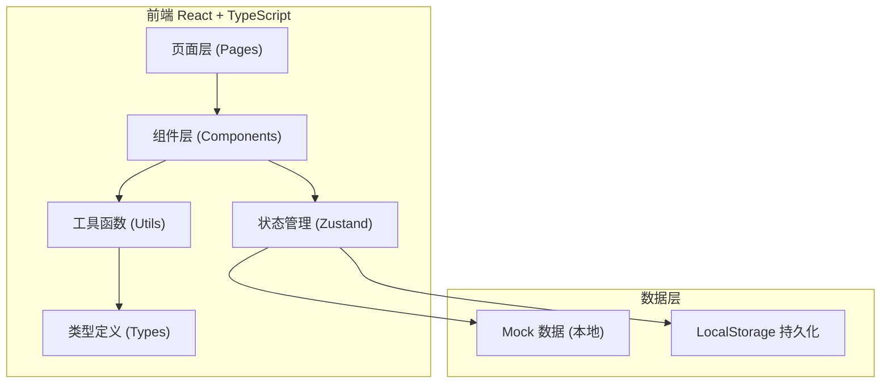
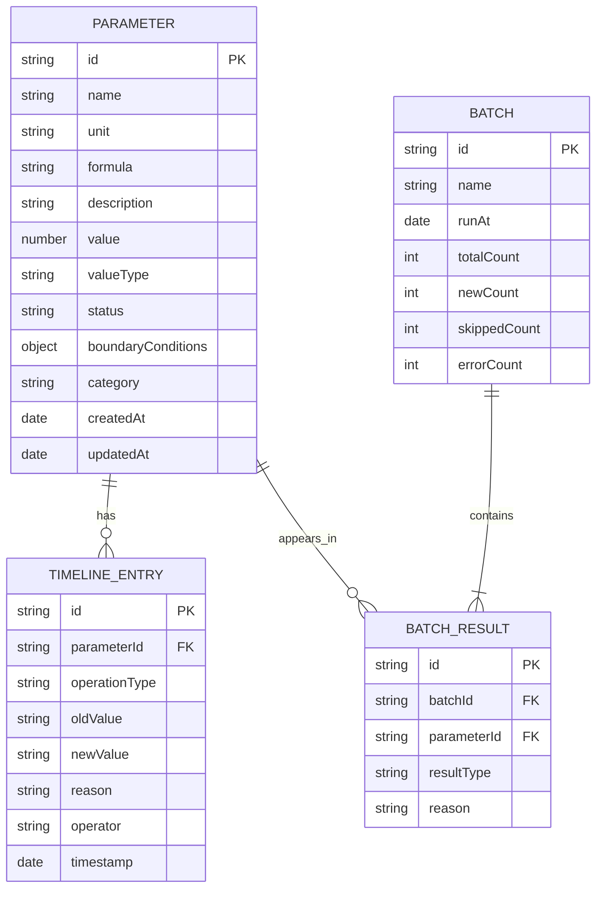

## 1. 架构设计



## 2. 技术描述

- **前端框架**：React 18 + TypeScript
- **构建工具**：Vite 5
- **样式方案**：TailwindCSS 3
- **状态管理**：Zustand 4
- **路由**：React Router DOM 6
- **图标**：Lucide React
- **数据持久化**：LocalStorage（模拟后端）
- **Mock 数据**：内置模拟参数数据，支持本地操作

## 3. 路由定义

| 路由 | 页面 | 说明 |
|------|------|------|
| `/` | 沙盘主页 | 参数总览、列表、批次运行入口 |
| `/timeline` | 全局时间线 | 所有操作历史记录 |
| `/reports` | 运行报告 | 批次运行结果列表 |
| `/parameter/:id` | 参数详情 | 单个参数的明细与操作 |

## 4. 数据模型

### 4.1 实体关系图



### 4.2 核心类型定义

```typescript
type ValueType = 'normal' | 'empty_set' | 'zero' | 'null' | 'undefined';
type ParameterStatus = 'pending' | 'approved' | 'rejected' | 'needs_review' | 'duplicate';
type OperationType = 'create' | 'update' | 'supplement' | 'withdraw' | 'rejudge' | 'approve' | 'reject';
type BatchResultType = 'new' | 'skipped' | 'updated' | 'error';

interface Parameter {
  id: string;
  name: string;
  unit: string;
  formula: string;
  formulaExplanation: string;
  description: string;
  value: number | null;
  valueType: ValueType;
  status: ParameterStatus;
  boundaryConditions: {
    min?: number;
    max?: number;
    mustBeInteger?: boolean;
    mustBePositive?: boolean;
    notes?: string;
  };
  category: string;
  createdAt: string;
  updatedAt: string;
}

interface TimelineEntry {
  id: string;
  parameterId: string;
  parameterName: string;
  operationType: OperationType;
  oldValue?: number | null;
  newValue?: number | null;
  oldStatus?: ParameterStatus;
  newStatus?: ParameterStatus;
  reason: string;
  operator: string;
  timestamp: string;
  details?: Record<string, unknown>;
}

interface Batch {
  id: string;
  name: string;
  runAt: string;
  totalCount: number;
  newCount: number;
  skippedCount: number;
  errorCount: number;
  previousBatchId?: string;
}

interface BatchResultItem {
  id: string;
  batchId: string;
  parameterId: string;
  parameterName: string;
  resultType: BatchResultType;
  reason: string;
  previousValue?: number | null;
  currentValue?: number | null;
}
```

## 5. 核心算法与逻辑

### 5.1 空集合与零值识别逻辑

```
空集合 (empty_set):
  - 值为 null 且 valueType 标记为 empty_set
  - 表示"这个参数项没有可取值的集合"，不是遗漏，是明确为空
  - 展示时用淡灰蓝色背景 + ∅ 符号标识

零值 (zero):
  - 值为 0 且 valueType 标记为 zero
  - 表示"值确实是零"，不是缺失也不是错误
  - 展示时用淡橙黄色背景 + 0 符号标识

普通零值 (normal 值为 0):
  - 值为 0 但 valueType 是 normal
  - 按普通值展示，不特殊标识
```

### 5.2 幂等运行逻辑

```
批次运行时:
1. 读取本次输入的参数列表
2. 与系统中已有参数比对（按 name + category 唯一键）
3. 分类:
   - 新增 (new): 系统中不存在的参数
   - 跳过 (skipped): 参数存在且值完全相同（含 valueType）
   - 更新 (updated): 参数存在但值或属性有变化
   - 错误 (error): 参数格式异常
4. 旧记录保持原 id 和计数不变
5. 生成运行报告，标出各类数量和明细
6. 用户可选择是否将"新增"和"更新"正式纳入
```

### 5.3 时间线记录逻辑

```
每次操作（补录/撤回/改判/通过/驳回）都:
1. 创建一条 TimelineEntry
2. 记录操作前后的值和状态
3. 记录操作理由（必填）
4. 记录操作人（默认"老叶"，可配置）
5. 记录时间戳
6. 可通过 parameterId 查询单参数时间线
   或查询全局时间线
```

## 6. 目录结构

```
src/
├── pages/
│   ├── Dashboard.tsx        # 沙盘主页
│   ├── Timeline.tsx         # 全局时间线
│   ├── Reports.tsx          # 运行报告
│   └── ParameterDetail.tsx  # 参数详情
├── components/
│   ├── ParameterCard.tsx    # 参数卡片
│   ├── ParameterTable.tsx   # 参数表格
│   ├── TimelineList.tsx     # 时间线列表
│   ├── TimelineItem.tsx     # 时间线条目
│   ├── StatCard.tsx         # 统计卡片
│   ├── BatchRunner.tsx      # 批次运行组件
│   ├── FormulaDisplay.tsx   # 公式展示
│   ├── StatusBadge.tsx      # 状态标签
│   ├── Modal.tsx            # 弹窗组件
│   └── OperationForm.tsx    # 操作表单（补录/改判/撤回）
├── store/
│   ├── useParameterStore.ts # 参数状态
│   ├── useTimelineStore.ts  # 时间线状态
│   └── useBatchStore.ts     # 批次运行状态
├── types/
│   └── index.ts             # 类型定义
├── utils/
│   ├── idempotent.ts        # 幂等运算工具
│   ├── formatters.ts        # 格式化工具
│   └── mockData.ts          # 模拟数据生成
├── App.tsx
├── main.tsx
└── index.css
```
