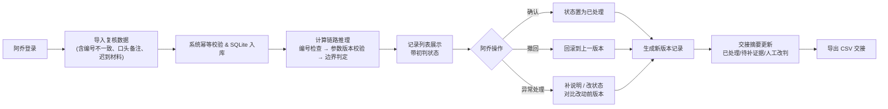

## 1. 产品概述

拓扑路径边界复核系统，面向建模社日常复核场景，解决参数版本修改无记录、复核数据混杂（含编号不一致、口头备注、迟到材料）、交接说不清来龙去脉等痛点。

- 目标用户：建模社复核同学（如阿乔），负责题目清单补录、边界复核、异常处理与交接
- 核心价值：让复核过程可追溯、计算链路透明、现场数据真实可操作，交接时拿页面摘要就能讲清

## 2. 核心功能

### 2.1 用户角色

| 角色 | 登录方式 | 核心权限 |
|------|----------|----------|
| 复核员（阿乔） | 本地账号 | 导入数据、复核确认/撤回、补说明改状态、查看历史版本、查询导出、查看计算链路 |

### 2.2 功能模块

1. **复核工作台**：数据导入、记录列表、状态筛选、批量操作
2. **计算链路面板**：展开每一步推理，高亮影响当前结论的关键步骤
3. **异常处理入口**：补说明、改状态、版本对比（改动前 vs 改动后）
4. **交接摘要面板**：已处理 / 待补证据 / 人工改判 三类统计与明细
5. **导出与幂等保障**：同一份 SQLite 读写，重复请求去重，导出 Excel/CSV

### 2.3 页面详情

| 页面名称 | 模块名称 | 功能描述 |
|----------|----------|----------|
| 复核工作台 | 顶部摘要栏 | 显示三类统计数字：已处理、待补证据、人工改判 |
| 复核工作台 | 数据导入区 | 拖拽/点击上传，幂等去重提示，导入后直接入列表 |
| 复核工作台 | 记录列表 | 每条记录含编号、参数版本、状态标签、操作按钮，支持搜索筛选 |
| 复核工作台 | 记录操作 | 确认、撤回、补说明、改状态、查看链路、查看历史版本 |
| 计算链路面板 | 步骤展开 | 树形/时间线展示推理步骤，点击每步查看输入输出与依据 |
| 计算链路面板 | 结论溯源 | 高亮最终结论由哪些步骤推导而来 |
| 异常处理入口 | 版本对比 | 左右分栏展示改动前与改动后的参数、结论、备注 |
| 异常处理入口 | 编辑区 | 文本框补说明、下拉改状态，保存后生成新版本记录 |
| 交接摘要面板 | 分类卡片 | 三类数据各自卡片，点击展开明细，可复制导出 |
| 导出功能 | 导出操作 | 按当前筛选条件导出 CSV，含完整版本信息 |

## 3. 核心流程

复核员阿乔夜间打开系统 → 导入当天补录的题目清单（含脏数据：编号不一致、口头备注、迟到材料）→ 系统自动做编号一致性检查并给出初判 → 阿乔逐条查看计算链路确认初判是否合理 → 对异常记录补说明、改状态（可看到改动前版本）→ 完成后查看交接摘要（已处理/待补证据/人工改判）→ 导出 CSV 供第二天交接。

## 4. 用户界面设计

### 4.1 设计风格

- 主色调：深夜蓝 `#0F1B2D` 为主背景，琥珀橙 `#F59E0B` 作为异常高亮，翠绿 `#10B981` 表示已处理，靛紫 `#6366F1` 标记人工改判
- 按钮风格：方角微圆（4px），实心主按钮配细微阴影，次要按钮描边
- 字体：标题用 **JetBrains Mono** 等宽字体突出工程感，正文用 **Noto Sans SC** 保证中文可读性
- 布局：三栏布局 — 左栏交接摘要、中栏记录列表、右栏计算链路/异常详情（可折叠）
- 视觉细节：背景加细颗粒噪点纹理，卡片用细描边 + 微妙内阴影，状态标签用圆角徽章

### 4.2 页面设计概览

| 页面名称 | 模块名称 | UI 元素 |
|----------|----------|----------|
| 复核工作台 | 顶部摘要栏 | 三张数字卡片（已处理/待补证据/人工改判），各带色点和趋势小箭头 |
| 复核工作台 | 数据导入区 | 虚线边框拖拽区，琥珀色提示"数据不必干净，系统照单全收" |
| 复核工作台 | 记录列表 | 每行高 64px，左编号、中参数版本+状态徽章、右操作按钮，斑马纹底色 |
| 计算链路面板 | 步骤时间线 | 竖线连接节点，节点为圆点，当前步骤放大高亮，hover 显示输入输出 |
| 异常处理入口 | 版本对比 | 左右两栏，中间竖线分隔，差异文字下划线琥珀色标出 |
| 交接摘要面板 | 分类卡片 | 每张卡片顶部色块+数字，下方可折叠明细列表，附"复制摘要"按钮 |

### 4.3 响应式

桌面优先设计（≥ 1280px 三栏并排），≤ 1024px 时右栏折叠为抽屉，≤ 768px 时左栏折叠为顶部标签页，列表单列展示。
