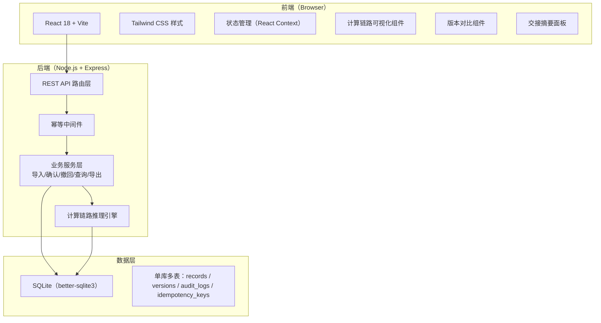
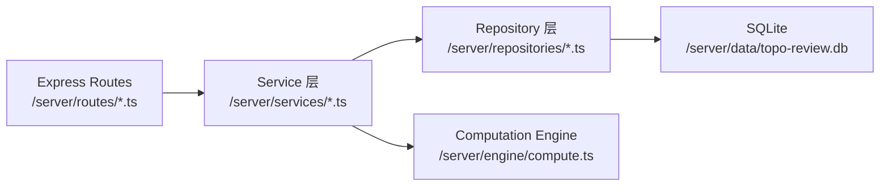
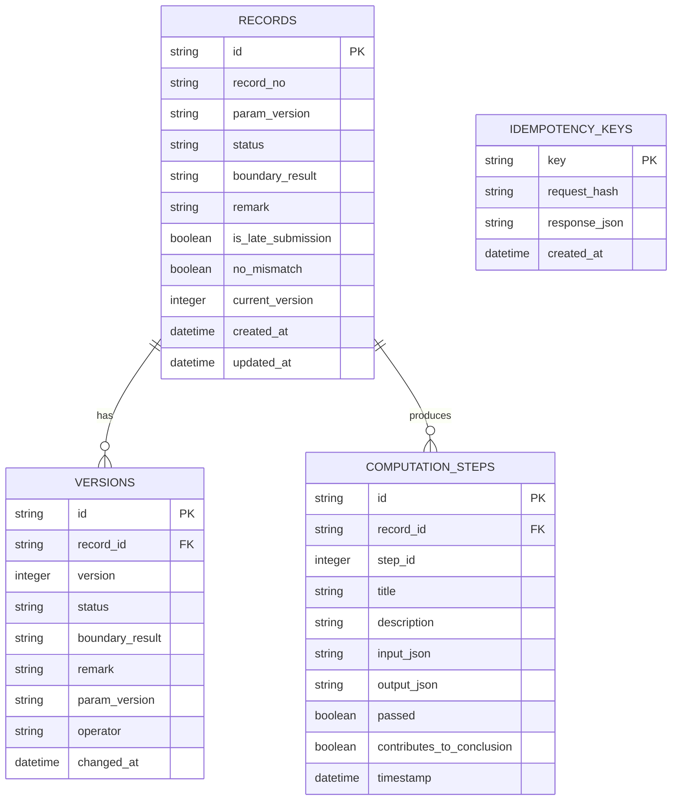

## 1. 架构设计



## 2. 技术说明

- 前端：React@18 + Tailwind CSS@3 + Vite，纯前端无额外路由库（单页应用内部切换面板）
- 初始化工具：`npm create vite@latest` 选用 React + TypeScript 模板
- 后端：Node.js + Express@4，与前端同仓库，`/server` 目录下
- 数据库：SQLite（`better-sqlite3` 同步驱动，零配置），所有读写走同一份 `.db` 文件
- 导出：CSV 原生拼接，Excel 用 `csv-writer`，不引入 xlsx 以保持轻量

## 3. 路由定义

| 前端路由（Hash/内部） | 用途 |
|------------------------|------|
| /workbench | 复核工作台（默认首页） |
| /workbench?recordId=xxx | 打开指定记录，右侧展开计算链路或异常处理 |

| 后端 API 路由 | Method | 用途 |
|---------------|--------|------|
| /api/records | GET | 查询记录列表，支持 status/keyword 筛选 |
| /api/records/:id | GET | 查询单条记录详情 + 当前版本 |
| /api/records/:id/versions | GET | 查询该记录所有历史版本 |
| /api/records/import | POST | 导入数据（带 Idempotency-Key 头） |
| /api/records/:id/confirm | POST | 确认复核（幂等） |
| /api/records/:id/revoke | POST | 撤回（回滚到上一版本，幂等） |
| /api/records/:id/update | POST | 补说明、改状态（生成新版本） |
| /api/records/:id/computation | GET | 获取该记录的计算链路步骤 |
| /api/summary | GET | 获取交接摘要（三类统计） |
| /api/export | GET | 按筛选条件导出 CSV |

## 4. API 类型定义

```typescript
// 记录状态
type RecordStatus = 'pending' | 'confirmed' | 'revoked' | 'need_evidence' | 'manual_overruled';

// 单条复核记录
interface TopoRecord {
  id: string;
  recordNo: string;           // 题目编号（可能不一致）
  paramVersion: string;       // 参数版本号
  status: RecordStatus;
  boundaryResult: 'pass' | 'fail' | 'unknown';
  remark: string;             // 口头备注
  isLateSubmission: boolean;  // 是否迟到材料
  noMismatch: boolean;        // 编号是否不一致
  createdAt: string;
  updatedAt: string;
  currentVersion: number;
}

// 版本记录
interface RecordVersion {
  id: string;
  recordId: string;
  version: number;
  status: RecordStatus;
  boundaryResult: 'pass' | 'fail' | 'unknown';
  remark: string;
  paramVersion: string;
  operator: string;
  changedAt: string;
}

// 计算链路步骤
interface ComputationStep {
  stepId: number;
  title: string;
  description: string;
  input: Record<string, unknown>;
  output: Record<string, unknown>;
  passed: boolean;
  contributesToConclusion: boolean;
  timestamp: string;
}

// 交接摘要
interface HandoverSummary {
  confirmed: { count: number; items: TopoRecord[] };
  needEvidence: { count: number; items: TopoRecord[] };
  manualOverruled: { count: number; items: TopoRecord[] };
}
```

**幂等处理规范：**
- 所有写操作（import/confirm/revoke/update）要求请求头携带 `Idempotency-Key: <uuid>`
- 服务端在 `idempotency_keys` 表记录 key 与响应，24 小时内同 key 直接返回缓存响应
- 若客户端未传，服务端拒绝（400），前端在页面加载时生成 key 并存 localStorage

## 5. 服务端分层



- **Routes**：参数校验、幂等中间件挂载、HTTP 状态码翻译
- **Service**：业务规则（确认时写版本记录、撤回时回滚版本、计算链路调度）
- **Repository**：纯 SQL 封装（better-sqlite3 同步 API）
- **Computation Engine**：编号一致性检查 → 参数版本校验 → 拓扑边界判定，每步落盘

## 6. 数据模型

### 6.1 ER 图



### 6.2 DDL 与初始数据

```sql
-- 表结构
CREATE TABLE IF NOT EXISTS records (
  id TEXT PRIMARY KEY,
  record_no TEXT NOT NULL,
  param_version TEXT NOT NULL,
  status TEXT NOT NULL DEFAULT 'pending',
  boundary_result TEXT NOT NULL DEFAULT 'unknown',
  remark TEXT DEFAULT '',
  is_late_submission INTEGER NOT NULL DEFAULT 0,
  no_mismatch INTEGER NOT NULL DEFAULT 0,
  current_version INTEGER NOT NULL DEFAULT 1,
  created_at TEXT NOT NULL,
  updated_at TEXT NOT NULL
);

CREATE TABLE IF NOT EXISTS versions (
  id TEXT PRIMARY KEY,
  record_id TEXT NOT NULL,
  version INTEGER NOT NULL,
  status TEXT NOT NULL,
  boundary_result TEXT NOT NULL,
  remark TEXT DEFAULT '',
  param_version TEXT NOT NULL,
  operator TEXT NOT NULL,
  changed_at TEXT NOT NULL,
  FOREIGN KEY (record_id) REFERENCES records(id)
);
CREATE INDEX IF NOT EXISTS idx_versions_record ON versions(record_id);

CREATE TABLE IF NOT EXISTS computation_steps (
  id TEXT PRIMARY KEY,
  record_id TEXT NOT NULL,
  step_id INTEGER NOT NULL,
  title TEXT NOT NULL,
  description TEXT NOT NULL,
  input_json TEXT NOT NULL,
  output_json TEXT NOT NULL,
  passed INTEGER NOT NULL,
  contributes_to_conclusion INTEGER NOT NULL,
  timestamp TEXT NOT NULL,
  FOREIGN KEY (record_id) REFERENCES records(id)
);
CREATE INDEX IF NOT EXISTS idx_steps_record ON computation_steps(record_id);

CREATE TABLE IF NOT EXISTS idempotency_keys (
  key TEXT PRIMARY KEY,
  request_hash TEXT NOT NULL,
  response_json TEXT NOT NULL,
  created_at TEXT NOT NULL
);

-- 贴近现场的初始数据（混入脏数据）
-- 1. 正常记录
INSERT INTO records (id, record_no, param_version, status, boundary_result, remark, is_late_submission, no_mismatch, current_version, created_at, updated_at)
VALUES ('rec-001', 'TOPO-2026-0142', 'v2.3.1', 'pending', 'pass', '', 0, 0, 1, '2026-06-21T09:15:00', '2026-06-21T09:15:00');

-- 2. 编号不一致记录（核心脏数据）
INSERT INTO records (id, record_no, param_version, status, boundary_result, remark, is_late_submission, no_mismatch, current_version, created_at, updated_at)
VALUES ('rec-002', 'TOPO-2026-142', 'v2.3.1', 'pending', 'unknown', '阿乔口头备注：编号好像少一位，明天问下小李', 0, 1, 1, '2026-06-21T10:22:00', '2026-06-21T10:22:00');

-- 3. 迟到材料
INSERT INTO records (id, record_no, param_version, status, boundary_result, remark, is_late_submission, no_mismatch, current_version, created_at, updated_at)
VALUES ('rec-003', 'TOPO-2026-0143', 'v2.2.8', 'need_evidence', 'unknown', '下午才补交，参数版本和之前不一样，待核实', 1, 0, 1, '2026-06-21T17:45:00', '2026-06-21T20:10:00');

-- 4. 已人工改判记录（带版本历史）
INSERT INTO records (id, record_no, param_version, status, boundary_result, remark, is_late_submission, no_mismatch, current_version, created_at, updated_at)
VALUES ('rec-004', 'TOPO-2026-0144', 'v2.3.1', 'manual_overruled', 'pass', '人工改判：原判定 fail，经复核边界条件满足', 0, 0, 2, '2026-06-21T08:30:00', '2026-06-21T19:00:00');

INSERT INTO versions (id, record_id, version, status, boundary_result, remark, param_version, operator, changed_at)
VALUES ('ver-004-1', 'rec-004', 1, 'pending', 'fail', '', 'v2.3.1', 'system', '2026-06-21T08:30:00');
INSERT INTO versions (id, record_id, version, status, boundary_result, remark, param_version, operator, changed_at)
VALUES ('ver-004-2', 'rec-004', 2, 'manual_overruled', 'pass', '人工改判：原判定 fail，经复核边界条件满足', 'v2.3.1', '阿乔', '2026-06-21T19:00:00');

-- 5. 已处理记录
INSERT INTO records (id, record_no, param_version, status, boundary_result, remark, is_late_submission, no_mismatch, current_version, created_at, updated_at)
VALUES ('rec-005', 'TOPO-2026-0145', 'v2.3.1', 'confirmed', 'pass', '', 0, 0, 1, '2026-06-21T07:50:00', '2026-06-21T18:20:00');
```
