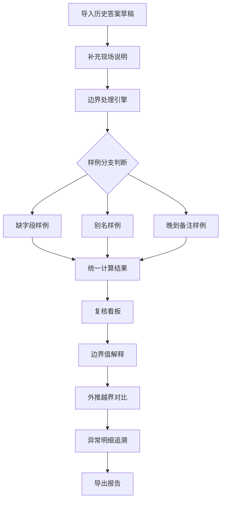

## 1. 产品概述

拓扑路径报告讲解系统是面向数据分析复核场景的专业工具。数学老师老叶拿到历史答案草稿后，通过本系统补充现场说明，自动化处理空集合和零值边界问题，确保复核过程全程可追溯。

- **核心价值**：将手工判断转化为系统化的复核流程，所有看板元素（筛选条件、统计卡片、明细表、导出文件）均来自同一批计算结果，确保数据一致性。
- **目标用户**：数据分析师、数学教研团队、质量复核人员。

## 2. 核心功能

### 2.1 用户角色

| 角色 | 注册方式 | 核心权限 |
|------|----------|----------|
| 复核员（老叶） | 内部账号 | 导入草稿、补充说明、边界处理、导出报告 |
| 查看者 | 只读账号 | 查看报告、追溯明细 |

### 2.2 功能模块

1. **首页看板页：草稿导入、边界处理、三种样例展示、复核工作台
2. **异常明细页：边界值解释、外推越界对比、原始材料追溯
3. **报告汇总页：统计卡片、明细表、导出功能

### 2.3 页面详情

| 页面名称 | 模块名称 | 功能描述 |
|---------|---------|----------|
| 首页看板 | 草稿导入区 | 历史答案草稿上传、现场说明补录、三种测试样例（缺字段/别名/晚到备注）展示 |
| 首页看板 | 边界处理引擎 | 空集合识别、零值特殊处理、边界值判断逻辑可视化 |
| 首页看板 | 复核工作台 | 统一数据源筛选条件、统计卡片、明细表、实时联动 |
| 异常明细 | 边界值解释 | 图表下方短解释，说明边界值改变判断的原因 |
| 异常明细 | 外推越界对比 | 变化前后阈值对比展示，保留历史参照 |
| 报告汇总 | 数据导出 | CSV/Excel导出、截图说明、原始材料追溯链接 |

## 3. 核心流程

老叶工作流：导入历史答案草稿 → 补充现场说明 → 系统自动识别边界问题（空集合/零值）→ 三种样例分支判断 → 复核看板统一展示 → 边界值解释生成 → 外推越界对比 → 异常明细追溯 → 导出最终报告

## 4. 用户界面设计

### 4.1 设计风格
- **主色调**：深蓝 (#1e3a5f) 代表专业理性，配以橙红 (#ff6b35) 突出异常
- **辅助色**：浅灰 (#f5f5f5) 背景，墨绿 (#2a9d8f) 表示正常
- **按钮风格**：微立体、圆角8px、悬停微上浮
- **字体**：标题用 Playfair Display，正文用 Lato
- **布局风格**：卡片式布局，左侧导航 + 右侧内容区，大量留白突出数据
- **图标风格**：线性图标，异常状态用实心图标强调

### 4.2 页面设计概览

| 页面名称 | 模块名称 | UI元素 |
|---------|---------|--------|
| 首页看板 | 草稿导入区 | 拖拽上传区、文本编辑器、三种样例卡片并排展示 |
| 首页看板 | 边界处理引擎 | 流程图可视化、状态标签、边界阈值滑块 |
| 首页看板 | 复核工作台 | 筛选栏横向布局、统计卡片4列网格、明细表固定表头 |
| 异常明细 | 边界值解释 | 折线图 + 下方说明文字区、边界线高亮标注 |
| 异常明细 | 外推越界对比 | 左右双栏对比、变化量箭头标注、历史值灰显 |
| 报告汇总 | 数据导出 | 导出按钮组、截图预览、追溯链接列表 |

### 4.3 响应式
- 桌面端（1280px+）：四列统计卡片、双栏对比布局
- 平板（768px-1279px）：两列统计卡片、单栏对比
- 移动端（<768px）：单列堆叠、横向滚动表

### 4.4 数据可视化
- 边界阈值线用虚线高亮，鼠标悬停显示判定逻辑
- 外推越界区域用半透明红色渐变背景
- 三种样例卡片底部有分支流向连接线动画
