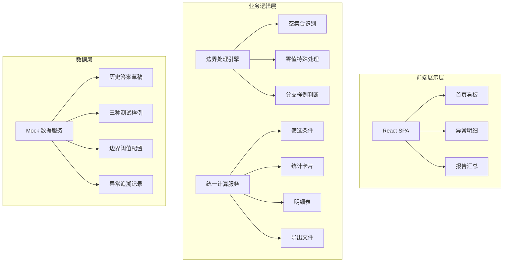
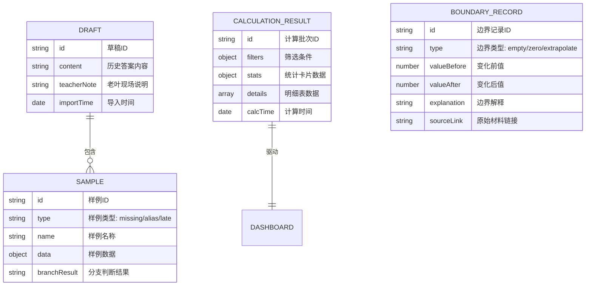

## 1. 架构设计



## 2. 技术选型

- **前端框架**: React@18 + TypeScript@5
- **构建工具**: Vite@5
- **样式方案**: TailwindCSS@3
- **图表库**: Recharts@2（折线图、柱状图、对比图）
- **状态管理**: Zustand@4（统一数据源共享）
- **路由**: React Router@6
- **图标**: Lucide React
- **导出**: xlsx（Excel导出）、html2canvas（截图）
- **后端**: 无后端，全量Mock数据

## 3. 路由定义

| 路由 | 页面 | 功能 |
|------|------|------|
| /dashboard | 首页看板 | 草稿导入、边界处理、三种样例、复核工作台 |
| /anomaly | 异常明细 | 边界值解释、外推越界对比、原始材料追溯 |
| /report | 报告汇总 | 统计卡片、明细表、导出功能 |

## 4. 数据模型

### 4.1 数据模型定义



### 4.2 核心类型定义

```typescript
// 草稿数据
interface Draft {
  id: string;
  content: string;
  teacherNote: string;
  importTime: Date;
  samples: Sample[];
}

// 样例类型
type SampleType = 'missing' | 'alias' | 'late';

interface Sample {
  id: string;
  type: SampleType;
  name: string;
  data: Record<string, any>;
  branchResult: 'normal' | 'warning' | 'error';
  description: string;
}

// 统一计算结果
interface CalculationResult {
  id: string;
  calcTime: Date;
  filters: FilterConfig;
  stats: StatsCard[];
  details: DetailRow[];
  boundaryRecords: BoundaryRecord[];
}

// 边界记录
interface BoundaryRecord {
  id: string;
  type: 'empty' | 'zero' | 'extrapolate';
  valueBefore: number | null;
  valueAfter: number | null;
  threshold: number;
  explanation: string;
  sourceMaterial: SourceMaterial;
}

// 原始材料追溯
interface SourceMaterial {
  id: string;
  name: string;
  type: 'csv' | 'excel' | 'note' | 'screenshot';
  url: string;
  uploadTime: Date;
}
```

## 5. 核心业务逻辑

### 5.1 边界处理引擎

```typescript
// 空集合处理
function handleEmptySet(data: any[]): BoundaryResult {
  if (data.length === 0) {
    return {
      isBoundary: true,
      type: 'empty',
      explanation: '输入集合为空，无法进行拓扑计算，已标记为边界异常。'
    };
  }
}

// 零值处理
function handleZeroValue(value: number): BoundaryResult {
  if (value === 0 && !isExpectedZero(value)) {
    return {
      isBoundary: true,
      type: 'zero',
      explanation: '出现非预期零值，可能是数据缺失或计算错误，需人工复核。'
    };
  }
}

// 外推越界处理
function handleExtrapolation(value: number, threshold: number): BoundaryResult {
  if (value > threshold * 1.5 || value < threshold * 0.5) {
    const before = value;
    const after = Math.max(Math.min(value, threshold * 1.5), threshold * 0.5);
    return {
      isBoundary: true,
      type: 'extrapolate',
      valueBefore: before,
      valueAfter: after,
      explanation: `外推值 ${before} 超出阈值范围 [${threshold * 0.5}, ${threshold * 1.5}]，已裁剪至 ${after}。`
    };
  }
}
```

### 5.2 统一数据源机制

所有看板组件共享同一个 `useCalculationStore`，确保筛选条件变化时，统计卡片、明细表、导出文件同步更新。

```typescript
const useCalculationStore = create((set, get) => ({
  filters: defaultFilters,
  stats: [],
  details: [],
  updateFilters: (newFilters) => {
    // 重新计算所有依赖数据
    const result = recalculateAll(newFilters);
    set({
      filters: newFilters,
      stats: result.stats,
      details: result.details,
      boundaryRecords: result.boundaryRecords
    });
  }
}));
```

## 6. 组件结构

```
src/
├── pages/
│   ├── Dashboard/
│   │   ├── DraftImport.tsx      # 草稿导入与说明补录
│   │   ├── SampleCards.tsx      # 三种样例展示
│   │   ├── BoundaryEngine.tsx   # 边界处理引擎
│   │   └── ReviewWorkspace.tsx  # 复核工作台
│   ├── Anomaly/
│   │   ├── BoundaryChart.tsx    # 边界值图表
│   │   ├── BoundaryExplanation.tsx # 边界值解释
│   │   ├── ExtrapolateCompare.tsx  # 外推越界对比
│   │   └── SourceTrace.tsx      # 原始材料追溯
│   └── Report/
│       ├── StatsCards.tsx       # 统计卡片
│       ├── DetailTable.tsx      # 明细表
│       └── ExportPanel.tsx      # 导出面板
├── store/
│   └── calculationStore.ts      # 统一计算状态
├── utils/
│   ├── boundaryEngine.ts        # 边界处理逻辑
│   └── mockData.ts              # Mock数据生成
└── types/
    └── index.ts                 # 类型定义
```
