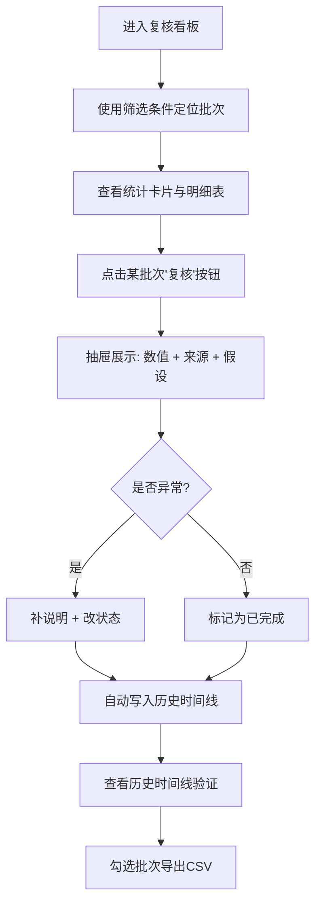

## 1. 产品概述

概率抽样错因追踪系统是面向竞赛助教的复核工作台，解决多版板书/多符号写法下计算结果难以溯源的问题。系统围绕"复核"构建看板，所有筛选、统计、明细、导出均绑定同一批计算批次，支持异常补说明、改状态、查看历史结论，并在服务重启后保留完整处理时间线。

- 目标用户：竞赛助教（核心用户为"小岑"）
- 解决痛点：板书版本更迭导致符号歧义、多人协作无法确认采用版本、复核入口隐蔽、历史处理痕迹丢失
- 核心价值：让每一个数值结果都有来源、每一次改动都有迹可循、每一批计算都可完整复现

## 2. 核心功能

### 2.1 用户角色

| 角色 | 注册方式 | 核心权限 |
|------|----------|----------|
| 竞赛助教 | 本地登录 | 查看所有批次、复核记录、补说明、改状态、导出、重跑计算 |

### 2.2 功能模块

1. **复核看板首页**：批次筛选栏、统计卡片、计算明细表、版本标签、异常入口
2. **批次详情与时间线**：版本对比、历史时间线、每次改动前后结论快照
3. **复核详情抽屉**：数值结果 + 数据来源 + 假设条件、异常处理（补说明/改状态）
4. **导出中心**：按批次导出 CSV，文件名携带版本号与时间戳

### 2.3 页面详情

| 页面名称 | 模块名称 | 功能描述 |
|----------|----------|----------|
| 复核看板 | 批次筛选栏 | 按日期范围、处理人、状态、板书版本筛选，条件联动所有卡片与表格 |
| 复核看板 | 统计卡片 | 展示总批次数、待复核数、异常数、已完成数，点击可跳转对应筛选 |
| 复核看板 | 计算明细表 | 列出每批计算的批次号、板书版本、符号体系、处理人、状态、数值、操作列（复核/查看时间线） |
| 复核看板 | 版本标识 | 每条记录显示板书照片版本号与采用符号写法，悬停可预览缩略图 |
| 批次详情 | 历史时间线 | 垂直时间线，展示该批次从创建、多轮计算、复核、异常处理到完成的全部事件，含操作人、时间、改动前后对比 |
| 批次详情 | 版本对比 | 并排展示不同板书版本下的符号写法差异与对应计算结果 |
| 复核详情抽屉 | 数值结果区 | 突出显示最终计算值，旁附"来源"与"假设"两个标签按钮，点击展开说明 |
| 复核详情抽屉 | 来源说明 | 列出采用的板书版本编号、照片引用、处理人、计算时间 |
| 复核详情抽屉 | 假设条件 | 列出计算时使用的符号映射假设、抽样方法、置信水平、排除项 |
| 复核详情抽屉 | 异常处理 | 快速操作：补说明（文本框）、改状态（下拉：待复核/复核中/异常/已完成），提交后自动写入时间线 |
| 复核详情抽屉 | 改动对比 | 显示改动前版本结论与改动后版本结论的并排对比 |
| 导出中心 | 批次导出 | 勾选批次后导出 CSV，文件名自动包含批次号、版本号、导出时间 |

## 3. 核心流程

竞赛助教小岑进入复核看板 → 通过筛选条件定位目标批次 → 查看统计概览 → 点击某批次"复核" → 在抽屉中查看数值+来源+假设 → 若发现异常则补说明/改状态 → 查看历史时间线确认改动痕迹 → 确认后标记完成 → 勾选多批次导出结果。

## 4. 用户界面设计

### 4.1 设计风格

- **主色调**：墨青蓝 `#1E3A5F`（严谨、专业），辅助色：琥珀橙 `#E8833A`（异常警示）、薄荷绿 `#3EA77C`（完成/正常）
- **按钮风格**：直角方角按钮，2px 边框，按下有下陷反馈；异常按钮使用琥珀橙描边
- **字体**：标题使用 "Noto Serif SC"（宋体衬线，学术感），正文使用 "JetBrains Mono"（等宽字体，数字清晰）
- **布局风格**：左右分栏，左侧为筛选与统计区（固定宽度 280px），右侧为表格与详情区（自适应）；卡片使用细边框 + 浅阴影，强调数据密度
- **图标风格**：线性 outline 图标，线条粗细 1.5px，颜色随语义变化（异常为橙色、完成为绿色）

### 4.2 页面设计概览

| 页面名称 | 模块名称 | UI 元素 |
|----------|----------|---------|
| 复核看板 | 批次筛选栏 | 左侧固定面板，墨青蓝顶部条，每个筛选项下方显示当前选中值的徽标 |
| 复核看板 | 统计卡片 | 4 张横向排列卡片，大号数字 + 小号标签，底部带环比趋势箭头；异常卡片带琥珀橙左边框 |
| 复核看板 | 计算明细表 | 斑马纹表格，版本号列带彩色圆点标识，操作列按钮为图标文字混合 |
| 批次详情 | 历史时间线 | 左侧垂直实线，每个节点为圆形时间标记，点击可展开该节点详细信息，改动内容使用删除线+新增对比展示 |
| 复核详情抽屉 | 数值结果区 | 超大字号数值居中显示，右上角"来源"与"假设"为胶囊按钮，点击展开对应区块 |
| 复核详情抽屉 | 异常处理 | 底部固定操作栏，左侧文本框输入说明，右侧状态下拉与提交按钮 |

### 4.3 响应式

桌面优先设计（最小宽度 1280px），中等屏幕（1024-1279px）将左侧筛选栏折叠为顶部水平条，移动端（<1024px）隐藏次要列仅保留批次号、状态、操作。

### 4.4 动效

- 抽屉滑入：右侧 300ms ease-out
- 时间线节点展开：高度过渡 + 渐入 200ms
- 表格行悬停：背景色浅淡过渡 150ms
- 数值卡片加载：数字从 0 滚动到目标值 600ms
