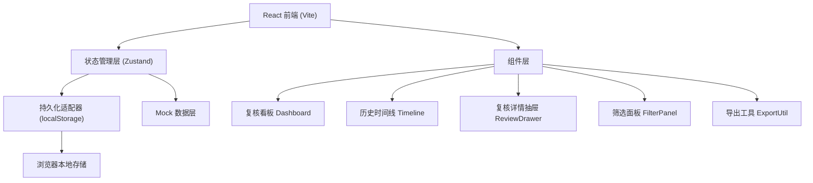
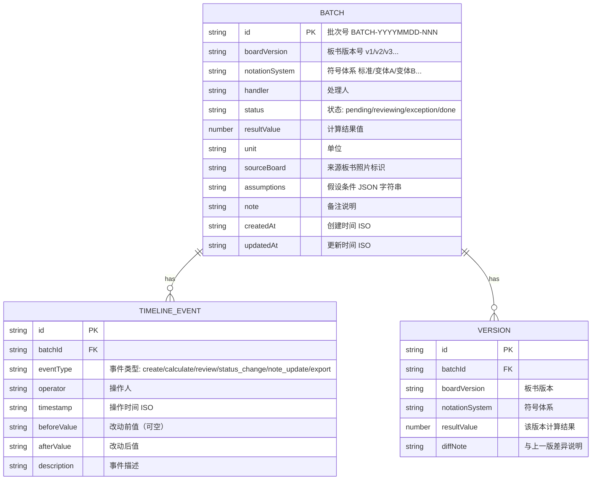

## 1. 架构设计



## 2. 技术描述

- **前端框架**：React@18 + TypeScript
- **构建工具**：Vite@5
- **样式方案**：TailwindCSS@3 + CSS 变量（主题色系统）
- **状态管理**：Zustand（轻量、支持 persist 中间件）
- **持久化方案**：localStorage（通过 Zustand persist 中间件自动同步，服务重启后数据保留）
- **图表/数字动效**：CSS 动画实现数字滚动
- **字体加载**：Google Fonts（Noto Serif SC + JetBrains Mono）
- **后端/数据库**：无后端，全部数据在前端 Mock + localStorage 持久化

## 3. 路由定义

| 路由 | 用途 |
|------|------|
| / | 复核看板首页（唯一页面，所有内容通过抽屉/弹窗展开） |

本系统为单页应用（SPA），无多路由切换，所有交互在同一页面内通过组件显隐完成。

## 4. 数据模型

### 4.1 数据模型定义



### 4.2 TypeScript 类型定义

```typescript
// 批次状态
type BatchStatus = 'pending' | 'reviewing' | 'exception' | 'done';

// 事件类型
type TimelineEventType = 'create' | 'calculate' | 'review' | 'status_change' | 'note_update' | 'export';

// 假设条件
interface Assumptions {
  symbolMapping: Record<string, string>;  // 符号映射
  samplingMethod: string;                  // 抽样方法
  confidenceLevel: number;                 // 置信水平
  exclusions: string[];                    // 排除项
}

// 版本快照
interface VersionSnapshot {
  id: string;
  boardVersion: string;
  notationSystem: string;
  resultValue: number;
  diffNote: string;
}

// 时间线事件
interface TimelineEvent {
  id: string;
  batchId: string;
  eventType: TimelineEventType;
  operator: string;
  timestamp: string;
  beforeValue?: string;
  afterValue: string;
  description: string;
}

// 计算批次
interface CalculationBatch {
  id: string;
  boardVersion: string;
  notationSystem: string;
  handler: string;
  status: BatchStatus;
  resultValue: number;
  unit: string;
  sourceBoard: string;
  assumptions: Assumptions;
  note: string;
  versions: VersionSnapshot[];
  timeline: TimelineEvent[];
  createdAt: string;
  updatedAt: string;
}

// 筛选条件
interface FilterState {
  dateRange: { start: string; end: string } | null;
  handlers: string[];
  statuses: BatchStatus[];
  boardVersions: string[];
  search: string;
}

// 全局状态
interface AppState {
  batches: CalculationBatch[];
  filters: FilterState;
  selectedBatchId: string | null;
  reviewDrawerOpen: boolean;
  timelineModalOpen: boolean;
  // actions
  setFilters: (f: Partial<FilterState>) => void;
  selectBatch: (id: string | null) => void;
  openReviewDrawer: (id: string) => void;
  closeReviewDrawer: () => void;
  openTimelineModal: (id: string) => void;
  closeTimelineModal: () => void;
  updateBatchStatus: (id: string, status: BatchStatus, note?: string) => void;
  updateBatchNote: (id: string, note: string) => void;
  exportBatches: (ids: string[]) => void;
}
```

## 5. 目录结构

```
src/
├── types/
│   └── index.ts              # 所有类型定义
├── store/
│   └── useAppStore.ts        # Zustand store + persist
├── data/
│   └── mockBatches.ts        # 初始 Mock 数据
├── components/
│   ├── layout/
│   │   └── AppLayout.tsx     # 主布局
│   ├── dashboard/
│   │   ├── FilterPanel.tsx   # 筛选面板
│   │   ├── StatsCards.tsx    # 统计卡片组
│   │   └── BatchTable.tsx    # 批次明细表
│   ├── timeline/
│   │   └── TimelineModal.tsx # 历史时间线弹窗
│   ├── review/
│   │   ├── ReviewDrawer.tsx  # 复核详情抽屉
│   │   ├── ResultDisplay.tsx # 数值结果展示（含来源/假设）
│   │   └── ExceptionForm.tsx # 异常处理表单
│   └── common/
│       ├── StatusBadge.tsx   # 状态徽标
│       ├── VersionTag.tsx    # 版本标签
│       └── IconButton.tsx    # 图标按钮
├── utils/
│   ├── export.ts             # CSV 导出工具
│   ├── formatters.ts         # 日期/数字格式化
│   └── idGenerator.ts        # ID 生成
├── App.tsx
├── main.tsx
└── index.css
```

## 6. 核心交互数据流

1. **应用启动**：Zustand persist 中间件从 localStorage 恢复数据；若无数据则加载 mockBatches.ts 初始化
2. **筛选操作**：用户操作 FilterPanel → dispatch setFilters → store 更新 → 所有订阅组件（StatsCards、BatchTable）自动重渲染
3. **复核操作**：点击"复核" → openReviewDrawer → 抽屉从右侧滑入，展示 ResultDisplay + ExceptionForm
4. **状态/备注修改**：提交 ExceptionForm → updateBatchStatus / updateBatchNote → store 更新批次 → 自动新增 TimelineEvent → localStorage 同步
5. **查看时间线**：点击"时间线" → openTimelineModal → 展示垂直时间线，节点可展开查看 before/after 对比
6. **导出**：勾选行 → exportBatches → 生成 CSV 文本（含版本号+时间戳文件名）→ 触发浏览器下载
7. **服务重启**：Zustand persist 自动从 localStorage 读取，历史数据与时间线完整保留
