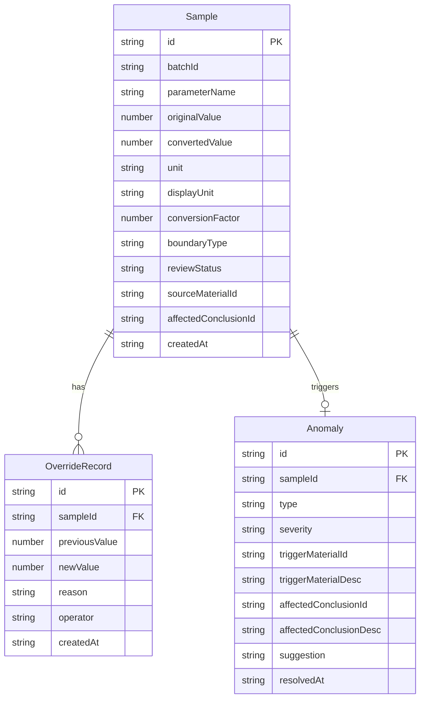

## 1. 架构设计

```mermaid
graph TD
    "前端 React SPA" --> "状态管理 Zustand"
    "状态管理 Zustand" --> "计算引擎（纯函数）"
    "计算引擎（纯函数）" --> "Mock 数据层"
    "Mock 数据层" --> "本地存储 localStorage"
    "前端 React SPA" --> "导出服务（前端生成）"
```

纯前端架构，所有计算在浏览器端完成，不依赖后端服务。计算结果统一输出到状态管理层，筛选条件、统计卡片、明细表和导出文件均消费同一份数据源。

## 2. 技术说明

- 前端：React@18 + TypeScript + Tailwind CSS@3 + Vite
- 初始化工具：Vite (react-ts 模板)
- 后端：无（纯前端）
- 数据库：无（Mock 数据 + localStorage 持久化）
- 状态管理：Zustand
- 导出：jsPDF（PDF报告）+ Papa Parse（CSV）
- 动画：framer-motion

## 3. 路由定义

| 路由 | 用途 |
|------|------|
| / | 复核看板页——筛选、统计卡片、明细表、操作栏 |
| /review/:id | 人工改判页——单条样本改判表单与改判历史 |
| /anomalies | 异常溯源页——异常列表与溯源详情 |
| /export | 导出与报告页——报告预览与文件导出 |

## 4. API 定义

无后端 API。前端通过 Zustand store 直接操作内存数据，变更同步写入 localStorage。

核心数据接口定义：

```typescript
type BoundaryType = "normal" | "empty_set" | "zero_value" | "extrapolation_overflow"

type ReviewStatus = "pending" | "confirmed" | "overridden"

interface Sample {
  id: string
  batchId: string
  parameterName: string
  originalValue: number | null
  convertedValue: number | null
  unit: string
  displayUnit: string
  conversionFactor: number
  boundaryType: BoundaryType
  reviewStatus: ReviewStatus
  sourceMaterialId: string
  affectedConclusionId: string
  createdAt: string
}

interface OverrideRecord {
  id: string
  sampleId: string
  previousValue: number | null
  newValue: number | null
  reason: string
  operator: string
  createdAt: string
}

interface Anomaly {
  id: string
  sampleId: string
  type: BoundaryType
  severity: "warning" | "critical"
  triggerMaterialId: string
  triggerMaterialDesc: string
  affectedConclusionId: string
  affectedConclusionDesc: string
  suggestion: string
  resolvedAt: string | null
}

interface ComputedStats {
  totalSamples: number
  boundaryAnomalies: number
  pendingReview: number
  overridden: number
}
```

## 5. 服务端架构图

不适用（纯前端项目）

## 6. 数据模型

### 6.1 数据模型定义



### 6.2 数据定义语言

使用 TypeScript 类型定义代替 DDL，数据以 JSON 形式存储于 localStorage。

Mock 数据包含以下样例场景：
- 正常记录：参数值在合理范围内，boundaryType 为 normal
- 空集合记录：originalValue 为 null，boundaryType 为 empty_set，触发异常说明
- 零值记录：originalValue 为 0，boundaryType 为 zero_value，需要确认是否为有效零
- 外推越界记录：convertedValue 超出合理区间，boundaryType 为 extrapolation_overflow
- 补录说明记录：备注字段含补充来源说明
- 人工改判记录：至少一条含 overrideRecord，展示改判历史不被覆盖
