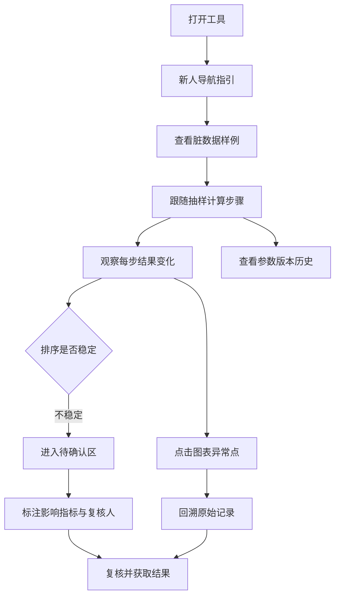

## 1. 产品概述
概率抽样报告讲解工具——面向数据分析人员的交互式抽样过程演示系统。核心价值在于通过"不干净"的真实数据样例，让使用者理解抽样计算每一步对结果的影响，而非只展示完美数据。
- 目标用户：数据分析人员（小孟）及团队同学
- 解决问题：参数版本被改无记录、只看漂亮图表不追溯原始记录、新人不知道材料/问题/结果在哪

## 2. 核心功能

### 2.1 功能模块
1. **主页面（抽样讲解工作台）**：新人导航面板、脏数据表、抽样计算步骤追踪、交互式图表、待确认区

### 2.2 页面详情

| 页面名称 | 模块名称 | 功能描述 |
|----------|----------|----------|
| 抽样讲解工作台 | 新人导航面板 | 三个入口卡片：材料位置、问题追踪、结果获取 |
| 抽样讲解工作台 | 脏数据样例表 | 展示三类脏数据：缺字段行、别名行、补充备注行，每行可展开查看详情 |
| 抽样讲解工作台 | 抽样计算步骤追踪 | 分步展示抽样过程，每步标注影响的样本、参数变更、结果变化，可点击样本回溯 |
| 抽样讲解工作台 | 交互式图表 | 抽样分布曲线，支持点击曲线点/异常点跳转对应原始记录，高亮展示 |
| 抽样讲解工作台 | 待确认区 | 收录排序不稳定记录，标注影响的数字指标、复核人、状态 |
| 抽样讲解工作台 | 参数版本抽屉 | 展示参数修改历史、修改人、修改时间、变更内容对比 |

## 3. 核心流程

使用者打开页面 → 新人导航引导了解布局 → 查看脏数据样例理解真实数据问题 → 跟随抽样计算步骤逐步观察每步对结果的影响 → 点击图表异常点回溯原始记录 → 发现排序不稳定记录自动进入待确认区 → 查看参数版本变更历史 → 复核待确认区记录并获取最终结果

## 4. 用户界面设计

### 4.1 设计风格
- 主色：深石板蓝 `#1e3a5f`（专业分析感）
- 辅色：暖琥珀 `#d97706`（异常/待确认警示）、翠青 `#0d9488`（正常/已确认）
- 按钮风格：微圆角（6px），按下微凹陷效果
- 字体：标题使用 Playfair Display（衬线、学术感），正文使用 JetBrains Mono（等宽、数据友好）
- 布局风格：三栏工作台布局 + 顶部状态条，卡片式分区，信息密度偏高
- 图标风格：简洁线性图标（Lucide），状态用色块区分

### 4.2 页面设计概览

| 页面名称 | 模块名称 | UI 元素 |
|----------|----------|---------|
| 抽样讲解工作台 | 新人导航面板 | 三张渐变卡片，图标 + 标题 + 简短说明 + 跳转按钮，进入时淡入上浮动画 |
| 抽样讲解工作台 | 脏数据样例表 | 斑马行，三类脏数据用左侧色块标记（缺字段红、别名橙、备注蓝），行展开动画 |
| 抽样讲解工作台 | 抽样计算步骤追踪 | 垂直时间轴，每步卡片含步骤编号、操作说明、参数值、受影响样本列表、结果差值，当前步骤高亮 |
| 抽样讲解工作台 | 交互式图表 | SVG 折线图，数据点悬停放大+阴影，点击后闪烁高亮并滚动定位到对应数据行 |
| 抽样讲解工作台 | 待确认区 | 琥珀色背景区块，记录卡片含异常描述、影响指标（高亮数字）、复核人标签、状态切换按钮 |
| 抽样讲解工作台 | 参数版本抽屉 | 右侧滑出，时间轴式版本列表，差异对比用 inline diff 样式 |

### 4.3 响应式
桌面端优先（1280px+），三栏并排。平板端折叠为上下两栏，移动端单列堆叠，图表可横向滚动。
