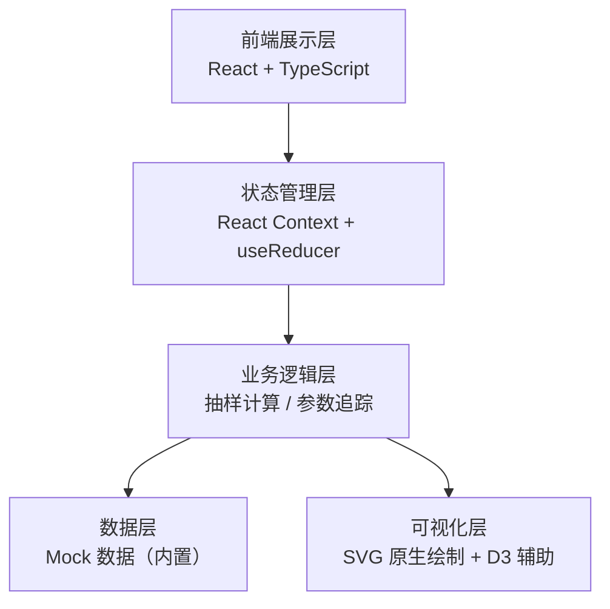

## 1. 架构设计



## 2. 技术描述
- 前端：React@18 + TypeScript + Vite
- 样式：TailwindCSS@3 + 自定义 CSS 变量主题
- 图表：原生 SVG 绘制（折线图、分布曲线），无需额外图表库
- 图标：Lucide React
- 后端：无，全部使用内置 Mock 数据
- 数据：TypeScript 类型定义 + JSON Mock 数据文件

## 3. 路由定义

| 路由 | 用途 |
|------|------|
| / | 抽样讲解工作台（主页面，单页应用） |

## 4. 数据模型

### 4.1 数据模型定义

```mermaid
erDiagram
    SAMPLE_RECORD {
        string id PK
        string name
        number value
        string category
        string alias nullable
        string remark nullable
        string dataIssue "缺字段/别名/备注/正常"
        boolean missingField
    }
    SAMPLING_STEP {
        number stepIndex PK
        string description
        object params
        string[] affectedSampleIds
        number resultDelta
        string note
    }
    UNSTABLE_RECORD {
        string id PK
        string sampleId FK
        string description
        string[] impactedMetrics
        string reviewer
        string status "待确认/已确认/已驳回"
        string createdAt
    }
    PARAM_VERSION {
        string version PK
        string changedBy
        string changedAt
        object beforeParams
        object afterParams
        string changeNote
    }
    CHART_POINT {
        number x
        number y
        string sampleId nullable
        boolean isOutlier
    }
```

### 4.2 数据定义（Mock 数据结构）

**脏数据样例（SAMPLE_RECORD）：**
- 正常记录：id, name, value, category 完整
- 缺字段记录：缺少 value 或 category 字段
- 别名记录：alias 字段存在，与 name 不同
- 备注记录：remark 字段有补充说明

**抽样步骤（SAMPLING_STEP）：**
- 步骤 1：原始数据载入
- 步骤 2：参数初始化（参数版本 v1）
- 步骤 3：缺字段处理（均值填充）
- 步骤 4：别名去重
- 步骤 5：排序（此处触发不稳定 → 进入待确认区）
- 步骤 6：分层抽样
- 步骤 7：结果输出

**待确认区（UNSTABLE_RECORD）：**
- 记录排序不稳定的样本 id
- 标注影响：抽样占比变化 0.3%、均值偏移 12.5
- 复核人：小孟
- 状态：待确认

**参数版本（PARAM_VERSION）：**
- v1（初始）：抽样率 0.1，分层键 category
- v2（同学修改无记录）：抽样率 0.15，分层键 value
- v3（回滚到合理值）：抽样率 0.12，分层键 category
