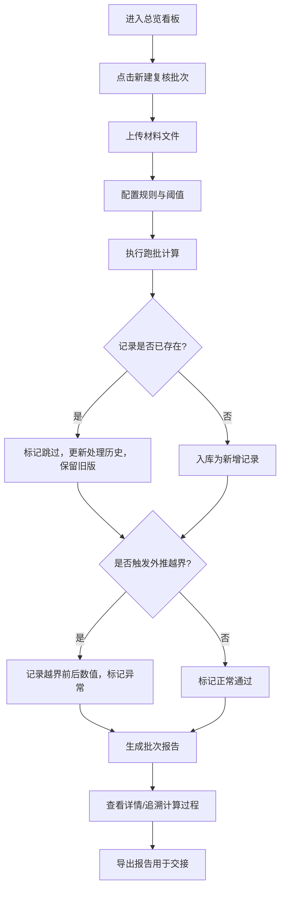

## 1. 产品概述
微分方程边界复核系统 —— 为数学教研场景设计的材料批次复核工具，解决"同一材料多版本说法保留、重复跑批结果稳定、计算过程可追溯、页面与导出数据一致"等核心问题。
- 目标用户：数学教师（老叶）及新同事
- 核心价值：让复核过程留痕、结论可交接、数据不自相矛盾

## 2. 核心功能

### 2.1 用户角色
| 角色 | 注册方式 | 核心权限 |
|------|----------|----------|
| 教研教师 | 本地登录 | 上传材料、跑批复核、查看版本、导出报告 |
| 新同事 | 本地登录 | 查看记录、阅读异常、导出报告 |

### 2.2 功能模块
1. **总览看板**：批次概览、快捷入口、最近复核记录
2. **批次复核**：上传材料、选择规则、执行计算、查看实时进度
3. **记录档案**：所有复核批次列表、版本对比、处理历史
4. **记录详情**：单条记录的计算过程、版本回溯、拉动因素标注
5. **异常看板**：外推越界、数据不一致、规则冲突等异常集中展示
6. **报告导出**：生成带标注的复核报告（新增/跳过/异常分类）

### 2.3 页面详情
| 页面名称 | 模块名称 | 功能描述 |
|----------|----------|----------|
| 总览看板 | 批次统计卡片 | 显示总批次数、新增记录、跳过记录、异常记录数量及趋势 |
| 总览看板 | 快捷入口区 | 三个醒目入口：新建复核批次、查看异常、导出最新报告 |
| 总览看板 | 最近活动时间线 | 展示最近 5 条处理记录及状态变化 |
| 批次复核 | 材料上传区 | 拖拽/选择上传文件，支持多文件批量，显示文件清单和哈希校验 |
| 批次复核 | 规则配置面板 | 选择复核规则集、边界阈值、外推处理策略 |
| 批次复核 | 执行与进度 | 显示实时进度条、已处理/待处理/异常计数，可暂停/继续 |
| 批次复核 | 结果预览 | 批次完成后展示新增 N 条、跳过 M 条、异常 K 条的分类清单 |
| 记录档案 | 批次列表 | 表格展示所有批次，支持搜索、筛选、排序，显示版本数量标记 |
| 记录档案 | 版本抽屉 | 点击版本号展开，展示该批次所有历史版本及被覆盖原因 |
| 记录档案 | 处理历史时间线 | 展示同一批次重复跑批的每次处理时间、操作人、变更摘要 |
| 记录详情 | 基本信息卡 | 记录编号、来源文件、创建时间、当前状态 |
| 记录详情 | 版本切换器 | 下拉选择不同版本查看，版本间差异高亮对比 |
| 记录详情 | 计算过程追踪 | 逐步展示计算逻辑，标注"哪条记录/哪个参数拉动了结果" |
| 记录详情 | 边界复核区 | 外推越界前/后的数值对比，页面值与明细表值一致性校验标记 |
| 异常看板 | 异常分类卡片 | 按异常类型分组展示数量：外推越界、数据不一致、规则冲突 |
| 异常看板 | 异常列表 | 表格展示异常详情，支持跳转到对应记录详情 |
| 异常看板 | 异常处理建议 | 针对每类异常给出处理指引 |
| 报告导出 | 导出配置 | 选择批次范围、报告格式（PDF/CSV）、是否包含版本历史 |
| 报告导出 | 报告预览 | 预览报告结构：新增记录区、跳过记录区、异常记录区、计算说明区 |
| 报告导出 | 下载与交接 | 一键下载，附带交接说明清单 |

## 3. 核心流程
用户进入总览看板 → 点击"新建复核批次"→ 上传材料文件 → 配置复核规则与边界阈值 → 执行跑批 → 系统逐条处理（查重则标记为跳过、保留旧版；新记录则入库）→ 检测外推越界并记录前后数值 → 生成批次报告，标注新增/跳过/异常 → 用户可查看记录详情追溯计算过程 → 导出报告用于交接。

## 4. 用户界面设计

### 4.1 设计风格
- **主色调**：墨蓝 `#1e3a5f`（学术沉稳感），搭配朱砂红 `#c0392b`（异常强调）
- **辅助色**：羊皮纸米 `#f5f0e1`（背景）、炭灰 `#2c2c2c`（正文）
- **按钮风格**：扁平化微立体，细边框+轻微投影，悬停上浮效果
- **字体方案**：标题用 Source Serif Pro（衬线体，学术气质），正文与数据用 JetBrains Mono（等宽字体，数字对齐清晰）
- **布局风格**：卡片网格布局，辅以细线分割，模拟学术笔记/档案的视觉感
- **图标风格**：线性图标，复古档案标签风格，配合少量数学符号装饰

### 4.2 页面设计概览
| 页面名称 | 模块名称 | UI 元素 |
|----------|----------|---------|
| 总览看板 | 批次统计卡片 | 羊皮纸底色卡片、墨蓝大数字、趋势折线小图、悬停微上浮 |
| 总览看板 | 快捷入口区 | 三个等宽大按钮，图标+文字，差异化底色区分入口类型 |
| 总览看板 | 最近活动时间线 | 左侧竖线时间轴，节点用数学符号（∂/∫/∑）标记 |
| 批次复核 | 材料上传区 | 虚线边框拖拽区，羊皮纸纹理背景，上传后显示文件清单表格 |
| 批次复核 | 规则配置面板 | 折叠式手风琴面板，每个规则可单独开关和配置阈值 |
| 批次复核 | 执行与进度 | 分段进度条（已处理/跳过/异常三色），实时数字跳动动画 |
| 记录档案 | 批次列表 | 斑马纹表格，版本号用档案标签样式徽章 |
| 记录档案 | 版本抽屉 | 右侧滑出层，版本卡片竖向排列，覆盖原因用斜体灰字标注 |
| 记录详情 | 计算过程追踪 | 逐步展开卡片，"拉动因素"用朱砂红箭头+高亮标注 |
| 记录详情 | 边界复核区 | 左右双栏对比：越界前 / 越界后，底部一致性校验状态徽章 |
| 异常看板 | 异常分类卡片 | 顶部横向排列，异常类型图标+数量，点击筛选下方列表 |
| 异常看板 | 异常列表 | 表格每行末尾带异常类型标签和跳转链接 |
| 报告导出 | 报告预览 | 模拟纸张效果的预览区，分页显示报告各章节 |

### 4.3 响应式
- 桌面优先设计，主工作区最小宽度 1280px
- 平板端：侧边栏折叠为图标菜单，表格支持横向滚动
- 移动端：卡片堆叠布局，重点保留总览、批次列表、异常看板核心功能

### 4.4 动效设计
- 页面加载：卡片淡入依次浮现（stagger 80ms）
- 进度条：数字跳动+进度平滑增长
- 版本切换：内容交叉淡入淡出
- 异常标记：轻微脉冲动画吸引注意但不干扰
- 导出完成：勾选图标弹性缩放动画
