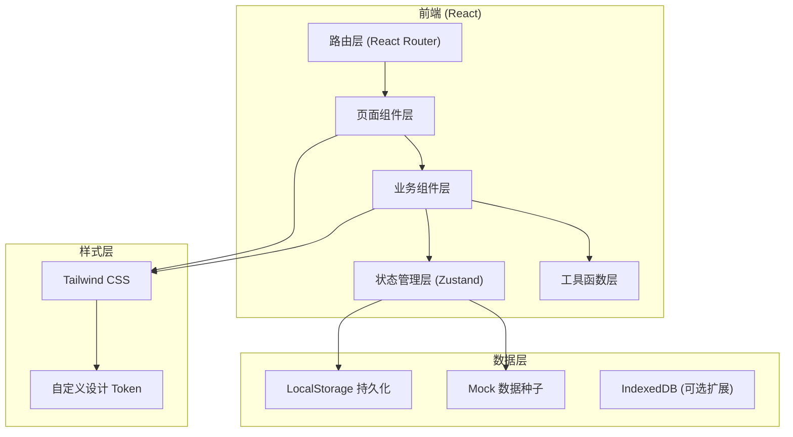
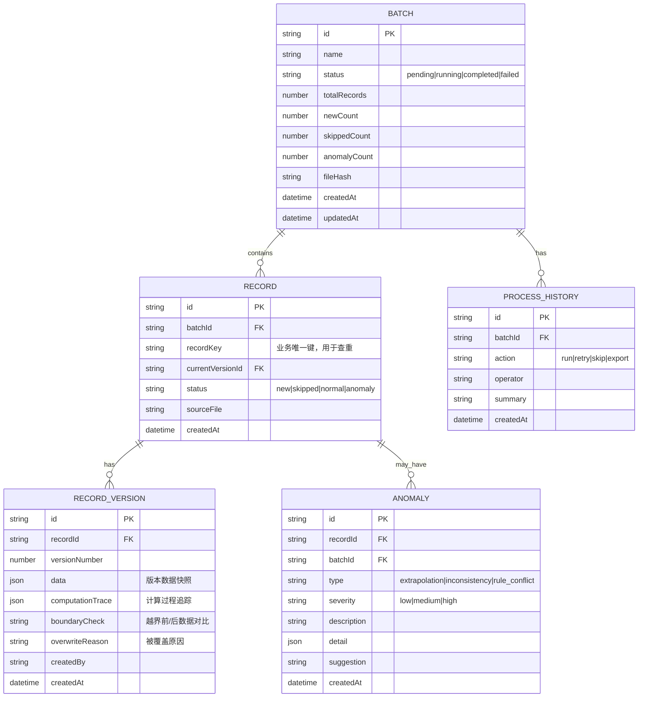

## 1. 架构设计



## 2. 技术描述
- **前端**：React@18 + TypeScript + Tailwind CSS@3 + Vite@5
- **初始化工具**：Vite create
- **后端**：无后端，纯前端本地存储（LocalStorage + 内存状态）
- **数据存储**：LocalStorage 持久化 + Mock 数据初始化
- **路由**：React Router DOM@6
- **状态管理**：Zustand（轻量、不可变更新、支持 devtools）
- **图标**：Lucide React（线性图标库）
- **图表**：Recharts（轻量 React 图表库，用于统计趋势）
- **导出**：jsPDF（PDF 导出）+ Papaparse（CSV 导出）

## 3. 路由定义
| 路由 | 页面组件 | 用途 |
|------|----------|------|
| / | DashboardPage | 总览看板：批次统计、快捷入口、最近活动 |
| /batches/new | BatchReviewPage | 新建复核批次：上传材料、配置规则、执行跑批 |
| /records | RecordsArchivePage | 记录档案：批次列表、版本抽屉、处理历史 |
| /records/:id | RecordDetailPage | 记录详情：版本切换、计算追踪、边界复核 |
| /anomalies | AnomalyBoardPage | 异常看板：分类统计、异常列表、处理建议 |
| /export | ReportExportPage | 报告导出：配置、预览、下载 |

## 4. 数据模型

### 4.1 数据模型定义



### 4.2 类型定义

```typescript
export type BatchStatus = 'pending' | 'running' | 'completed' | 'failed';
export type RecordStatus = 'new' | 'skipped' | 'normal' | 'anomaly';
export type AnomalyType = 'extrapolation' | 'inconsistency' | 'rule_conflict';
export type AnomalySeverity = 'low' | 'medium' | 'high';

export interface ComputationStep {
  step: number;
  description: string;
  formula: string;
  input: Record<string, number>;
  output: number;
  isDrivingFactor?: boolean;
  drivingFactorNote?: string;
}

export interface BoundaryCheck {
  beforeExtrapolation: {
    value: number;
    source: string;
    status: 'within' | 'exceeded';
  };
  afterExtrapolation: {
    value: number;
    method: string;
    status: 'within' | 'exceeded';
  };
  consistencyCheck: {
    pageValue: number;
    tableValue: number;
    exportValue: number;
    isConsistent: boolean;
  };
}

export interface Batch {
  id: string;
  name: string;
  status: BatchStatus;
  totalRecords: number;
  newCount: number;
  skippedCount: number;
  anomalyCount: number;
  fileHash: string;
  createdAt: string;
  updatedAt: string;
}

export interface RecordVersion {
  id: string;
  recordId: string;
  versionNumber: number;
  data: Record<string, unknown>;
  computationTrace: ComputationStep[];
  boundaryCheck: BoundaryCheck;
  overwriteReason?: string;
  createdBy: string;
  createdAt: string;
}

export interface ReviewRecord {
  id: string;
  batchId: string;
  recordKey: string;
  currentVersionId: string;
  status: RecordStatus;
  sourceFile: string;
  versions: RecordVersion[];
  createdAt: string;
}

export interface ProcessHistory {
  id: string;
  batchId: string;
  action: 'run' | 'retry' | 'skip' | 'export';
  operator: string;
  summary: string;
  createdAt: string;
}

export interface Anomaly {
  id: string;
  recordId: string;
  batchId: string;
  type: AnomalyType;
  severity: AnomalySeverity;
  description: string;
  detail: Record<string, unknown>;
  suggestion: string;
  createdAt: string;
}

export interface ReviewRule {
  id: string;
  name: string;
  enabled: boolean;
  description: string;
  threshold: {
    lower: number;
    upper: number;
  };
  extrapolationMethod: 'clip' | 'linear' | 'parabolic';
}
```

## 5. 状态管理设计

### 5.1 Store 分层

```typescript
// useBatchStore - 批次管理
interface BatchStore {
  batches: Batch[];
  currentBatch: Batch | null;
  processHistories: ProcessHistory[];
  createBatch: (files: File[]) => Promise<Batch>;
  runBatch: (batchId: string, rules: ReviewRule[]) => Promise<void>;
  getBatchHistory: (batchId: string) => ProcessHistory[];
}

// useRecordStore - 记录管理
interface RecordStore {
  records: ReviewRecord[];
  currentRecord: ReviewRecord | null;
  anomalies: Anomaly[];
  getRecordById: (id: string) => ReviewRecord | undefined;
  getRecordsByBatch: (batchId: string) => ReviewRecord[];
  switchVersion: (recordId: string, versionId: string) => void;
}

// useRuleStore - 规则配置
interface RuleStore {
  rules: ReviewRule[];
  updateRule: (id: string, patch: Partial<ReviewRule>) => void;
  toggleRule: (id: string) => void;
}

// useExportStore - 导出功能
interface ExportStore {
  generateCSV: (batchId: string) => string;
  generatePDF: (batchId: string) => Promise<Blob>;
  getReportData: (batchIds: string[]) => ReportData;
}
```

## 6. 幂等性与版本保留实现策略

1. **查重机制**：每条记录基于 `recordKey`（材料内容哈希 + 来源标识）进行唯一性判断，重复跑批时检测到相同 key 则标记为 `skipped`，不创建新版本
2. **版本快照**：每次更新记录时创建 `RecordVersion` 快照，包含完整数据、计算追踪、边界校验结果；被覆盖的版本保留 `overwriteReason`
3. **处理历史**：每次对批次执行操作（run/retry/skip/export）都写入 `ProcessHistory`，即使操作结果无数据变更也留痕
4. **一致性校验**：导出时重新计算并比对页面展示值、明细表值、导出生成值，三者不一致则标记异常

## 7. 目录结构

```
src/
├── assets/           # 静态资源（字体、装饰图案）
├── components/       # 通用业务组件
│   ├── ui/          # 基础 UI 组件（Button, Card, Badge, Table 等）
│   ├── layout/      # 布局组件（Sidebar, Header, PageContainer）
│   ├── batch/       # 批次相关组件
│   ├── record/      # 记录相关组件
│   ├── anomaly/     # 异常相关组件
│   └── export/      # 导出相关组件
├── pages/            # 页面组件（对应路由）
├── store/            # Zustand stores
├── types/            # TypeScript 类型定义
├── utils/            # 工具函数（哈希、计算、导出、日期等）
├── data/             # Mock 数据种子
├── hooks/            # 自定义 React Hooks
├── App.tsx
├── main.tsx
└── index.css
```
