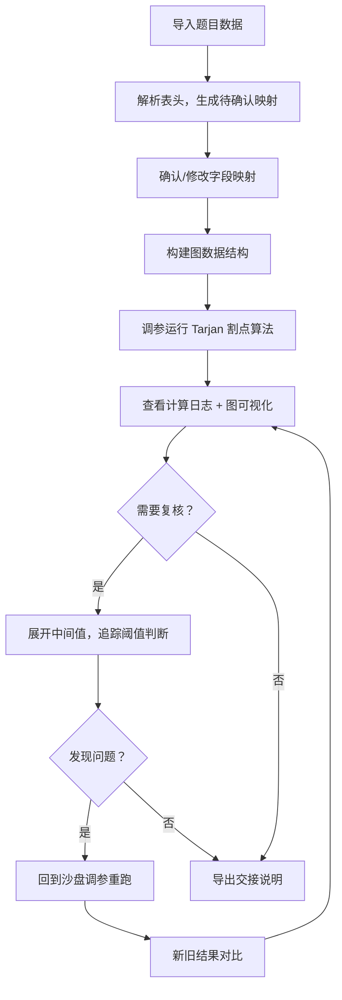

## 1. 产品概述

图论割点参数沙盘——面向建模社同学的图论割点算法调试与参数追踪工具。核心解决两个痛点：一是不同题目来源的表头字段不统一时，原字段、猜测映射和处理理由必须一起留在待确认区，不能丢；二是割点计算过程全链路可追溯，公式、单位换算、参数版本、边界样本都能追到，重跑后变化可解释。

- 目标用户：建模社同学（以阿乔为代表），需要调试割点算法参数、对齐异构数据源、复核中间结果并完成交接
- 核心价值：把"图上看着顺但明细对不回去"的因果留下可查记录，减少复核会逐条追问的沟通成本

## 2. 核心功能

### 2.1 用户角色

| 角色 | 使用方式 | 核心权限 |
|------|----------|----------|
| 建模社成员 | 打开即用 | 导入数据、运行计算、查看复核、导出交接说明 |

### 2.2 功能模块

1. **题目清单与字段对齐页**：导入题目数据，自动识别表头差异，生成待确认映射区
2. **割点计算沙盘页**：图可视化 + 割点算法运行，全参数可调，计算过程完整留痕
3. **复核详情页**：展开每个节点的中间值（dfn、low、阈值判断），快速定位是阈值还是单位问题
4. **交接说明页**：可复制的运行命令 + 一组真实小数据，少背景多操作

### 2.3 页面详情

| 页面名称 | 模块名称 | 功能描述 |
|----------|----------|----------|
| 题目清单与字段对齐 | 数据导入区 | 支持粘贴 CSV/JSON 数据，自动解析表头 |
| 题目清单与字段对齐 | 字段映射待确认区 | 原字段名 | 猜测标准字段 | 处理理由 | 确认状态，四列并排 |
| 题目清单与字段对齐 | 映射历史记录 | 每次确认/修改都带时间戳和操作人备注，可回溯 |
| 割点计算沙盘 | 图可视化区 | 节点和边的交互式图，高亮割点，支持拖拽布局 |
| 割点计算沙盘 | 参数面板 | Tarjan 算法参数：根节点选择、阈值偏移、单位换算系数 |
| 割点计算沙盘 | 计算日志区 | 每步显示：公式 → 代入值 → 中间结果 → 最终结果，附带参数版本号 |
| 割点计算沙盘 | 重跑对比 | 修改参数后重跑，新旧结果并排对比，变化行高亮 |
| 复核详情 | 节点中间值展开 | 点击节点展开 dfn序/low值/访问顺序/父节点/子节点数等中间值 |
| 复核详情 | 阈值判断追踪 | 每个割点/非割点判定：判断条件 → 实际值 → 阈值 → 结论 |
| 复核详情 | 除零边界提示 | 遇到度为1的节点或孤立点时，用交接话术提示（如"该节点只有一条边连着，移除后不会断开其他通路"） |
| 交接说明 | 命令区 | 可复制的运行命令，包含完整参数 |
| 交接说明 | 样本数据区 | 一组真实小数据（5-7节点），可直接粘贴验证 |
| 交接说明 | 参数变更日志 | 参数版本列表，每个版本记录变更内容和原因 |

## 3. 核心流程

用户导入题目数据 → 系统解析表头 → 生成待确认字段映射 → 用户确认/修改映射 → 系统构建图 → 用户调参运行 Tarjan 割点算法 → 查看计算日志和图可视化 → 进入复核页展开中间值 → 发现问题则回到沙盘调参重跑 → 新旧对比确认变化 → 导出交接说明

## 4. 用户界面设计

### 4.1 设计风格

- 主色调：深灰底（#1a1a2e）+ 青色强调（#00d4aa）+ 琥珀色警告（#f0a500）
- 风格：工业仪表盘风格，数据密集但层次分明
- 字体：等宽字体用于数据区（JetBrains Mono），无衬线字体用于界面（Noto Sans SC）
- 布局：顶部导航切换页面，各页面内部左右分栏（左：主操作区，右：日志/详情面板）
- 按钮：圆角矩形，带微弱内发光，操作按钮实心、辅助按钮描边

### 4.2 页面设计概述

| 页面名称 | 模块名称 | UI 元素 |
|----------|----------|----------|
| 字段对齐 | 数据导入区 | 文本域 + 解析按钮，支持 CSV/JSON 自动识别 |
| 字段对齐 | 待确认映射表 | 四列表格：原字段 | 猜测字段 | 处理理由 | 状态标签，行内编辑 |
| 字段对齐 | 映射历史 | 时间轴样式，每条带时间戳和备注 |
| 计算沙盘 | 图可视化 | Canvas 画布，节点可拖拽，割点红色高亮，边灰色 |
| 计算沙盘 | 参数面板 | 滑块 + 数字输入，参数版本号显示 |
| 计算沙盘 | 计算日志 | 折叠式日志条目，每条显示公式→代入→结果 |
| 计算沙盘 | 重跑对比 | 左右分栏新旧对比，差异行琥珀色高亮 |
| 复核详情 | 中间值展开 | 手风琴式展开，每节点一行，点击展开 dfn/low/判断详情 |
| 复核详情 | 除零边界提示 | 琥珀色提示条，用自然语言描述边界情况 |
| 交接说明 | 命令区 | 代码块 + 一键复制按钮 |
| 交接说明 | 样本数据 | 代码块 + 一键复制按钮 |
| 交接说明 | 参数变更日志 | 版本号 + 时间 + 变更摘要的列表 |

### 4.3 响应式

桌面优先设计，最小宽度 1024px。数据表格在小屏下允许横向滚动，图可视化区保持固定高度。

### 4.4 3D 场景指导

不适用
