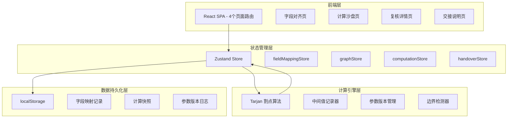
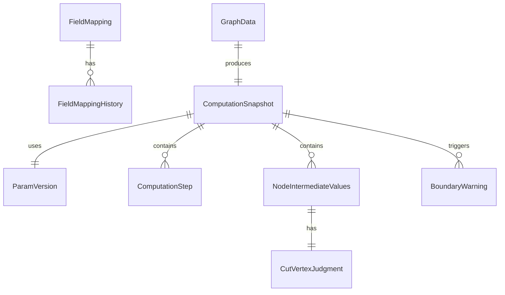

## 1. 架构设计



## 2. 技术说明

- 前端：React@18 + TypeScript + Tailwind CSS@3 + Vite
- 初始化工具：Vite (react-ts template)
- 状态管理：Zustand（轻量，适合单页工具类应用）
- 图可视化：Canvas 2D 自绘（轻量可控，无需引入重型图形库）
- 后端：无（纯前端，数据存 localStorage）
- 数据库：无（localStorage 持久化 + 导出 JSON 文件）

## 3. 路由定义

| 路由 | 用途 |
|------|------|
| / | 字段对齐页 - 导入数据、字段映射待确认区 |
| /sandbox | 割点计算沙盘 - 图可视化 + 参数调试 + 计算日志 |
| /review | 复核详情页 - 展开中间值、阈值追踪、边界提示 |
| /handover | 交接说明页 - 可复制命令 + 样本数据 + 参数变更日志 |

## 4. API 定义

无后端 API。所有数据通过 Zustand store 管理，localStorage 持久化。

核心 TypeScript 类型定义：

```typescript
interface FieldMapping {
  id: string
  originalField: string
  guessedField: string
  reason: string
  status: 'pending' | 'confirmed' | 'rejected'
  confirmedAt?: string
  note?: string
}

interface FieldMappingHistory {
  id: string
  timestamp: string
  action: string
  before?: FieldMapping
  after?: FieldMapping
  operatorNote?: string
}

interface GraphNode {
  id: string
  label: string
  x: number
  y: number
}

interface GraphEdge {
  source: string
  target: string
  weight?: number
}

interface ComputationStep {
  nodeId: string
  stepType: 'init' | 'dfs_enter' | 'dfs_exit' | 'update_low' | 'check_cut'
  formula: string
  substitutedValues: string
  intermediateResult: string
  finalResult: string
  paramVersion: string
  timestamp: number
}

interface NodeIntermediateValues {
  nodeId: string
  dfn: number
  low: number
  parent: string | null
  childCount: number
  visitOrder: number
  isRoot: boolean
  cutVertexJudgment: {
    condition: string
    actualValue: string
    threshold: string
    conclusion: 'is_cut' | 'not_cut'
    boundaryNote?: string
  }
}

interface ParamVersion {
  version: string
  timestamp: string
  changes: string
  rootId: string
  thresholdOffset: number
  unitScale: number
}

interface ComputationSnapshot {
  id: string
  paramVersion: ParamVersion
  steps: ComputationStep[]
  intermediates: NodeIntermediateValues[]
  cutVertices: string[]
  boundaryWarnings: BoundaryWarning[]
  createdAt: string
}

interface BoundaryWarning {
  nodeId: string
  type: 'degree_one' | 'isolated' | 'root_special' | 'divide_by_zero'
  humanMessage: string
  technicalDetail?: string
}
```

## 5. 服务器架构图

不适用（纯前端应用）

## 6. 数据模型

### 6.1 数据模型定义



### 6.2 数据定义语言

所有数据存储在 Zustand store 中，通过 localStorage 持久化。数据结构即上述 TypeScript 类型定义。

关键持久化键名：
- `cutpoint-field-mappings`: 字段映射及历史
- `cutpoint-graph-data`: 图数据（节点和边）
- `cutpoint-snapshots`: 计算快照列表（含所有中间值和日志）
- `cutpoint-param-versions`: 参数版本日志
