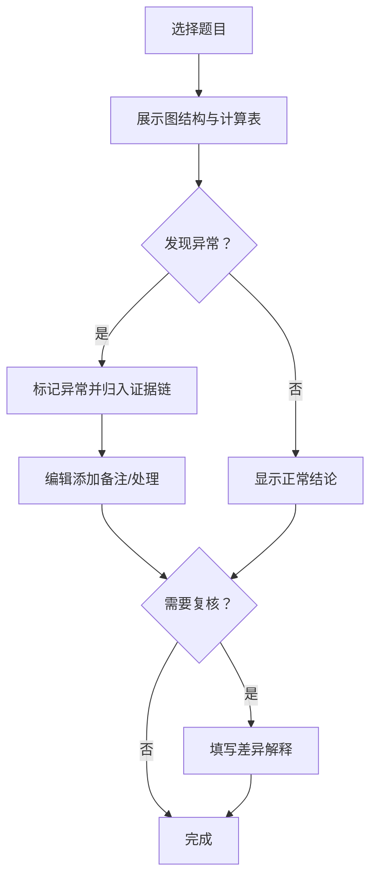

## 1. 产品概述

图论割点错因追踪系统——面向教研编辑阿宁的单页面工具，用于记录图论割点题目中"图上看着对但明细对不回去"的因果链，保留中间计算表与异常样本，确保数值溢出、空集合、缺单位等异常不被当作普通失败覆盖，复核结论旁附带可读差异解释，所有判断与备注持久化存储，重启后可查。

- 目标用户：教研编辑（阿宁），日常需要复核割点题目的答案正确性
- 核心价值：将证据链、当前状态、处理建议说清，减少手工记忆补洞

## 2. 核心功能

### 2.1 用户角色

| 角色 | 核心权限 |
|------|----------|
| 教研编辑 | 查看题目清单、运行算法、标记异常、复核结论、添加备注 |

### 2.2 功能模块

1. **主控台（单页面）**：题目清单 + 选中题目详情 + 证据链面板，无需页面跳转
2. **题目详情区**：图结构展示、中间计算表、异常标记
3. **证据链面板**：异常追溯、复核历史、差异解释

### 2.3 页面详情

| 页面名称 | 模块名称 | 功能描述 |
|----------|----------|----------|
| 主控台 | 题目清单 | 左侧面板列出所有割点题目，显示状态标签（待复核/已复核/异常/边界） |
| 主控台 | 图结构展示 | 居中展示当前题目的图（节点+边），高亮割点候选 |
| 主控台 | 中间计算表 | 算法执行每一步的 dfn/low/parent 值表，异常行标红 |
| 主控台 | 异常检测区 | 列出当前题目的所有异常（溢出/空集/缺单位/边界），每条附带状态和备注 |
| 主控台 | 证据链时间线 | 右侧面板按时间排列所有事件（计算步骤、异常发现、复核操作），形成完整因果链 |
| 主控台 | 复核入口 | 结论旁的复核按钮，点击后填写当前结论与上次结论的差异解释 |
| 主控台 | 处理建议 | 根据异常类型自动生成处理建议（如"缺单位：需补充节点单位标注"） |

## 3. 核心流程

1. 教研编辑从题目清单选择一道割点题
2. 系统展示图结构和中间计算表（Tarjan算法逐步结果）
3. 发现异常时（溢出/空集/缺单位/边界），异常自动归入证据链，状态标记为"待处理"
4. 教研编辑对异常添加备注或处理结果，状态变更为"已处理"或"延后"
5. 复核结论时，若与上次不同，必须填写差异解释
6. 所有操作持久化到 localStorage，重启后可完整恢复

## 4. 用户界面设计

### 4.1 设计风格

- 主色调：深灰底(#1a1a2e) + 琥珀色强调(#f59e0b)，工具感强但不冰冷
- 辅助色：异常红(#ef4444)、边界橙(#f97316)、已处理绿(#22c55e)
- 字体：Source Code Pro（数据区）+ Noto Sans SC（中文区）
- 布局：三栏式（左题目列表 / 中详情 / 右证据链），单页面无跳转
- 图标：lucide-react

### 4.2 页面设计概览

| 页面名称 | 模块名称 | UI元素 |
|----------|----------|--------|
| 主控台 | 题目清单 | 紧凑卡片列表，状态色标，搜索过滤 |
| 主控台 | 图结构展示 | SVG 节点连线图，割点高亮，hover 显示 dfn/low |
| 主控台 | 中间计算表 | 表格行按步骤排列，异常行背景标红，可展开行内注释 |
| 主控台 | 异常检测区 | 标签式列表，每条异常带类型图标、状态徽章、备注输入 |
| 主控台 | 证据链时间线 | 竖向时间线，节点分颜色区分事件类型，点击可展开详情 |
| 主控台 | 复核入口 | 结论区旁的"复核"按钮，弹出行内表单（当前结论+差异解释） |
| 主控台 | 处理建议 | 异常条目下方自动生成的建议文字，斜体灰色 |

### 4.3 响应式

桌面优先，最小宽度 1024px，三栏布局在小屏幕下折叠为上下结构。

## 5. 数据持久化策略

- 所有数据通过 localStorage 持久化，键名为 `cutvertex_tracker`
- 每次状态变更自动保存，无需手动操作
- 异常处理结果（含备注）与复核记录（含差异解释）均持久化
- 启动时从 localStorage 恢复全部状态，若无数据则加载内置样例
