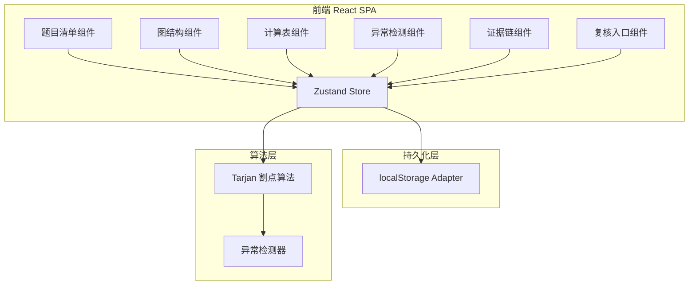
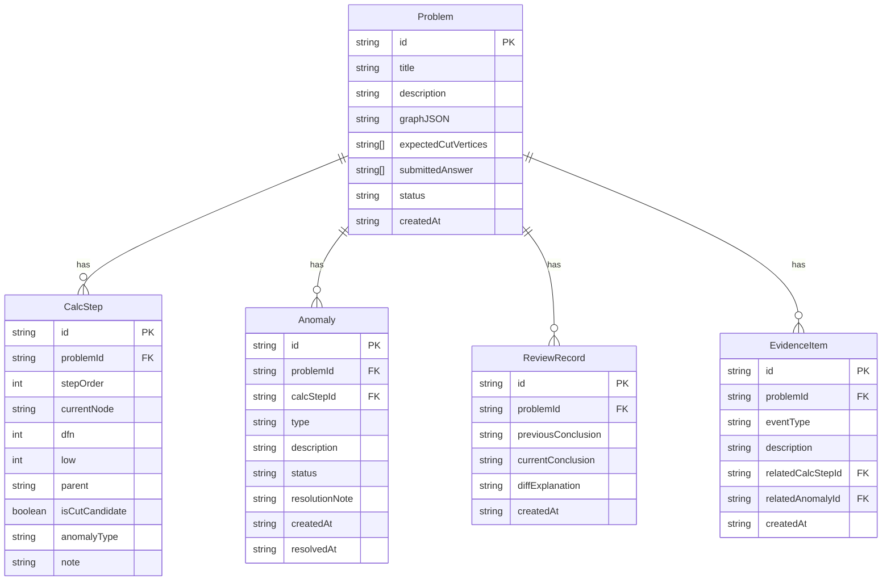

## 1. 架构设计



## 2. 技术说明

- 前端：React@18 + TypeScript + Tailwind CSS@3 + Vite
- 状态管理：Zustand（含 persist 中间件，自动同步 localStorage）
- 图形渲染：SVG（节点+边的自定义渲染）
- 图标：lucide-react
- 无后端，纯前端应用，所有数据持久化到 localStorage
- 初始化工具：vite-init，模板 react-ts

## 3. 路由定义

| 路由 | 用途 |
|------|------|
| / | 主控台单页面，包含题目清单、图详情、证据链 |

## 4. 数据模型

### 4.1 数据模型定义



### 4.2 核心类型定义

```typescript
type ProblemStatus = "pending" | "reviewed" | "anomaly" | "boundary"
type AnomalyType = "overflow" | "empty_set" | "missing_unit" | "boundary"
type AnomalyStatus = "pending" | "resolved" | "deferred"
type EventType = "calc_step" | "anomaly_found" | "review" | "note_added"

interface GraphNode {
  id: string
  label: string
  x: number
  y: number
  unit?: string
}

interface GraphEdge {
  from: string
  to: string
}

interface GraphData {
  nodes: GraphNode[]
  edges: GraphEdge[]
}
```

### 4.3 内置脏数据样例

系统启动时若无 localStorage 数据，自动加载以下样例：

1. **正常题**：5节点树，2个割点，计算无误
2. **溢出题**：某节点 low 值计算过程中数值溢出（模拟大数运算越界）
3. **空集题**：某节点子树为空集合，导致 low 值无法回溯
4. **缺单位题**：节点缺少单位标注，导致判断条件不完整
5. **边界题**：孤立节点 + 单边连接，割点判断处于边界条件
6. **复核差异题**：已有两次复核结论不同，附带差异解释

## 5. 异常处理策略

| 异常类型 | 检测方式 | 处理建议 | 持久化要求 |
|----------|----------|----------|------------|
| overflow | low/dfn 值超过安全阈值 | 标记溢出步骤，建议用大数或分段计算 | 完整保留溢出值和上下文 |
| empty_set | 子树回溯时发现空集合 | 标记空集步骤，建议补充孤立节点处理逻辑 | 保留空集位置和触发条件 |
| missing_unit | 节点缺少 unit 字段 | 标记缺单位节点，建议补充物理/数学单位 | 保留缺失单位和默认假设 |
| boundary | 割点判断恰好等于阈值 | 标记边界条件，建议人工确认 | 保留边界值和判断依据 |
